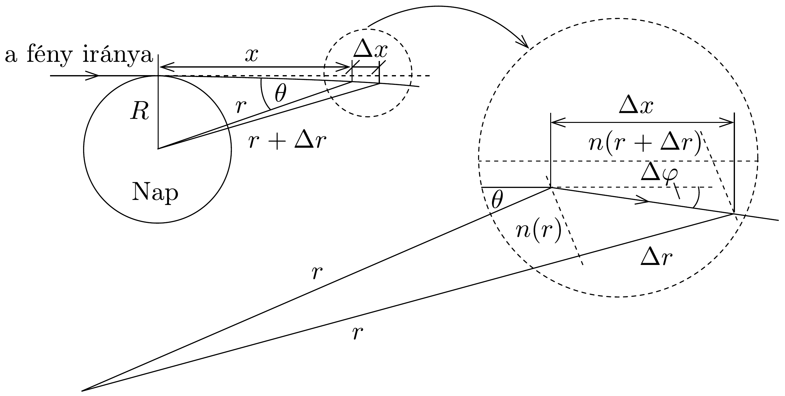

## Megoldás 3

A rész
- a) A rudak szabad végeinek rezgését leíró $\Delta x_{t}$ függvényben az (amplitúdó időbeli csökkenését megadó) exponenciális faktor 50 s alatt 20 \%-kal csökken, tehát $0,8=e^{-\mu \cdot 50 \mathrm{~s}}$, ahonnan $\mu=4,5 \cdot 10^{-3} \mathrm{~s}^{-1}$.
- b) A longitudinális hullámok sebessége az alumínium megadott anyagi állandóiból számítható: $v=\sqrt{E / \varrho}=5100 \mathrm{~m} / \mathrm{s}$. Tudjuk továbbá, hogy az egyik végén rögzített, a másik végén szabadon mozgó rúd longitudinális alaprezgésénél a rúd hossza a hullámhossz negyede, vagyis $\lambda_{\text {rúd }}=4 \ell=4 \mathrm{~m}$, alaprezgés frekvenciája tehát $f=v / \lambda=1,3 \mathrm{kHz}$, körfrekvenciája pedig $\omega=2 \pi f=8,1 \cdot 10^{3} \mathrm{~s}^{-1}$.
- c) A lebegés frekvenciája ( $\Delta \ell \ll \ell$ )
\[
\Delta f=v\left(\frac{1}{\lambda_{2}}-\frac{1}{\lambda_{1}}\right)=v \frac{\lambda_{1}-\lambda_{2}}{\lambda_{1} \lambda_{2}} \approx \frac{4 v \Delta \ell}{16 \ell^{2}} .
\]

A két (közelítőleg 1 méteres) rúd hosszának különbsége tehát
\[
\Delta \ell=\frac{4 \ell^{2}}{v} \Delta f=\frac{\Delta f}{f} \ell=3,8 \cdot 10^{-6} \mathrm{~m} .
\]
- d) Ha az egyik végén rögzített rúd rúdirányú $g$ gravitációs térerősségứ térben van, akkor a szabad végétől mért $x$ távolság függvényében a benne ébredő rugalmas feszültség:
\[
\sigma(x)=\frac{m(x) g}{A}=\frac{\varrho A x g}{A}=\varrho x g,
\]
ahol $A$ a rúd keresztmetszetének terültete. Azaz a rúd szabad végén nulla a feszültség, a rögzítésnél $\varrho \ell g$. Mivel a feszültség lineárisan változik, ezért a teljes

rudat tekintve átlagos feszültséggel számolhatunk: $\bar{\sigma}=\varrho \ell g / 2$. Ennek hatására a rúd deformációja
\[
\varepsilon=\frac{\delta \ell}{\ell}=\frac{\bar{\sigma}}{E}=\frac{\varrho \ell g}{2 E} .
\]
Ha a gravitációs térerősség megváltozása $\Delta g$, akkor a rúd fenti állapotához képesti hosszváltozása
\[
\Delta \ell=\frac{\varrho \ell^{2}}{2 E} \Delta g .
\]
e) A $\Delta \ell=656 \mathrm{~nm} \cdot 10^{-4}=\frac{\varrho \ell^{2}}{2 E} \cdot \Delta g$ összefüggésből a megadott számadatokkal a szükséges rúd hosszára $\ell \approx 2 \cdot 10^{8} \mathrm{~m}$ adódik. Ilyen hosszú (csillagászati méretú) rúd nyilvánvalóan nem készíthető! A számítás eredménye mindenesetre tanulságos, rávilágít arra a tényre, hogy a gravitációs hullámok kísérleti kimutatása technikailag igen nehéz feladat, nem csoda, hogy erre 2015-ig várni kellett.

Megjegyzés: A fenti becslésnél azt tételeztük fel, hogy a gravitációs térerősség egy igen kicsit megváltozik, majd stabilan a megváltozott érték marad; emiatt az egyik rúd szabad vége kicsit elmozdul. A reálisan várható mérési elrendezésben $\Delta g$ csak egy nagyon rövid ideig különbözik nullától (hiszen a gravitációs hullámok fénysebességgel terjednek), és csak „meglökik” a rudat, amely (kicsiny csillapítás esetén) az alaprezgés frekvenciájával hosszú ideig tartó rezgésbe kezd. A tervezett mérésekben ennek a rezgésnek közvetett hatásait szeretnék kimutatni.

B rész
a) A $h f=m c^{2}$ összefüggésből az $f$ frekvenciájú foton „ekvivalens tömege” $m=$ $h f / c^{2}$. A Nap felszínéről induló és onnan nagyon messze eltávolodó foton mozgási energiája a gravitációs helyzeti energia változása miatt $h f^{\prime}=h f-G m M / R$ értékú lesz, ahonnan a bizonyítandó $f^{\prime}=f\left(1-\frac{G M}{R c^{2}}\right)$ formulát kapjuk.
b) Ha a gravitációs mező jelenléte a Nap középpontjától $r$ távolságban a frekvenciákat és a távolságokat $\left(1-\frac{G M}{R c^{2}}\right)$ arányban csökkenti, az időtartamokat pedig ugyanilyen mértékben növeli, akkor ez a fény terjedési sebességének $\left(1-\frac{G M}{R c^{2}}\right)^{2}$ arányú csökkenéséhez vezet. Ezek szerint az effektív törésmutató
\[
n_{r}=\frac{c}{c^{\prime}}=\left(1-\frac{G M}{r c^{2}}\right)^{-2} \approx 1+2 \cdot \frac{G M}{r c^{2}},
\]
vagyis a kérdéses $\alpha$ állandó számértéke 2.
c) A Nap szélét éppen érintő fénysugár a gravitáció hatására - a fentebb kiszámított, helyről helyre változó effektív törésmutató miatt - fokozatosan elgörbül.

Osszuk fel a fénysugár pályáját a Napot érintő pontjától mért $x$ távolság függvényében kicsiny szakaszokra. Az $x$ és $x+\Delta x$ radiális távolsággal jellemzett pontok közötti gömbhéjat tekintsük optikailag homogén, $n(r+\Delta r)$ törésmutatójú közegnek, az alatta levő réteget pedig $n(r)$ törésmutatójúnak (lásd a 237. ábrát)!

A réteg alsó határfelületére eső fénysugár a Snellius-Descartes-törvénynek megfelelően megtörik, eredeti irányához képest igen kicsiny $\Delta \varphi$ szöggel eltérül:
\[
\frac{\sin \theta}{\sin (\theta+\Delta \varphi)}=\frac{n(r+\Delta r)}{n(r)} .
\]
Használjuk ki, hogy $\Delta \varphi$ és $\Delta r=\Delta x \cos \theta$ kicsiny mennyiségek, továbbá hogy $n(r) \approx 1$ miatt a fény pályája alig tér el az egyenestől, így
\[
\sin (\theta+\Delta \varphi) \approx \sin \theta+\Delta \varphi \cos \theta
\]
és
\[
n(r+\Delta r)-n(r)=\frac{2 G M}{c^{2}}\left(\frac{1}{r+\Delta r}-\frac{1}{r}\right) \approx-\frac{2 G M}{r^{2} c^{2}} \Delta r,
\]
ahonnan a szögeltérülésre
\[
\Delta \varphi=\frac{2 G M}{r^{2} c^{2}} \operatorname{tg} \theta \cdot \Delta r=\frac{2 G M R}{c^{2}} \cdot \frac{\Delta x}{\left(x^{2}+R^{2}\right)^{3 / 2}}
\]
adódik. Összegezve (integrálva) ezt az összefüggést (az $x$ változó teljes tartományára) megkapjuk a fény teljes eltérülését:
\[
\varphi=\frac{2 G M R}{c^{2}} \int_{-\infty}^{\infty} \frac{\mathrm{d} x}{\left(x^{2}+R^{2}\right)^{3 / 2}}=\frac{4 G M}{R c^{2}} \approx 8,4 \cdot 10^{-6} \text { radián. }
\]

Megjegyzés. A feladat megoldása során követett gondolatmenet a klasszikus newtoni gravitációelmélet fogalmait használja (némi relativisztikus korrekcióval). Ez a leírás nem minden esetben tükrözi helyesen a kísérletileg megfigyelt tényeket; erre mai tudásunk szerint csak az Einstein-féle általános relativitáselmélet képes, melynek matematikai apparátusa és fogalomrendszere azonban sokkal bonyolultabb annál, semhogy
középiskolás versenyfeladatok között felhasználható volna. A diákolimpián szereplő (a gravitációs fényelhajlást tárgyaló) feladatban a „félklasszikus" gondolatmenettel kapott formula megegyezik az általános relativitáselmélet (kísérletek által is pontosan igazolt) jóslatával, a gravitációs hullámok Einstein-féle elmélete azonban sokkal összetettebb, mint azt a versenyfeladat megoldása alapján vélhetnénk.

\title{
