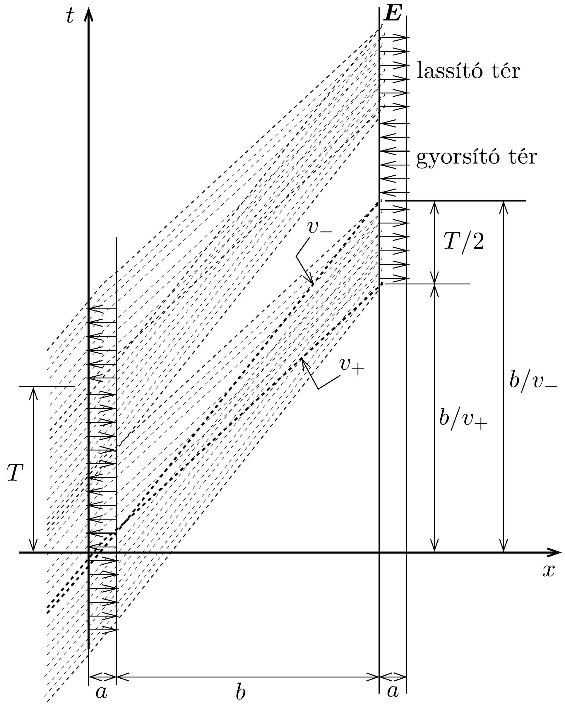
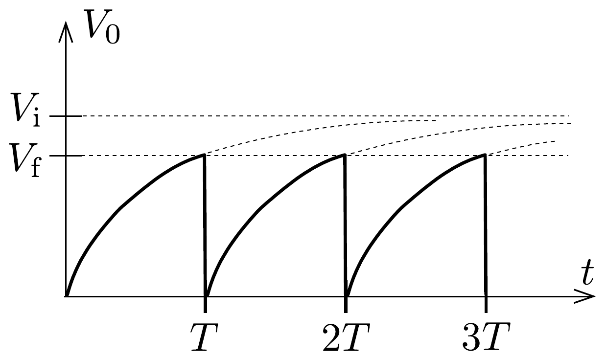
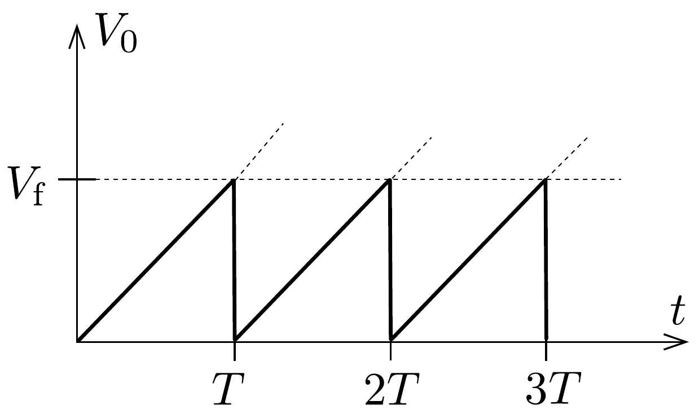
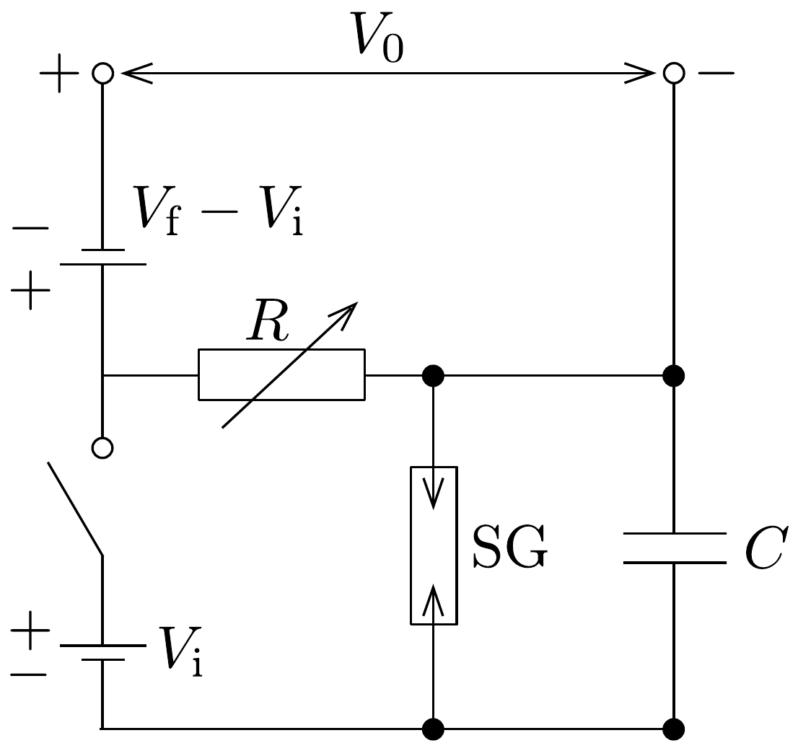

## Megoldás 1

1.1. feladat. a) A - e töltésú, $m$ tömegú, $v_{0}$ kezdősebességú elektronok $m v_{0}^{2} / 2$ mozgási energiája $\pm V$ feszültség hatására $\mp e V$ értékkel változik meg. Így a bal oldali üregből kilépő, felgyorsított részecskék sebessége
\[
v_{+}=\sqrt{v_{0}^{2}+2\left(\frac{e}{m}\right) V}=2,044 \cdot 10^{6} \frac{\mathrm{~m}}{\mathrm{~s}},
\]
a lelassított elektronoké pedig
\[
v_{-}=\sqrt{v_{0}^{2}-2\left(\frac{e}{m}\right) V}=1,956 \cdot 10^{6} \frac{\mathrm{~m}}{\mathrm{~s}} .
\]
Ha a négyszögjel első félperiódusában az elektronok lelassulnak, akkor a jobb oldali üreghez $b / v_{-}$idő alatt érnek. A következő félperiódusban az elektronok felgyorsulnak, így a másik üreghez $b / v_{+}$idő alatt érnek. Az elektronok akkor torlódnak össze, ha egyszerre érkeznek a kimeneti üreghez, azaz:
\[
\frac{b}{v_{-}}=\frac{b}{v_{+}}+\frac{T}{2},
\]
ahonnan
\[
b=\frac{v_{+} v_{-}}{v_{+}-v_{-}} \cdot \frac{T}{2}=2,273 \mathrm{~cm} .
\]
b) Ha a kilépő üreg feszültsége olyan, hogy az odaérkező elektronokat lassítja, akkor az elektromos tér energiát nyel el az elektronoktól. Az bementi üregre kapcsolt négyszögjel első félperiódusában odaérkező elektronok lelassulnak, a második félperiódusban odaérkezők pedig felgyorsulnak, valamint ezek az elektronok egyszerre érkeznek a kimeneti üreghez, tehát félperiódusnyi ideig kell a kimeneti üregben a lassítófeszültséget alkalmazni. A kimeneti üregre kapcsolt négyszögjel másik félperiódusában (tehát amikor a feszültség előjele az előbbivel ellentétes) nincsenek torlódó elektronok, majd a rákövetkező félperiódusban ismét megjelennek, és így tovább. Az elektronsugár egyes részecskéinek vázlatos út-idő diagramját a 245. ábra mutatja.

Tehát, ha a bemeneti üregből kilépő lassú elektronok $t=b / v_{-}$időponttól kezdve $T / 2$ ideig a kimeneti üregnél $-V$ feszültséget éreznek (akárcsak a gyorsak), energiát adnak az elektromos térnek. Vagyis a bemeneti és a kimeneti üregre kapcsolt jel közötti fáziskülönbség:
\[
\Delta \varphi=2 \pi \cdot \frac{t}{T}=2 \pi \frac{b}{v_{-} \cdot T}=2 \pi \cdot 11,61 .
\]
Ennek megfelelő, $2 \pi$-nél kisebb (pozitív) fáziskülönbség:
\[
\Delta \varphi=2 \pi \cdot 0,61 \text { radián } \approx 3,8 \text { radián } \approx 220^{\circ} \text {. }
\]
Természetesen a $220^{\circ}-360^{\circ}=-140^{\circ}$ is ezzel egyenértékú.
1.2. feladat. Az ideális gáznak tekintett vízgőz súrúsége a gáztörvény szerint
\[
\varrho_{\mathrm{V}}=\frac{m}{V}=\frac{p_{0} M}{R T} .
\]

A víz és a vízgő́z sűrúségének aránya légköri nyomáson és a forráspont hőmérsékletén
\[
\frac{\varrho_{\mathrm{L}}}{\varrho_{\mathrm{V}}}=\frac{R T \varrho_{\mathrm{L}}}{p_{0} M} \approx 1720 \approx 12^{3} .
\]
Mivel a súrúség a molekulák közötti átlagos távolság köbével fordítottan arányos, megállapíthatjuk, hogy gőzfázisban a molekulák kb. 12-szer messzebb vannak egymástól, mint folyadék halmazállapotban.
1.3. feladat. a) A kapcsoló zárását követően a kondenzátor az $R$ ellenálláson keresztül eleinte gyorsan, majd egyre lassabban töltődik. A $V_{0}$ feszültség és a telepfeszültség különbsége az idő exponenciális függvénye szerint csökken mindaddig, míg $V_{0}$ el nem éri a $V_{\mathrm{f}}$ kisülési feszültséget. Ekkor a szikrakisülés hatására $V_{0}$ hirtelen nullára csökken, majd a folyamat kezdődik elölről (246.a) ábra).

246. ábra.
b) $V_{\mathrm{f}} \ll V_{\mathrm{i}}$ esetén a kondenzátor feszültsége elhanyagolható a telepfeszültség mellett. A töltőáram ilyenkor jó közelítéssel állandónak tekinthető, a kondenzátor feszültsége tehát (egészen a szikrakisülésig) időben lineárisan növekszik (246.b) ábra).
c) Ha a linearitási feltétel teljesül, az áramerősség $I=V_{\mathrm{i}} / R$, a kondenzátor töltése $t$ időtartamú töltés után $Q=I t$, feszültsége pedig
\[
U=\frac{Q}{C}=\frac{V_{\mathrm{i}}}{R C} t .
\]
Ez akkor egyezik meg a $V_{\mathrm{f}}$ kisülési feszültséggel, amikor
\[
t=T=\frac{V_{\mathrm{f}}}{V_{\mathrm{i}}} R C,
\]
ekkora tehát a fűrészfog-generátor periódusideje.
Megjegyzés: A periódusidőt megadó formulát a kondenzátor töltődését leíró
\[
V_{\mathrm{f}}=V_{\mathrm{i}}\left(1-\mathrm{e}^{-\frac{T}{R C}}\right)
\]
összefüggésből is megkaphatjuk, ha kihasználjuk, hogy $V_{\mathrm{f}} \ll V_{\mathrm{i}}$, emiatt $T \ll R C$. Az exponenciális függvény kis $x$-ekre érvényes $\mathrm{e}^{x} \approx 1+x$ közelítő alakjából
\[
V_{\mathrm{f}} \approx V_{\mathrm{i}}\left[1-\left(1-\frac{T}{R C}\right)\right]=\frac{V_{\mathrm{i}} T}{R C}, \quad \text { ahonnan } \quad T \approx \frac{V_{\mathrm{f}}}{V_{\mathrm{i}}} R C .
\]
d) Az $R$ ellenállás értékét megváltoztatva (és a szikraköz $V_{\mathrm{f}}$ kisülési feszültségét rögzített értéken tartva) fürészfogjelnek csak a periódusideje változik, amplitúdója nem.
e) Ha az ellenállás nagyságát és a szikraköz távolságát egyszerre változtatjuk, méghozzá olymódon, hogy az $R \cdot V_{\mathrm{f}}$ szorzat változatlan maradjon, akkor a fürészfogjelnek csak az amplitúdója változik, periódusideje nem.
f) A megadott („fordított fúrészfog”) jelalak többféle kapcsolással is megvalósítható. Egy lehetséges megoldást mutat a 247. ábra.

\section*{1.4. feladat.}
I. megoldás. $T$ hőmérsékletú gázban az $M$ tömegú atomok termikus átlagsebessége az energia egyenletes eloszlásának tételéből (az ekvipartíciós tételből) határozhatjuk meg. Eszerint
\[
\frac{1}{2} M v^{2}=\frac{1}{2} k T,
\]
ahol $v$ a sebesség valamelyik komponensének átlagos nagysága ${ }^{16}$, $k$ pedig a Boltzmann-állandó. Innen a sebesség bármelyik komponensének, speciálisan a vízszintes összetevőjének átlagos nagysága $v=\sqrt{k T / M}$.

A kemence falán levő kicsiny lyukon keresztül „vízszintesen” kilépő atomokból álló részecskenyaláb a haladási irányára merőlegesen fokozatosan kiszélesedik, az atomsugár átméróje megnő. Ennek az az (egyik) oka, hogy a $D$ átmérójú lyukon

\footnotetext{
${ }^{16} \mathrm{Az}$ „átlagos nagyság” a négyzetes átlagolást, a sebességkomponens négyzetének átlagából vont négyzetgyököt jelenti.

áthaladó részecskék $v_{\perp}$ „transzverzális” (a haladási irányra merőleges) sebessége nem lehet pontosan nulla, hanem a Heisenberg-féle határozatlansági reláció értelmében legalább
\[
\Delta v_{\perp} \approx \frac{\hbar}{M D}
\]
nagyságú (ahol $\hbar$ a $2 \pi$-vel osztott Planck-állandót jelöli).
A atomsugár $t=L / v$ idő alatt tesz meg $L$ hosszúságú utat, ezalatt $2 v_{\perp} \cdot t$ értékkel nő az átmérője, mérete tehát hozzávetőlegesen
\[
D^{\prime}=D+\frac{2 L \hbar}{D \sqrt{k T M}}
\]
lesz. (Ez a kifejezés csak nagyságrendi becslésnek tekinthető, a benne szereplő számfaktort tehát nem szabad nagyon „komolyan venni”; a kétszerese, vagy a fele éppúgy elfogadható lenne.)
II. megoldás. A kemencéből kilépő $v \approx \sqrt{k T / M}$ sebességú részecskék a de Broglie-féle hipotézis szerint $\lambda=h /(M v)$ hullámhosszúságú „anyaghullámnak” tekinthetók. Ezek az anyaghullámok - a fényhullámokhoz hasonlóan - elhajlást szenvednek a $D$ átmérőjű kör alakú nyíláson. A nyílás különböző részeiből kiinduló hullámok interferálnak, és bizonyos irányokban haladva erósítik, más irányokban viszont kioltják egymást. (Pl. a pontosan „előrefelé” haladó hullámok útkülönbsége nulla, ezek tehát mind erósítik egymást.) Az atomnyaláb szélességét az elsó interferencia-minimummal azonosítva nagyságrendi becslést kaphatunk az atomsugár kiszélesedésére.

Ismeretes, hogy egy $D$ szélességú (párhuzamos falú) rés esetén az első kioltás olyan $\vartheta$ elhajlási szögnél észlelhető, amelynél a rés egyik szélétől induló hullámok éppen egy hullámhosszal nagyobb utat tesznek meg az észlelő ernyőig, mint a rés másik szélétől induló hullámok. Ennek geometriai feltétele (kicsiny szögü elhajlások és viszonylag távoli ernyő esetén):
\[
\sin \vartheta \approx \vartheta=\frac{\lambda}{D} \approx \frac{h}{D \sqrt{k T M}} .
\]
Jelen esetben az elhajlás nem résen, hanem kör alakú lyukon történik, emiatt a formulában szereplő számfaktor egy kicsit más lesz, ez azonban egy nagyságrendi becslésnél figyelmen kívül hagyható.

A $\vartheta$ szögben elhajló atomsugarak az $L$ távolságban levő ernyốt $2 L \vartheta$ átmérőjú körben érik, ekkora lesz tehát (nagyságrendileg) a kiszélesedett sugár mérete. Ez az érték viszonylag távoli ernyőnél ( $L \vartheta \gg D$ teljesülése esetén) megegyezik az előző megoldásban kapott kifejezéssel.

Megjegyzés: A feladat megoldásánál feltételeztük, hogy a kemence falán lévő (az atomok méretével összemérhető átmérőjú) lyukon áthaladó atomok egymással nem ütköznek (vagyis a részecskék szabad úthossza sokkal nagyobb, mint a fal vastagsága). Feltettük továbbá azt is, hogy a kemence falának és az atomsugárnak a kölcsönhatása csak a nyaláb transzverzális méretének korlátozásában játszik szerepet, és nem lép fel a klasszikus tömegpontok (pl. biliárdgolyók) rugalmas falak közötti ide-oda pattogásának

megfeleló jelenség. Azt is feltételeztük, hogy a részecskék a kilépésük után már szabadon mozognak, a levegő molekuláival nem ütköznek.

Mindezek a feltevések meglehetősen idealisztikusak, kísérleti megvalósításuk szinte lehetetlen. Reálisabb lenne a feladat, ha a kemencéből kilépő részecskék vákuumban haladnának, és a mozgásirányuk bizonytalanságát egy bizonyos távolságban elhelyezett akadályon lévő $D$ átmérőjú diafragma korlátozná.
