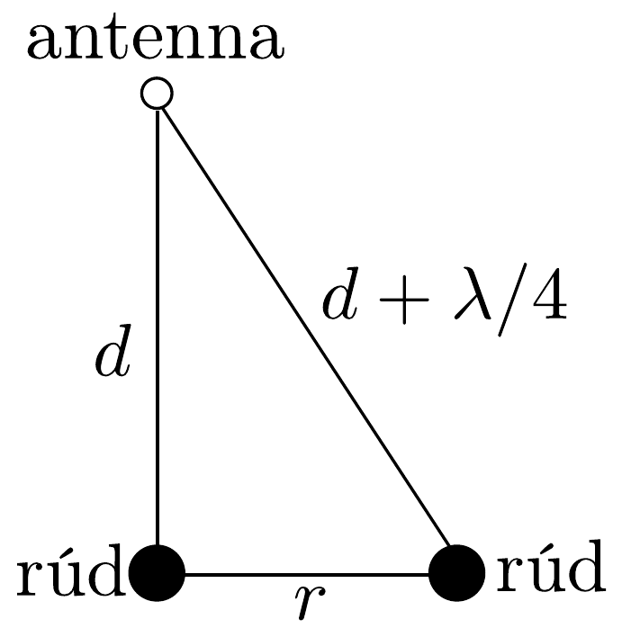

## Megoldás 1

$a$ ) A hullám $v$ fázissebességét (az azonos fázisú helyzetek haladási sebességét) az
\[
\omega t-\beta z=\text { állandó, } \quad \text { azaz } \quad \omega \Delta t-\beta \Delta z=0
\]
összefüggés határozza meg. Innen
\[
v=\frac{\Delta z}{\Delta t}=\frac{\omega}{\beta}=\frac{1}{\sqrt{\frac{\mu \varepsilon}{2}\left(\sqrt{1+\frac{\sigma^{2}}{\varepsilon^{2} \omega^{2}}}+1\right)}} \approx \frac{1}{\sqrt{\mu \varepsilon}} .
\]

Megjegyzések. (i) A fentebb kiszámított fázissebesség - az adott közelítésben - független a hullám frekvenciájától, és alakilag a fény terjedési sebességével egyezik meg. (Természetesen a látható fény frekvenciatartományában a formula nem érvényes.)
(ii) A radarhullámok nem végtelen síkhullámok, hanem térben és időben korlátozott kiterjedésú hullám-vonulatok (hullámcsomagok). Ezek terjedését nem a fázissebesség, hanem az ún. csoportsebesség jellemzi, amely a $\beta(\omega)$ függvény differenciálhányadosának reciproka, és a nagysága általában különbözik a fázissebességtől. Amennyiben $\beta$ arányos $\omega$-val (a feladatban használható közelítésben ez teljesül), a kétféle sebesség megegyezik.
b) A földbe hatoló hullámok érzékelhetőségi távolságára jellemző „behatolási mélység" (vagyis az a mélység, ahol a hullám amplitúdója a felszíni érték $1 / e \approx$ 0,37-szerese) az $\alpha$ a csillapodási együttható reciproka:
\[
\delta=\frac{1}{\alpha}=\frac{1}{\omega \sqrt{\frac{\mu \varepsilon}{2}\left(\sqrt{1+\frac{\sigma^{2}}{\varepsilon^{2} \omega^{2}}}-1\right)}} \approx \frac{1}{\omega \sqrt{\frac{\mu \varepsilon}{2}\left[\left(1+\frac{\sigma^{2}}{2 \varepsilon^{2} \omega^{2}}\right)-1\right]}}=\frac{2}{\sigma} \sqrt{\frac{\varepsilon}{\mu}} \approx 16 \mathrm{~m} .
\]
c) A rudakról visszaverődő hullámok fáziskülönbsége akkor lesz 180°, ha az egyik rúd és a múszer távolsága éppen egy negyed hullámhossznyival nagyobb, mint a másik rúd és a múszer távolsága. A 253. ábrán látható helyzetben tehát fennáll
\[
r^{2}+d^{2}=\left(d+\frac{\lambda}{4}\right)^{2},
\]

ahonnan $\lambda^{2}+8 \lambda d-16 r^{2}=0$. A megadott $d=4 \mathrm{~m}$ és $r=0,5 \mathrm{~m}$ adatokkal: $\lambda=12,5 \mathrm{~cm}$.

A hullám terjedési sebessége a megadott számadatokból $v=1 / \sqrt{\mu \varepsilon} \approx 1,0 \cdot$ $10^{8} \mathrm{~m} / \mathrm{s}$, a kérdéses frekvencia tehát
\[
f_{\min }=\frac{v}{\lambda} \approx 800 \mathrm{MHz} .
\]
d) Ha a detektor a rúdhoz legközelebbi helyzettől $x$ távolságra van, akkor a radarimpulzusok visszaérkezési ideje a $d$ mélységben fekvő rúdról
\[
t(x)=2 \frac{\sqrt{d^{2}+x^{2}}}{v} \geq t_{\min }=\frac{2 d}{v} .
\]
Innen
\[
d=\frac{v t_{\min }}{2}=5 \mathrm{~m} .
\]
