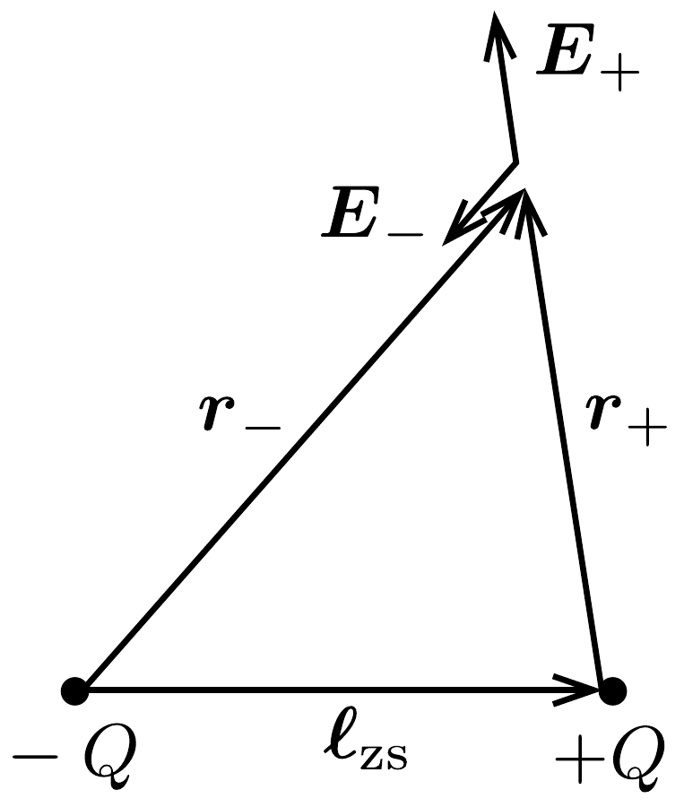

## Megoldás 2

a) Ha egy gömb alakú, kicsiny elektródából homogén és végtelen közegben $I$ állandó áram folyik ki, akkor a szimmetria miatt nyilvánvaló, hogy az áramsűrúség csak az elektródától mért távolságtól függ, az iránytól nem. A töltésmegmaradás miatt egy tetszőleges, $r$ sugarú, elektróda középpontú gömbfelületen $I$ áram folyik ki át, ezért
\[
j=\frac{I}{4 \pi r^{2}},
\]
vagy az irányokat is figyelembe véve
\[
\boldsymbol{j}=\frac{I}{4 \pi r^{3}} \boldsymbol{r} .
\]
b) Ha az előzőekben vizsgált szituációban a közeg fajlagos ellenállása $\varrho$, akkor a differenciális Ohm-törvény alapján az elektróda által létrehozott elektromos térerősség az $\boldsymbol{r}$ helyvektorú pontban
\[
\boldsymbol{E}=\varrho \cdot \boldsymbol{j}=\frac{I \varrho}{4 \pi r^{3}} \boldsymbol{r} .
\]

Vegyük észre, hogy ez az elektromos mezó egy $Q=\varepsilon_{0} \varrho I$ nagyságú pontszerú töltés, vagy egy töltött gömb (gömbön kívüli) elektromos terével egyezik meg.

Tekintsük most a feladatban leírt esetet! A zsákmány belsejében elképzelt két, egymástól viszonylag távol lévő gömb egyikéből $I_{\mathrm{zs}}$ áram folyik ki, a másik gömbbe pedig $I_{\mathrm{zs}}$ áram folyik be. A gömbök között végtelen, homogén, $\varrho$ fajlagos ellenállású közeg van. A kialakuló elektromos mező és árameloszlás (az elektromos mezőt leíró egyenletek linearitása miatt) felfogható úgy, mint egy végtelen, homogén közegben elhelyezkedő $+Q$ töltésú és egy tőle $\ell_{\mathrm{zs}}$ távolságra levő $-Q$ töltésú gömbelektróda elektromos és áramterének lineáris szuperpozícióją ${ }^{17}$. A 254, ábra

jelöléseivel az egyes mezők térerősségei és potenciáljai:
\[
\boldsymbol{E}_{+}=\frac{1}{4 \pi \varepsilon_{0}} \frac{Q}{r_{+}^{3}} \boldsymbol{r}_{+}=\frac{\varrho I_{\mathrm{zs}}}{4 \pi r_{+}^{3}} \boldsymbol{r}_{+}, \quad U_{+}=\frac{1}{4 \pi \varepsilon_{0}} \frac{Q}{r_{+}}=\frac{\varrho I_{\mathrm{zs}}}{4 \pi r_{+}},
\]
illetve
\[
\boldsymbol{E}_{-}=\frac{1}{4 \pi \varepsilon_{0}} \frac{(-Q)}{r_{-}^{3}} \boldsymbol{r}_{-}=-\frac{\varrho I_{\mathrm{ZS}}}{4 \pi r_{-}^{3}} \boldsymbol{r}_{-}, \quad U_{-}=\frac{1}{4 \pi \varepsilon_{0}} \frac{(-Q)}{r_{-}}=-\frac{\varrho I_{\mathrm{ZS}}}{4 \pi r_{-}} .
\]
A szuperpozíció eredménye:
\[
\begin{aligned}
\boldsymbol{E} & =\boldsymbol{E}_{+}+\boldsymbol{E}_{-}=\frac{\varrho I_{\mathrm{zs}}}{4 \pi}\left(\frac{\boldsymbol{r}_{+}}{r_{+}^{3}}-\frac{\boldsymbol{r}_{-}}{r_{-}^{3}}\right), \\
U & =U_{+}+U_{-}=\frac{\varrho I_{\mathrm{zs}}}{4 \pi}\left(\frac{1}{r_{+}}-\frac{1}{r_{-}}\right) .
\end{aligned}
\]
A feladatban vizsgálandó $P$ pontban $r_{+}=r_{-}=r$, valamint $\boldsymbol{r}_{-}-\boldsymbol{r}_{+}=\boldsymbol{\ell}_{\mathrm{zs}}$, ezért a ragadozó helyén az elektromos térerősség
\[
\boldsymbol{E}_{\mathrm{r}}=-\frac{\varrho I_{\mathrm{zs}}}{4 \pi r^{3}} \boldsymbol{\ell}_{\mathrm{zs}} .
\]

\footnotetext{
${ }^{17}$ Vagy másképpen az alábbi két eset szuperpozíciója: az egyik gömbnél bevezetünk $I_{\mathrm{zs}}$ áramot és a végtelenben elvezetjük, illetve a végtelenben bevezetünk és a másik gömbnél kivezetünk $I_{\mathrm{zs}}$ áramot.

Felhasználva, hogy $r \approx y$,
\[
\boldsymbol{E}_{\mathrm{r}}=-\frac{\varrho I_{\mathrm{ZS}}}{4 \pi y^{3}} \ell_{\mathrm{ZS}} .
\]
c) Jelölje a zsákmányállatot modellező két gömb alakú áramforrás közül a negatív elektróda potenciálját $U_{x}$, a pozitív elektródáét pedig $U_{y}$. Ezek a potenciálok a $b$ ) részben megadott formula segítségével az $r_{\mathrm{zs}}$ sugarú elektródák felületén is meghatározható (a kicsiny gömbökön belül nincs elektromos tér, így itt a potenciál ugyanaz, mint a felületen):
\[
U_{x}=\frac{\varrho I_{\mathrm{zs}}}{4 \pi}\left(\frac{1}{\ell_{\mathrm{zs}}-r_{\mathrm{zs}}}-\frac{1}{r_{\mathrm{zs}}}\right), \quad U_{y}=\frac{\varrho I_{\mathrm{zs}}}{4 \pi}\left(\frac{1}{r_{\mathrm{zs}}}-\frac{1}{\ell_{\mathrm{zs}}-r_{\mathrm{zs}}}\right)
\]
Az elektródák közötti $U_{\mathrm{zs}}$ feszültség a potenciálok különbségeként kapható:
\[
U_{\mathrm{zs}}=U_{y}-U_{x}=\frac{\varrho I_{\mathrm{zs}}}{2 \pi r_{\mathrm{zs}}} \frac{\ell_{\mathrm{zs}}-2 r_{\mathrm{zs}}}{\ell_{\mathrm{zs}}-r_{\mathrm{zs}}} .
\]
Felhasználva, hogy $r_{\mathrm{zs}} \ll \ell_{\mathrm{zs}}$, a zsákmányban elképzelt forrásgömbök közötti feszültség:
\[
U_{\mathrm{zs}}=\frac{\varrho I_{\mathrm{zs}}}{2 \pi r_{\mathrm{zs}}} .
\]

Ezt az eredményt úgy is megkaphatjuk, ha az egyes gömbök középpontjában írjuk fel a potenciálokat:
\[
U_{x}=-\frac{k Q}{r_{\mathrm{zs}}}+\frac{k Q}{\ell_{\mathrm{zs}}} \approx-\frac{k Q}{r_{\mathrm{zs}}}, \quad U_{y}=\frac{k Q}{r_{\mathrm{zs}}}-\frac{k Q}{\ell_{\mathrm{zs}}} \approx \frac{k Q}{r_{\mathrm{zs}}} .
\]
A kettő különbsége az előző eredményt adja $\left(k=1 /\left(4 \pi \varepsilon_{0}\right)\right)$ :
\[
U_{\mathrm{zs}}=U_{y}-U_{x}=\frac{2 k Q}{r_{\mathrm{zs}}}=\frac{\varrho I_{\mathrm{zs}}}{2 \pi r_{\mathrm{zs}}} .
\]

A forrásgömbök közötti $R_{\mathrm{zs}}$ ellenállás és a forrás $P_{\mathrm{zs}}$ teljesítménye könnyen megkapható:
\[
R_{\mathrm{zs}}=\frac{U_{\mathrm{zs}}}{I_{\mathrm{zs}}}=\frac{\varrho}{2 \pi r_{\mathrm{zs}}}, \quad P_{\mathrm{zs}}=U_{\mathrm{zs}} I_{\mathrm{zs}}=\frac{\varrho I_{\mathrm{zs}}^{2}}{2 \pi r_{\mathrm{zs}}} .
\]
d) A zsákmány által keltett elektromos mező homogénnek tekinthető a ragadozó helyén, térerőssége a korábban meghatározott $E_{\mathrm{r}}$, ezért a helyettesítő kapcsolásban az $U$-val jelölt feszültség:
\[
U=E_{\mathrm{r}} \ell_{\mathrm{d}}=\frac{\varrho I_{\mathrm{zs}}}{4 \pi y^{3}} \ell_{\mathrm{zs}} \ell_{\mathrm{d}},
\]
ahol $\ell_{\mathrm{d}}$ a ragadozó érzékelő (detektáló) gömbjeinek távolságát jelöli, a gömbök sugara pedig $r_{\mathrm{d}}\left(r_{\mathrm{d}} \ll \ell_{\mathrm{d}}\right)$.

A környezó tengervíz $R_{\mathrm{v}}$ ellenállása az $R_{\mathrm{zs}}$-vel való analógia alapján:
\[
R_{\mathrm{v}}=\frac{\varrho}{2 \pi r_{\mathrm{d}}} .
\]

A modellben szereplő soros kapcsolású áramkörben a kérdezett $U_{\mathrm{d}}$ feszültség és $P_{\mathrm{d}}$ teljesítmény egyszerúen számolható:
\[
U_{\mathrm{d}}=U \frac{R_{\mathrm{d}}}{R_{\mathrm{d}}+R_{\mathrm{v}}}=\frac{\varrho I_{\mathrm{zs}}}{4 \pi y^{3}} \ell_{\mathrm{zs}} \ell_{\mathrm{d}} \frac{R_{\mathrm{d}}}{R_{\mathrm{d}}+\frac{\varrho}{2 \pi r_{\mathrm{d}}}},
\]
illetve
\[
P_{\mathrm{d}}=\frac{U_{\mathrm{d}}^{2}}{R_{\mathrm{d}}}=\left(\frac{\varrho I_{\mathrm{zs}}}{4 \pi y^{3}} \ell_{\mathrm{zs}} \ell_{\mathrm{d}}\right)^{2} \frac{R_{\mathrm{d}}}{\left(R_{\mathrm{d}}+\frac{\varrho}{2 \pi r_{\mathrm{d}}}\right)^{2}} .
\]

Megjegyzés. Az áramkör helyettesítő kapcsolása alapján megállapítható, hogy az elrendezés éppen olyan, mintha egy $U$ elektromotoros erejú, $R_{\mathrm{v}}$ belsó ellenállású feszültségforrásra $R_{\mathrm{d}}$ nagyságú terhelő ellenállást kötöttünk volna.

Jóllehet a verseny során a résztvevőktől nem kérték annak belátását, hogy a rendszer (vagyis a ragadozó + zsákmány + tengervíz) elektromos szempontból a megadott áramkörrel helyettesíthető, de „versenyen kívül” tanulságos lehet ennek végiggondolása.

Induljunk ki abból a helyzetből, amelyben a ragadozó halon még nem tud áram folyni (mondjuk azért, mert a hal „kikapcsolta” a detektáló egységét, vagyis annak belső ellenállása végtelen nagy). A hal közelében $E_{\mathrm{r}}$ az elektromos térerősség, az egymástól $\ell_{\mathrm{d}}$ távol levố érzékelői között tehát $U=E_{\mathrm{r}} \ell_{\mathrm{d}}$ feszültség alakul ki.

Kapcsoljuk most be a hal detektáló egységét, csökkentsük le a hal belső ellenállását a megadott $R_{\mathrm{d}}$ értékre! Ekkor a halon keresztül valamekkora $I$ áram indul meg, s ez a ragadozó halat modellező két gömböt elektromosan töltötté teszi (az egyik pozitív, a másik negatív töltésú lesz). Ha nem lenne a környező tengervíz, akkor a hal testében folyó áramnak - a töltésmegmaradás törvénye miatt - előbb-utóbb meg kellene szünnie. Ilyen esetben tehát a gömbök feltöltődése csak addig tarthatna, amíg a feltöltődés következtében kialakuló elektromos erőtér a külső erőtérrel együtt éppen nulla potenciálkülönbséget eredményez a két gömb között.

Más a helyzet azonban akkor, amikor a hal testén átáramló töltések a környező tengervízben vissza tudnak jutni az eredeti helyükre. Ekkor folyamatos $I$ áram alakul ki, a halra (a modellben a két gömbre) jutó $U_{\mathrm{d}}$ feszültség pedig nullától különböző lesz. Ez a feszültség kétféle módon is kiszámítható. Egyrészt úgy, mint
\[
U_{\mathrm{d}}=I R_{\mathrm{d}}
\]
(Ohm-törvény). Másrészt úgy is megkapható, mint az eredő elektromos térerősségnek (vagyis a zsákmány által a ragadozó helyén létrehozott „külső“ $E_{\mathrm{r}}$ és a gömbök feltöltődése miatt kialakuló $E_{1}$ különbségének) és az $\ell_{\mathrm{d}}$ távolságnak a szorzata:
\[
U_{\mathrm{d}}=\left(E_{\mathrm{r}}-E_{1}\right) \ell_{\mathrm{d}} .
\]
A jobb oldalon a zárójelet felbontva az első tag éppen a külső erőtér által létrehozott $U$ feszültséggel egyezik meg, a második tag pedig kifejezhető a környezó tengervíz „effektív ellenállásával":
\[
E_{1} \ell_{\mathrm{d}}=I R_{\mathrm{v}} .
\]
Mindezeket összevetve végül felírhatjuk, hogy $U-I R_{\mathrm{v}}=I R_{\mathrm{d}}$, ami valóban a megadott helyettesítő kapcsolás feszültség-áram viszonyainak felel meg.
- e) Az $R_{\mathrm{d}}$ függvényében vizsgált $P_{\mathrm{d}}$ teljesítmény akkor maximális, ha az
\[
\frac{R_{\mathrm{d}}}{\left(R_{\mathrm{d}}+\frac{\varrho}{2 \pi r_{\mathrm{d}}}\right)^{2}}
\]
kifejezés maximális, vagy ennek reciproka minimális. Közismert, hogy ez
\[
R_{\mathrm{d}}=R_{\mathrm{v}}=\frac{\varrho}{2 \pi r_{\mathrm{d}}}
\]
esetén következik be (vagyis akkor, amikor a „telepet” éppen a „belső ellenállásával" egyenlő nagyságú ellenállással terheljük). Ezt például a számtani és a mértani közép közötti egyenlőtlenség felhasználásával, vagy deriválással láthatjuk be.
$P_{\mathrm{d}}$ maximuma behelyettesítéssel kapható:
\[
P_{\mathrm{d}}^{(\max )}=\frac{\varrho\left(I_{\mathrm{zs}} \ell_{\mathrm{zs}} \ell_{\mathrm{d}}\right)^{2} r_{\mathrm{d}}}{32 \pi y^{6}} .
\]
