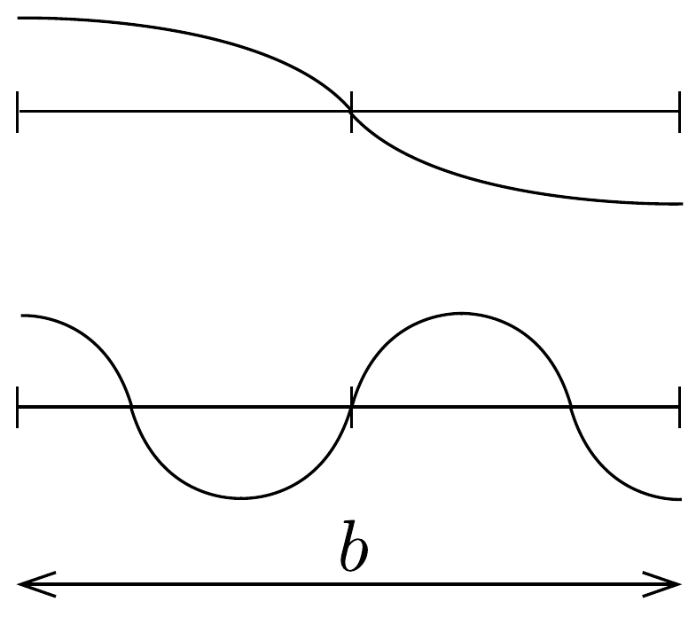

## Megoldás 2

a) A dugattyú $\Delta t$ idő alatt $v \Delta t$ utat tett meg, azaz ennyivel nyomta össze a rudat. Ennyi idő alatt a nyomáshullám $u \Delta t$ utat tett meg, tehát a rúd bal oldali részének deformációja (relatív hosszváltozása):
\[
S=\frac{\Delta \ell}{\ell}=\frac{-v \Delta t}{u \Delta t}=\frac{-v}{u},
\]
a nyomás tehát a bal oldali felületnél
\[
p=-Y S=Y \frac{v}{u}=\varrho u v .
\]
(Kihasználtuk, hogy a lökéshullám terjedési sebessége $u=\sqrt{Y / \varrho}$.)
- b) Ha a rúd (helyről helyre és pillanatról pillanatra változó) elmozdulása
\[
\xi(x, t)=\xi_{0} \sin k(x-u t),
\]
akkor a sebesség (deriválással, vagy a forgómozgással való analógia kihasználásával)
\[
v(x, t)=-k u \xi_{0} \cos k(x-u t),
\]
a deformáció (az előző alkérdés eredményének felhasználásával, vagy közvetlenül az elmozdulásfüggvény $x$ szerinti deriválásával)
\[
S(x, t)=\frac{-v(x, t)}{u}=k \xi_{0} \cos k(x-u t),
\]

a nyomás pedig
\[
p(x, t)=\varrho u v(x, t)=-k \varrho u^{2} \xi_{0} \cos k(x-u t)=-Y S(x, t) .
\]
c) A hasáb közepe nem tud elmozdulni, így $g(b / 2)=0$, emiatt $B_{2}=0$. Másrészt $g(x)$ maximális értéke 1 , ebből $B_{1}= \pm 1$ következik.
d) A hasáb két végénél a nyomás (és ezzel együtt a deformáció is) minden pillanatban nulla. Ez akkor teljesül, ha a hasáb szélei (a nyitott végú csövekben kialakuló hanghullámokhoz hasonlóan, 265. ábra) az állóhullám duzzadóhelyei. Eszerint a legnagyobb lehetséges hullámhossz a hasáb $b$ hosszának kétszerese, a megfeleló frekvencia pedig
\[
f_{1}=\frac{u}{2 b}=273 \mathrm{kHz} .
\]
A második legkisebb frekvencia (ami annak felel meg, hogy a hasáb hossza a

félhullámhossz háromszorosa):
\[
f_{2}=3 f_{1}=\frac{3 u}{2 b}=819 \mathrm{kHz} .
\]
e) A piezoelektromos hatást leíró egyik egyenletből kifejezhetjük a mechanikai feszültséget:
\[
T=\left(S-d_{\mathrm{p}} E\right) Y,
\]
majd ezt a másik egyenletbe helyettesítve az elektromos töltéssűrúségre
\[
\sigma=d_{\mathrm{p}} Y \cdot S+\left(\varepsilon_{T}-d_{\mathrm{p}}^{2} Y\right) E
\]
adódik. Az elektromos térerősséget a megadott elektromos feszültségből számíthatjuk:
\[
E(x, t)=\frac{V(t)}{h}=\frac{V_{\mathrm{m}} \cos \omega t}{h} .
\]

Mivel $E$ időfüggése $\cos \omega t$ alakú, feltehetjük, hogy a hasáb $S$ deformációja is így változik időben, vagyis
\[
\begin{gathered}
\xi(x, t)=\xi_{\mathrm{m}} \sin k\left(x-\frac{b}{2}\right) \cdot \cos \omega t \\
S(x, t)=\frac{\mathrm{d} \xi(x, t)}{\mathrm{d} x}=k \xi_{\mathrm{m}} \cos k\left(x-\frac{b}{2}\right) \cdot \cos \omega t .
\end{gathered}
\]
Helyettesítsük (03-9)-et és (03-11)-et a (03-7) egyenletbe, és használjuk ki, hogy a hasáb széleinél (pl. $x=0$-nál) a mechanikai feszültség nulla. Innen a rezgés amplitúdójára
\[
\xi_{\mathrm{m}}=\frac{d_{\mathrm{p}} V_{\mathrm{m}}}{h k \cos \frac{k b}{2}}
\]
adódik. Összevetve a feladatban megadott $\sigma(x, t)$ formulát a (03-8) egyenlettel, felhasználva $S$ (03-11) szerinti kifejezését, a kérdéses együtthatók:
\[
D_{1}=\frac{d_{\mathrm{p}}^{2} Y}{\cos \frac{k b}{2}} \quad \text { és } \quad D_{2}=\varepsilon_{T}-d_{\mathrm{p}}^{2} Y .
\]
f) Az előzó pontban kiszámított felületi töltéssűrúséget $x$ szerint integrálva megkapjuk a hasáb egyik kontaktusán levő teljes töltést:
\[
Q(t)=w \int_{0}^{b} \sigma(x, t) d x=\left(\frac{\varepsilon_{T} w b}{h}+\frac{2 d_{\mathrm{p}}^{2} Y w}{h k} \operatorname{tg} \frac{k b}{2}-\frac{d_{\mathrm{p}}^{2} w Y b}{h}\right) V(t) .
\]
A feladatban megadott formulával összevetve:
\[
C_{0}=\frac{\varepsilon_{T} b w}{h} \quad \text { és } \quad \alpha^{2}=\frac{Y d_{p}^{2}}{\varepsilon_{T}} .
\]
$C_{0}$ a hasáb (mint $w$ széles, $b$ hosszú és $h$ vastagságú síkkondenzátor) alacsony frekvenciákon érvényes kapacitása (a megadott formulában $k \rightarrow 0$ esetén $\operatorname{tg} x \approx$ $x)$, és $\alpha^{2}=9,82 \cdot 10^{-3}$ az ún. elektromechanikus csatolási állandó négyzete.
