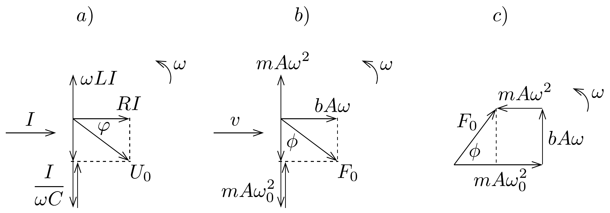

## Megoldás 3

$a) \mathrm{A} z(t)=A \sin (\omega t-\phi)$ függvényt behelyettesítve a szinuszos gerjesztéssel csillapított kényszerrezgést leíró $m \ddot{z}+b \dot{z}+m \omega_{0}^{2} z=F_{0} \sin (\omega t)$ egyenletbe, és $\sin (\omega t-\phi)$-re, $\cos (\omega t-\phi)$-re alkalmazva az addíciós azonosságokat, rendezés után azt kapjuk, hogy:
\[
\begin{aligned}
{\left[m A\left(\omega_{0}^{2}-\omega^{2}\right) \cos \phi+b A \omega \sin \phi\right.} & \left.-F_{0}\right] \sin (\omega t)= \\
& =\left[-m A\left(\omega_{0}^{2}-\omega^{2}\right) \sin \phi+b A \omega \cos \phi\right] \cos (\omega t) .
\end{aligned}
\]
Ez az egyenlet csak úgy állhat fenn minden $t$ időpillanatban, ha mind a $\sin (\omega t)$, mind a $\cos (\omega t)$ együtthatója zérus. Ebből az $A$ amplitúdóra valamint a $\phi$ fázis tangensére a
\[
\operatorname{tg} \phi=\frac{b \omega}{m\left(\omega_{0}^{2}-\omega^{2}\right)}, \quad A=\frac{F_{0}}{\sqrt{m^{2}\left(\omega_{0}^{2}-\omega^{2}\right)^{2}+b^{2} \omega^{2}}}
\]
megoldás adódik. Speciálisan az $\omega=\omega_{0}$ „rezonanciafrekvencián”:
\[
\phi=\frac{\pi}{2}, \quad A=\frac{F_{0}}{b \omega_{0}} .
\]

Megjegyezések:
1. A rezonanciafrekvencia szó itt kicsit félrevezető, ugyanis (04-15) második összefüggése szerint nem zérus csillapítás mellett $(b>0)$ az $A(\omega)$ amplitúdó a maximumát nem $\omega_{0}$, hanem $\omega_{\text {max }}=\sqrt{\omega_{0}^{2}-\frac{b^{2}}{2 m^{2}}}$ értéknél veszi fel. Azonban a feladatban szereplő $\omega_{0} \gg \frac{b}{m}>0$ feltevés mellett, azaz kis csillapításnál $\omega_{\text {max }} \approx \omega_{0}$, ezért a feladat további részében is „rezonanciafrekvencián" kicsit pongyolán a gerjesztés és csillapítás nélkül létrejövő rezgés $\omega_{0}$ frekvenciáját értjük.
2. A feladatban leírt jelenség az ún. kényszerrezgés. Ugyanez jön létre egy soros RLC-körben, a $z(t)$-re megadott differenciálegyenlet ugyanolyan alakú. A pillanatnyi feszültségértékekre a Kirchhoff-törvény:
\[
L \ddot{q}+R \dot{q}+\frac{1}{C} q=U_{0} \sin (\omega t),
\]
ahol $q(t)$ a kondenzátor pillanatnyi töltése. A fenti egyenlet alapján a megfeleltetés:
\[
q(t) \rightarrow z(t), \quad L \rightarrow m, \quad R \rightarrow b, \quad \frac{1}{C} \rightarrow m \omega_{0}^{2}, \quad U_{0} \rightarrow F_{0} .
\]
Rezgőköröknél használatos a fázorábrázolás, ami során az áram-, illetve feszültségértékek effektív értékeit forgóvektorosan ábrázoljuk, hiszen ezen értékek egymáshoz képesti fázisviszonyai az idő folyamán nem változnak. Ugyanez érvényes mechanikai kényszerrezgésnél is, azaz a rezgő testre ható erők fázisviszonyai egymáshoz képest nem változnak. (A gerjesztés bekapcsolását követően a $z(t)$ általános megoldás tartalmaz egy, a sajátrezgést tartalmazó lecsengő tagot, amit most figyelmen kívül hagyunk, mert a gerjesztés bekapcsolását követő hosszú idő után kialakuló állandósult rezgési állapotot vizsgáljuk.) Mivel az effektív érték szinuszos gerjesztés esetén a maximumérték $\sqrt{2}$-ed része, mechanikai esetben az effektív érték helyett a maximumot lehet tekinteni (hiszen az amplitúdóra vagyunk kíváncsiak). Mivel $i(t)=\dot{q}(t)$, ezért $I \rightarrow A \omega$ (az áram a sebességnek felel meg). Rezgőkör esetén a fázorábrát a 271, a) ábra, a mechanikai rezgés esetén a 271, b) ábra mutatja. A 271, c) ábra a mechanikai kényszerrezgésre vonatkozó elforgatott és eltolt fázorábrát illusztrálja.

Fontos megjegyezni, hogy rezgőkör esetén $\varphi$ az áram és a gerjesztő feszültség közötti fázist jelenti, míg mechanikai rezgés esetén $\phi$ a rugóerő és a gerjesztő erő közötti fázist adja meg. (A gerjesztett mechanikai rezgést úgy hozhatjuk létre, hogy a rugó másik végének helyzetét szinuszosan változtatjuk. Ekkor a rugóra akasztott test és a rugó felső végének helyzete közötti fázist $\phi$ adja meg.)

A fázorábrából Pithagorasz-tétellel a (04-15) egyenletek szerinti formulákat kapjuk.
b) A $2 \sin \alpha \sin \beta=\cos (\alpha-\beta)-\cos (\alpha+\beta)$ azonosság felhasználásával a lock-in erósítőben létrejövő szorzatjel a következő alakban írható:
\[
\begin{aligned}
V_{\mathrm{be}} V_{\mathrm{ref} .} & =V_{\mathrm{B}} \sin \left(\omega_{\mathrm{B}} t-\phi_{\mathrm{B}}\right) V_{\mathrm{r}} \sin (\omega t)= \\
& =\frac{V_{\mathrm{B}} V_{\mathrm{r}}}{2}\left(\cos \left[\left(\omega_{\mathrm{B}}-\omega\right) t-\phi_{\mathrm{B}}\right]-\cos \left[\left(\omega_{\mathrm{B}}+\omega\right) t-\phi_{\mathrm{B}}\right]\right) .
\end{aligned}
\]
Általában mindkét koszinusz függvény időátlaga nulla. A szorzat jelnek csak az $\omega_{\mathrm{B}}=\omega$ speciális esetben van egyenfeszültségú komponense, ugyanis ekkor az első koszinusz függvény argumentuma független az időtől. Ekkor a kimenő jel
egyenfeszültségú komponense:
\[
\frac{V_{\mathrm{B}} V_{\mathrm{r}}}{2} \cos \phi_{\mathrm{B}} .
\]

Megjegyezés: A fenti számolás rávilágít a lock-in erósítési technika lényegére. Tegyük fel ugyanis, hogy a $V_{\mathrm{be}}$ bemenó jelet nagy, esetleg magánál a $V_{\mathrm{B}}$ jelamplitúdónál is nagyobb véletlen zaj terheli. Hagyományos módon ekkor nem tudnánk kiszűrni a mérendő jelet a háttérzajból. Azonban a lock-in detektor kimenetén a véletlen zaj nulla időátlagú jelet ad, úgy, ahogy $\omega_{\mathrm{B}} \neq \omega$ esetén is zérus a kimeneti jel időátlaga. Pontosabban, a zajt is, mint ahogy minden más jelet, fel lehet bontani különbözó frekvenciájú szinuszos jelek összegére (ezt hívják Fourier-analízisnek). A lock-in detektor egy igen erősen szelektív frekvenciaszűróként múködik, a referenciajel $\omega$ frekvenciájának egy nagyon szúk környékén átengedi a jelet, míg minden más frekvenciájú Fourier-komponenst elnyom. Így a zaj nagy része nem jelenik meg a kimeneten, míg az $\omega$ frekvenciájú jel zavartalanul átjut a lock-in erősítőn.
c) Az a) pont (04-16) eredménye szerint az $\omega_{0}$ rezonanciafrekvencián az érzékelőkar kitérése $\pi / 2$ fázissal késik a gerjesztéshez képest. Így az $F=c_{1} V_{\text {ref. }}^{\prime}=$ $=c_{1} V_{\mathrm{r}} \sin \left(\omega t+\frac{\pi}{2}\right)$ gerjesztés hatására a fotoérzékeló kimenő jele $V_{\mathrm{be}}=c_{2} z=$ $=c_{2} \frac{c_{1} V_{\mathrm{r}}}{b \omega_{0}} \sin (\omega t)$ alakú, azaz azonos fázisban van a $V_{\text {ref. }}=V_{\mathrm{r}} \sin (\omega t)$ referenciajellel. Így a (04-17) formulában $\phi_{\mathrm{B}}=0$, tehát a lock-in erósítő egyenáramú kimenő jele:
\[
\frac{V_{\mathrm{B}} V_{\mathrm{r}}}{2} \cos 0=c_{1} c_{2} \frac{V_{\mathrm{r}}^{2}}{2 b \omega_{0}} .
\]
d) A $\Delta m$ tömegváltozás hatására az $\omega_{0}=\sqrt{k / m}$ rezonanciafrekvencia eltolódása a megadott közelítéssel:
\[
\Delta \omega_{0}=\sqrt{\frac{k}{m+\Delta m}}-\sqrt{\frac{k}{m}}=\sqrt{\frac{k}{m}}\left(\frac{1}{\sqrt{1+\frac{\Delta m}{m}}}-1\right) \approx-\omega_{0} \frac{\Delta m}{2 m} .
\]

A rezonanciafrekvencia és a tömegváltozás hatására (04-15) első egyenletének értelmében a gerjesztés és a kialakult kényszerrezgés közötti $\phi$ fázis is megváltozik. Kezdetben (a tömegváltozás előtt) a rendszer $\omega=\omega_{0}$ rezonanciafrekvencián múködött, és a fázistolás értéke $\phi=\pi / 2$ volt. A tömeg megváltozása nem befolyásolja az $\omega=\omega_{0}$ gerjesztési frekvenciát, azonban a fázis, a tömeg, ill. a rezonanciafrekvencia a $\phi \rightarrow \frac{\pi}{2}+\Delta \phi, m \rightarrow m+\Delta m$, ill. $\omega_{0} \rightarrow \omega_{0}+\Delta \omega_{0}$ formulának megfelelően eltolódik. Ezeket a helyettesítéseket elvégezve (04-15) elsó egyenletében, és $\Delta \phi$, ill. $\Delta m$ kicsiny értékei mellett alkalmas közelítést használva
\[
\begin{aligned}
& \operatorname{tg}\left(\frac{\pi}{2}+\Delta \phi\right)=\frac{b \omega_{0}}{(m+\Delta m)\left[\left(\omega_{0}+\Delta \omega_{0}\right)^{2}-\omega_{0}^{2}\right]} \\
& \quad-\frac{1}{\Delta \phi}=\frac{b \omega_{0}}{2 \omega_{0} \Delta \omega_{0}(m+\Delta m)} \approx \frac{b \omega_{0}}{-2 m \omega_{0} \Delta \omega_{0}}
\end{aligned}
\]

A rezonanciafrekvencia-eltolódás kifejezésével a fáziseltolódásból még éppen kimutatható tömegváltozás:
\[
\Delta m=\frac{b}{\omega_{0}} \Delta \phi=b \sqrt{\frac{m}{k}} \Delta \phi=\frac{b}{m} \sqrt{\frac{m^{3}}{k}} \Delta \phi=1,7 \cdot 10^{-18} \mathrm{~kg} .
\]
e) Mivel a minta által kifejtett $f(h) \approx f\left(h_{0}\right)+c_{3}\left(h-h_{0}\right)$ eró is lineárisan függ a kar elmozdulásától, csakúgy, mint a rugóerő, a két erő eredője egy új, $k^{\prime}$ rugóállandójú effektív rugóerőnek tekinthető, és ez határozza meg az új rezonanciafrekvenciát. Pontosabban a $h_{0}$ egyensúlyi helyzettől mért $z=h-h_{0}$ kitérésre a következő mozgásegyenlet írható fel:
\[
m \ddot{z}+b \dot{z}+m \omega_{0}^{2} z=F_{0} \sin (\omega t)+c_{3} z .
\]
(Az új egyensúlyi helyzetben az $f\left(h_{0}\right)$ konstans kiesik az egyenletből.) Látható, hogy az új effektív rugóállandó $k^{\prime}=m \omega_{0}^{2}-c_{3}$, így az új rezonanciafrekvencia:
\[
\omega_{0}^{\prime}=\sqrt{\frac{k^{\prime}}{m}}=\omega_{0} \sqrt{1-\frac{c_{3}}{m \omega_{0}^{2}}}, \quad \text { és } \quad \Delta \omega_{0}=\omega_{0}^{\prime}-\omega_{0} \approx-\frac{c_{3}}{2 m \omega_{0}} .
\]
f) A maximális frekvenciaeltolódás akkor jön létre, amikor a mikroszkóp érzékelő túje éppen a csapdázott elektron fölött van. Ekkor a minta és a kar közötti Coulomb-erő $f(h)=k_{\mathrm{e}} \frac{q Q}{h^{2}}$. Feltéve, hogy a kar rezgésének amplitúdója jóval kisebb, mint a két töltés $d_{0}$ távolsága, az $f(h)$ függvényt linearizálhatjuk az egyensúlyi helyzet körül:
\[
f(h)=k_{\mathrm{e}} \frac{q Q}{d_{0}}+\left.\frac{\mathrm{d} f}{\mathrm{~d} h}\right|_{h=d_{0}} .\left(h-d_{0}\right)=f\left(d_{0}\right)+c_{3}\left(h-d_{0}\right) .
\]
Tehát a meredekségre a
\[
c_{3}=-2 k_{\mathrm{e}} \frac{q Q}{d_{0}^{3}}
\]
érték adódik, ahonnan (04-18) felhasználásával a frekvenciaeltolódás
\[
\Delta \omega_{0} \approx \frac{k_{\mathrm{e}} q Q}{m \omega_{0} d_{0}^{3}} .
\]
Innen a keresett távolság az adatok behelyettesítésével ( $\omega_{0}=\sqrt{k / m}$ továbbra is):
\[
d_{0}=\sqrt[3]{\frac{k_{\mathrm{e}} q Q}{m \omega_{0} \Delta \omega_{0}}}=4,1 \cdot 10^{-8} \mathrm{~m}=41 \mathrm{~nm} .
\]

Az 1985-ben G. Binnig, C. F. Quate és Ch. Gerber által felfedezett atomierőmikroszkóp ${ }^{19}$ két tekintetben is a pásztázó alagútmikroszkóp (Scanning Tunneling Microscope, STM) kishúgának tekinthető: egyrészt a két berendezés felfedezői

\footnotetext{
${ }^{19}$ Phys. Rev. Lett., 56, 930-933 (1986).

részben azonosak ${ }^{20}$; másrészt, a két berendezés múködési elvének is vannak hasonló vonásai. Mindkét eszközben egy nagyon kis méretú, éles hegyú tút mozgatnak a minta fölött, soronként pásztázva végig a minta felszínét. Mindkét berendezés alkalmas atomi méretú mintázatok detektálására. Az STM-ben a mért jel a tú és a minta között folyó áram ingadozása, míg az AFM-ben a türe ható mechanikai erő finom változásait érzékelik. Így az atomierő-mikroszkóp lényegében úgy tapogatja le a minta felszínét, mint ahogy a régi lemezjátszók túje érzékeli a hangjeleket tartalmazó mikrobarázdákat a bakelit hanglemezen.

A fenti feladat az AFM egy fejlettebb változatának elvi múködéséhez kapcsolódik; az érzékelő tú nem kerül direkt kontaktusba a minta felszínével, hanem ahhoz nagyon közel gerjesztett rezgőmozgást végez, és a rezgés fázisának a minta hatására bekövetkező eltolódását detektálják.

Az AFM technikának több jelentős előnye is van a néhány évvel korábban felfedezett STM-mel szemben: a mintát nem kell légüres térbe helyezni, vizsgálhatók levegőben, vagy folyadék alatt lévő minták is; a mintának nem kell elektromos vezetőnek lennie; a vizsgálat kevésbé roncsoló hatású, így vizsgálhatók lágyabb minták, például biológiai szövetek is.

\footnotetext{
${ }^{20}$ A pásztázó alagútmikroszkópot G. Binnig és H. Rohrer fedezte föl 1981-ben; felfedezésükért 1986-ban Nobel-díjat kaptak.

\section*{
