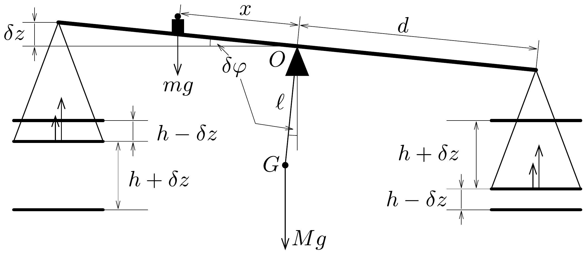

## Megoldás 2

a) Az $\omega$ szögsebességgel egyenletesen forgó, $a$ sugarú tekercsre feszített felületen a mágneses fluxus az idő függvényében $\Phi(t)=N a^{2} \pi B_{0} \cos (\omega t)$, tehát a tekercsben indukált elektromotoros erő:
\[
\mathcal{E}=-\frac{\mathrm{d} \Phi}{\mathrm{~d} t}=N a^{2} \pi B_{0} \omega \sin (\omega t) .
\]
A tekercs forgatásához szükséges átlagos teljesítmény megegyezik az $R$ ellenállású tekercsben disszipálódott $P(t)=\frac{\mathcal{E}^{2}(t)}{R}$ pillanatnyi teljesítmény átlagértékével, ami
\[
\langle P\rangle=\frac{1}{T} \int_{t=0}^{T} P(t) \mathrm{d} t=\frac{\left(N a^{2} \pi B_{0} \omega\right)^{2}}{2 R},
\]
ahol $T=\frac{2 \pi}{\omega}$ a forgatás periódusidejét jelöli, és felhasználtuk, hogy
\[
\frac{1}{2 \pi} \int_{0}^{2 \pi} \sin ^{2} x \mathrm{~d} x=\frac{1}{2}
\]
b) A forgó keretben indukált áram mágneses tere hozzáadódik a külső mágneses térhez, ez okozza az iránytú elfordulását. Számoljuk ki először a tekercs középpontjában a mágneses indukcióvektor pillanatnyi értékét, majd az egyes komponensek időátlagát. A középpontban elhelyezett iránytú a mágneses tér időátlagát érzékeli.

A $t$ időpillanatban a forgó keret normálisa éppen $\omega t$ szöget zár be az $x$ tengellyel, így a kör alakú keret közepén a tekercsben folyó áram által keltett mágneses indukció az idő függvényében
\[
\boldsymbol{B}(t)=\frac{\mu_{0} N I(t)}{2 a}\left[\cos (\omega t) \cdot \boldsymbol{e}_{\boldsymbol{x}}+\sin (\omega t) \cdot \boldsymbol{e}_{\boldsymbol{y}}\right],
\]
ahol
\[
I(t)=\frac{\mathcal{E}(t)}{R}=\frac{N a^{2} \pi B_{0} \omega}{R} \sin (\omega t)
\]
a keretben folyó áram pillanatnyi értéke. Így, figyelembe véve a $\boldsymbol{B}=B_{0} \boldsymbol{e}_{\boldsymbol{x}}$ külső mágneses indukciót is, felhasználva a feladatban megadott integrálokat a mágneses indukció egyes komponenseinek átlagértékére a következőket kapjuk:
\[
\begin{aligned}
& \left\langle B_{x}\right\rangle=B_{0}+\frac{\mu_{0} N^{2} a \pi B_{0} \omega}{2 R}\langle\cos \omega t \sin \omega t\rangle=B_{0}, \\
& \left\langle B_{y}\right\rangle=\frac{\mu_{0} N^{2} a \pi B_{0} \omega}{2 R}\left\langle\sin ^{2} \omega t\right\rangle=\frac{\mu_{0} N^{2} a \pi B_{0} \omega}{4 R} .
\end{aligned}
\]

A mágnestú az átlagtér irányába áll be, tehát az $x$ tengellyel bezárt $\theta$ szögére
\[
\operatorname{tg} \theta=\frac{\left\langle B_{y}\right\rangle}{\left\langle B_{x}\right\rangle}
\]
amiből
\[
R=\frac{\mu_{0} N^{2} a \pi \omega}{4 \operatorname{tg} \theta} \approx \frac{\mu_{0} N^{2} a \pi \omega}{4 \theta} .
\]

Érdekes, hogy a kapott eredmény nem függ a külső mágneses tér $B_{0}$ nagyságától.
c) Az $a$ sugarú, $N$ menetes $C$ és $C^{\prime}$ tekercsek középpontjukban $B=\frac{\mu_{0} N I}{2 a}$ nagyságú, tengelyirányú mágneses teret hoznak létre. Ebben a térben $\omega$ szögsebességgel forgó fémkorongban levő elektronokra sugár irányban hat a Lorentzerő, melynek nagysága a tengelytől mért $r$ távolság függvényében $F_{\mathrm{L}}(r)=\operatorname{er} \omega B$, ahol $e$ az elektron töltése. Mivel a korongok sugara $b \ll a$, feltehetjük, hogy a mágneses tér közel homogén a tengely közelében. A Lorentz-erő hatására a fémkorongban levő szabad elektronok sugárirányban elmozdulnak, és olyan radiális $E(r)$ elektrosztatikus teret hoznak létre, mely a Lorentz-eró hatását kiegyenlíti, azaz $E(r)=\frac{F_{\mathrm{L}}(r)}{e}$. Ez az elektromos tér okozza a korong közepe és pereme között fellépő feszültséget, melynek értéke:
\[
\mathcal{E}_{D}=\int_{r=0}^{b} E(r) \mathrm{d} r=\int_{r=0}^{b} r \omega B \mathrm{~d} r=\frac{\mu_{0} N I b^{2} \omega}{4 a} .
\]

Mivel a $C$ és $C^{\prime}$ tekercsek mágneses tere ellentétes irányú, tehát pl. a $D$ korong 3-mal jelölt közepe negatív, a 4-gyel jelölt oldala pozitív töltésü, míg a $D^{\prime}$ korong 2-vel jelölt közepe pozitív, az 1-gyel jelölt oldala pedig negatív. Azaz az 1-es és 4-es pont között mérhető elektromotoros erő
\[
\mathcal{E}=\mathcal{E}_{D}-\mathcal{E}_{D^{\prime}}=2 \mathcal{E}_{D}=\frac{\mu_{0} N I b^{2} \omega}{2 a} .
\]

Megjegyzés. Ha a forgó korongok helyett küllős kereket képzelünk, a homogén mágneses térben mozgó küllőkben indukált feszültség az általános indukciós törvény értelmében megegyezik az időegység alatt súrolt fluxussal:
\[
\mathcal{E}_{D}=\left|\frac{\mathrm{d} \Phi}{\mathrm{~d} t}\right|=\frac{B b^{2} \pi \frac{\omega \mathrm{~d} t}{2 \pi}}{\mathrm{~d} t}=B \frac{b^{2} \omega}{2},
\]
összhangban az integrálással kapott eredménnyel.
d) Ha a $G$ galvanométer nullát mutat, akkor ebben az ágban nem folyik áram, tehát a tekercsek $I$ árama halad át a vizsgált $R$ ellenálláson is. Az ellenálláson esó $R I$ feszültség megegyezik az előbb kiszámolt $\mathcal{E}$ elektromotoros eróvel:
\[
R=\frac{\mathcal{E}}{I}=\frac{\mu_{0} N b^{2} \omega}{2 a} .
\]
e) A végtelen hosszú, $I_{1}$ árammal átjárt egyenes vezetó $r$ távolságban $B_{1}(r)=$ $=\frac{\mu_{0} I_{1}}{2 \pi r}$ mágneses teret hoz létre, ami hosszegységenként
\[
f(r)=B_{1}(r) I_{2}=\frac{\mu_{0} I_{1} I_{2}}{2 \pi r}
\]
eróvel hat az első vezetővel párhuzamos, $I_{2}$ árammal átjárt vezetőre. Esetünkben $I_{1}=I_{2}=I$, a két vezető távolsága $r=h$, és a körvezető hossza $2 \pi a$, tehát a két szomszédos tekercs között ható $F(h)$ erő:
\[
F(h)=2 \pi a f(h)=\frac{\mu_{0} a I^{2}}{h} .
\]
f) A mérleg két serpenyőjére ható erők együtt $4 F d$ forgatónyomatékot fejtenek ki a mérleg karjára, hiszen mindkét serpenyőre $2 F$ erő hat, és mindkét eró azonos $d$ erókaron azonos irányba forgatja a mérleg karját (erőpár). Egyensúlyban ezt a forgatónyomatékot a mérleg karján elhelyezett $m$ tömeg $m g x$ forgatónyomatéka kiegyenlíti, tehát
\[
m g x=4 F d=\frac{4 \mu_{0} a d I^{2}}{h} \rightarrow I=\frac{1}{2} \sqrt{\frac{m g x h}{\mu_{0} a d}} .
\]
$g$ ) Térítsük ki a mérleg karját a vízszinteshez képest kicsiny $\delta \varphi$ szöggel, és vizsgáljuk meg, hogy a karra mekkora $\delta \varphi$ kitérés esetén hat visszatérítő forgatónyomaték (280. ábra).

A mérlegre ható nehézségi eró a kitérést ellensúlyozni igyekszik és forgatónyomatéka $M g \ell \sin \delta \varphi$. A serpenyőkre ható külső tekercsek forgatónyomatéka
\[
2 d(F(h+\delta z)+F(h-\delta z)),
\]
ahol $\delta z=d \sin \delta \varphi$ a mérlegserpenyők függőleges elmozdulása, hiszen mindkét oldalon a serpenyők az egyik rögzített tekercshez $\delta z$-vel közelebb, a másik rögzített tekercstól pedig $\delta z$-vel távolabb kerülnek. Az $m$ tömegú test forgatónyomatéka kis $\delta \varphi$ szög esetén gyakorlatilag ( $\delta \varphi$-ben első rendben) nem változik, értéke marad $m g x$. (A mérlegkar elfordulásával mind az $x$, mind a $d$ erókar $\cos \delta \varphi$ szeresére csökken, ez az effektus azonban kis $\delta \varphi$-re elhanyagolható, hiszen $\cos \delta \varphi \approx$ $\approx 1-\frac{1}{2}(\delta \varphi)^{2}$, ami másodrendúen kicsiny hatás.) Így a kitérített mérlegkar akkor fordul vissza eredeti egyensúlyi helyzete felé, ha
\[
M g \ell \sin \delta \varphi+m g x>2 d(F(h+\delta z)+F(h-\delta z)) .
\]

Használjuk fel az $e$ ) és $f$ ) alkérdésre kapott eredményeket, továbbá alkalmazzuk a
\[
\sin \delta \varphi \approx \delta \varphi \approx \frac{\delta z}{d}, \quad \text { és } \quad \frac{1}{h \pm \delta z} \approx \frac{1}{h}\left[1 \mp \frac{\delta z}{h}+\left(\frac{\delta z}{h}\right)^{2}\right]
\]
közelítéseket. Ekkor azt kapjuk, hogy
\[
\frac{M g \ell \delta z}{d}>\frac{4 \mu_{0} a d I^{2}(\delta z)^{2}}{h^{3}}, \quad \text { ahonnan } \quad \delta z<\frac{M g \ell h^{3}}{4 \mu_{0} a d^{2} I^{2}}=\frac{M \ell h^{2}}{m x d} .
\]
