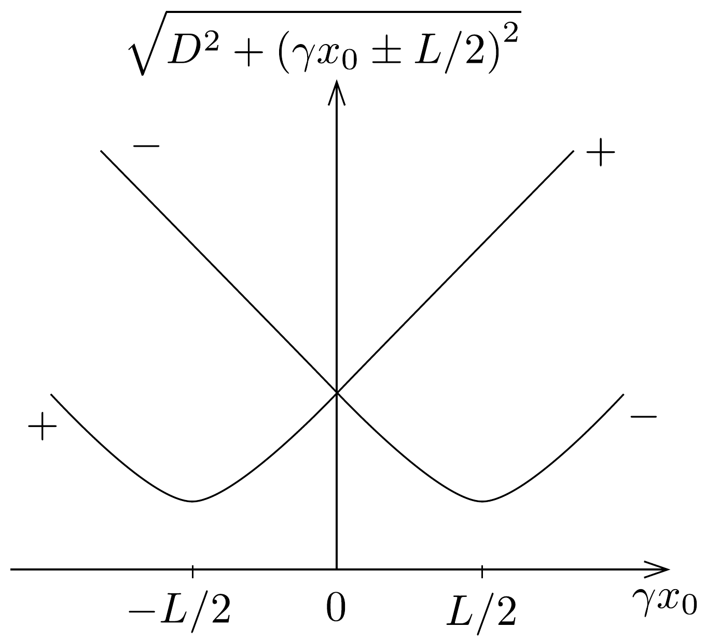

## Megoldás 2

2.1. A lyukkamerával készített képen az $\tilde{x}$ helyen látható rúddarabkát kirajzoló fény $T=\frac{\sqrt{D^{2}+\tilde{x}^{2}}}{c}$ idővel korábban indult, mint a felvétel készítésének időpontja. Ennyi idő alatt a rúd $v T$ távolságot tesz meg, tehát a felvétel készítésekor a rúd valódi helyzete: $x=\tilde{x}+\beta \sqrt{D^{2}+\tilde{x}^{2}}$.
2.2. A fenti egyenletből $\tilde{x}$ így fejezhető ki:
\[
\tilde{x}=\gamma^{2} x-\beta \gamma \sqrt{D^{2}+(\gamma x)^{2}} .
\]
2.3. A Lorentz-kontrakciónak megfelelően a mozgó rúd hossza $L / \gamma$, így a mozgó rúd két végének valódi helyzete:
\[
x_{ \pm}=x_{0} \pm \frac{L}{2 \gamma},
\]
ahol a pozitív jel a rúd elejének, a negatív pedig a végének felel meg.
A lyukkamera képe a rúd két végét a (06-1) szerint az
\[
\tilde{x}_{ \pm}=\gamma\left(\gamma x_{0} \pm \frac{L}{2}\right)-\beta \gamma \sqrt{D^{2}+\left(\gamma x_{0} \pm \frac{L}{2}\right)^{2}}
\]
helyeken mutatja. Így a rúd $\tilde{L}=\tilde{x}_{+}-\tilde{x}_{-}$látszólagos hossza
\[
\tilde{L}=\gamma L+\beta \gamma \sqrt{D^{2}+\left(\gamma x_{0}-\frac{L}{2}\right)^{2}}-\beta \gamma \sqrt{D^{2}+\left(\gamma x_{0}+\frac{L}{2}\right)^{2}} .
\]
2.4. Mivel a rúd állandó $v$ sebességgel mozog, azaz időben $x_{0}$ egyenletesen növekszik, így a rúd látszólagos hosszára vonatkozó kérdés azt jelenti, hogy az $\tilde{L}$ mennyiség növekszik vagy csökken, ha $x_{0}$ növekszik. A rúd látszólagos hosszát mutató (06-3) kifejezésben szereplő két négyzetgyökös tagot a 287. ábra mutatja vázlatosan.

A „-”-os és a „+”-os négyzetgyökös kifejezések különbségéről világosan látszik, hogy ez a különbség folyamatosan csökken, miközben $x_{0}$ növekszik. Tehát az $\tilde{L}$ látszólagos hossz az idő függvényében folyamatosan csökken.
2.5. Szimmetriai okokból a rúd látszólagos hossza a szimmetrikus képen megegyezik a rúdnak a lyukkamera koordináta-rendszerében mért „valódi” hosszával, mert a rúd két végéről egyszerre elinduló fény egyszerre ér a lyukkamerába. Ennek megfelelően $\tilde{L}=L / \gamma$ (ami természetesen különbözik a rúd nyugalmi rendszerében észlelt $L$ hossztól).
2.6. Ebben az esetben a rúd végpontjainak látszólagos helyzetére érvényes az $\tilde{x}_{-}=-\tilde{x}_{+}$összefüggés, amit (06-2) segítségével így is kifejezhetünk:
\[
0=\tilde{x}_{+}+\tilde{x}_{-}=2 \gamma^{2} x_{0}-\beta \gamma \sqrt{D^{2}+\left(\gamma x_{0}+\frac{L}{2}\right)^{2}}-\beta \gamma \sqrt{D^{2}+\left(\gamma x_{0}-\frac{L}{2}\right)^{2}} .
\]
Hasonlítsuk össze ezt a kifejezést a szimmetrikus helyzetú rúd (06-3) szerinti hosszával:
\[
\frac{L}{\gamma}=\tilde{x}_{+}-\tilde{x}_{-}=\gamma L-\beta \gamma \sqrt{D^{2}+\left(\gamma x_{0}+\frac{L}{2}\right)^{2}}+\beta \gamma \sqrt{D^{2}+\left(\gamma x_{0}-\frac{L}{2}\right)^{2}} .
\]
Észrevehetjük, hogy a négyzetgyökös tagok kifejezhetők:
\[
\sqrt{D^{2}+\left(\gamma x_{0} \pm \frac{L}{2}\right)^{2}}=\frac{2 \gamma^{2} x_{0} \pm\left(\gamma L-\frac{L}{\gamma}\right)}{2 \beta \gamma}=\frac{\gamma x_{0}}{\beta} \pm \frac{\beta L}{2} .
\]

Ebből akár a „+”, akár a „-” előjelú változatot választjuk, ugyanarra az eredményre jutunk:
\[
x_{0}=\beta \sqrt{D^{2}+\left(\frac{L}{2 \gamma}\right)^{2}} .
\]
2.7. A szimmetrikus képen a rúd középpontjának látszólagos helyzetét (06-1) alapján számíthatjuk ki felahsználva a (06-4) eredményt:
\[
\tilde{x}_{0}=\gamma^{2} x_{0}-\beta \gamma \sqrt{D^{2}+\left(\gamma x_{0}\right)^{2}}=\beta \gamma\left(\sqrt{(\gamma D)^{2}+\left(\frac{L}{2}\right)^{2}}-\sqrt{(\gamma D)^{2}+\left(\frac{\beta L}{2}\right)^{2}}\right) .
\]
A középpont a rúd elejének képétől $\ell=\tilde{x}_{+}-\tilde{x}_{0}=\frac{L}{2 \gamma}-\tilde{x}_{0}$ távolságra van, amiből
\[
\ell=\frac{L}{2 \gamma}-\beta \gamma \sqrt{(\gamma D)^{2}+\left(\frac{L}{2}\right)^{2}}+\beta \gamma \sqrt{(\gamma D)^{2}+\left(\frac{\beta L}{2}\right)^{2}},
\]
ami így is felírható:
\[
\ell=\frac{L}{2 \gamma}\left(1-\frac{\frac{\beta L}{2}}{\sqrt{(\gamma D)^{2}+\left(\frac{L}{2}\right)^{2}}+\sqrt{(\gamma D)^{2}+\left(\frac{\beta L}{2}\right)^{2}}}\right) .
\]
2.8. A nagyon korai képek $x_{0}$ nagyon nagy negatív értékeihez, míg a nagyon késő̇ek $x_{0}$ nagyon nagy pozitív értékeihez tartoznak. (06-3) kifejezésben $D$-t elhanyagolva:
\[
\tilde{L}=\gamma L+\beta \gamma\left(\left|\gamma x_{0}-\frac{L}{2}\right|-\left|\gamma x_{0}+\frac{L}{2}\right|\right),
\]
így a nagyon korai képeken $\left(x_{0} \rightarrow-\infty\right)$ a rúd látszólagos hossza:
\[
\tilde{L}_{\text {korai }}=\gamma L+\beta \gamma\left[-\gamma x_{0}+\frac{L}{2}-\left(-\gamma x_{0}-\frac{L}{2}\right)\right]=(1+\beta) \gamma L=\sqrt{\frac{1+\beta}{1-\beta}} L,
\]
illetve a nagyon késói képeken $\left(x_{0} \rightarrow \infty\right)$ a rúd látszólagos hossza:
\[
\tilde{L}_{\text {késői }}=\gamma L+\beta \gamma\left[\gamma x_{0}-\frac{L}{2}-\left(\gamma x_{0}+\frac{L}{2}\right)\right]=(1-\beta) \gamma L=\sqrt{\frac{1-\beta}{1+\beta}} L .
\]
A kifejezésekből következik, hogy $\tilde{L}_{\text {korai }}>\tilde{L}_{\text {késői }}$, tehát a 3 méteres látszólagos kép korai, míg az 1 méteres késői kép.
2.9. A (06-5) és a (06-6) eredmények hányadosából a $\beta=\frac{v}{c}$ arány kifejezhető:
\[
\beta=\frac{\tilde{L}_{\text {korai }}-\tilde{L}_{\text {késői }}}{\tilde{L}_{\text {korai }}+\tilde{L}_{\text {késő }}},
\]
vagyis $\beta=1 / 2$, tehát $v=c / 2$. Ezen kívül: $\gamma=1 / \sqrt{1-\beta^{2}}=2 / \sqrt{3} \approx 1,16$.
2.10. A (06-5) és a (06-6) eredmények szorzatából kifejezhető a nyugvó rúd hossza:
\[
L=\sqrt{\tilde{L}_{\text {korai }} \cdot \tilde{L}_{\text {késői }}}=\sqrt{3} \mathrm{~m} \approx 1,73 \mathrm{~m} .
\]
2.11. A 2.5. alkérdésnek megfelelően a rúd látszólagos hossza a szimmetrikus képen:
\[
\tilde{L}=\frac{L}{\gamma}=\frac{2 \tilde{L}_{\text {korai }} \cdot \tilde{L}_{\text {késói }}}{\tilde{L}_{\text {korai }}+\tilde{L}_{\text {késói }}}=1,5 \mathrm{~m} .
\]
