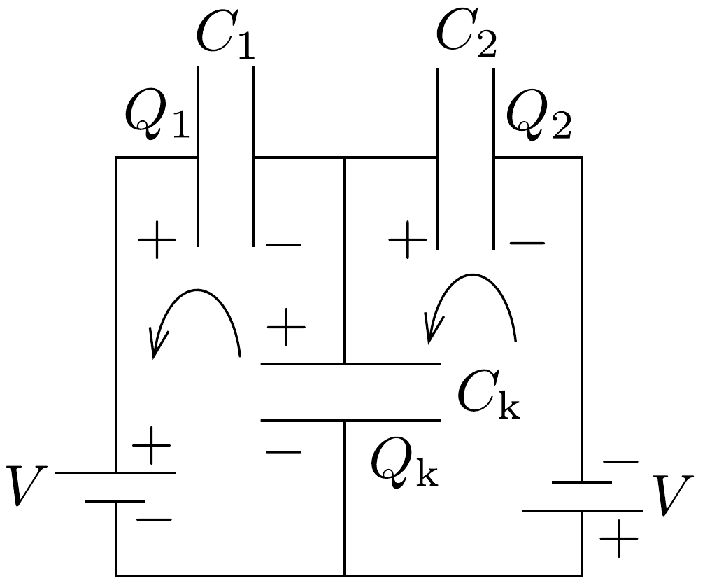

## Megoldás 2

2.1.1. Egyetlen, $Q$ töltésú lemez terét a Gauss-törvénnyel kapjuk meg (ennek kétszerese a kondenzátorlemezek közötti tér elektromos térerőssége):
\[
E_{1}=\frac{Q}{2 \varepsilon_{0} A} .
\]
A másik, $-Q$ töltésú lemez ebben a homogén elektromos mezőben van, azaz a rá ható erő
\[
F_{\mathrm{e}}=E_{1} Q=\frac{Q^{2}}{2 \varepsilon_{0} A} .
\]
2.1.2. A Hooke-törvény alapján a rugóerő: $F_{\mathrm{r}}=k x$. Egyensúly esetén a rugóeró megegyezik az előző pontban meghatározott elektromos eróvel:
\[
k x=\frac{Q^{2}}{2 \varepsilon_{0} A} \rightarrow x=\frac{Q^{2}}{2 \varepsilon_{0} A k}
\]
2.1.3. A térerősség a kondenzátorlemezek között homogén, így a lemezek közötti $V$ potenciálkülönbség egyszerúen számolható: $V=E(d-x)$. Behelyettesítve az előző részekben kapott eredményeket:
\[
V=\frac{Q d}{\varepsilon_{0} A}\left(1-\frac{Q^{2}}{2 \varepsilon_{0} A k d}\right) .
\]
2.1.4. A $C$ kapacitás a töltés és a potenciálkülönbség hányadosa: $C=\frac{Q}{V}$. Felhasználva az előző kérdésre kapott eredményt:
\[
\frac{C}{C_{0}}=\left(1-\frac{Q^{2}}{2 \varepsilon_{0} A k d}\right)^{-1} .
\]

A $C=\varepsilon_{0} A /(d-x)$ is ugyenezt az eredményt adja.
2.1.5. A rugóban tárolt mechanikai energia $U_{\mathrm{r}}=\frac{1}{2} k x^{2}$, a kondenzátorban tárolt elektromos energia pedig $U_{\mathrm{e}}=\frac{1}{2} \frac{Q^{2}}{C}$. Így a rendszerben tárolt teljes energia
\[
U=U_{\mathrm{r}}+U_{\mathrm{e}}=\frac{Q^{2} d}{2 \varepsilon_{0} A}\left(1-\frac{Q^{2}}{4 \varepsilon_{0} A k d}\right) .
\]
2.2.1. Adott $x$ érték esetén az egyes kondenzátorok töltése egyszerúen számolható:
\[
Q_{1}=V C_{1}=\frac{\varepsilon_{0} A V}{d-x}, \quad Q_{2}=V C_{2}=\frac{\varepsilon_{0} A V}{d+x} .
\]
2.2.2. Ne felejtsük el, hogy két kondenzátorunk van. Felhasználva az 1.1.1. kérdésre kapott választ, a középső lemezre ható erők:
\[
F_{1}=\frac{Q_{1}^{2}}{2 \varepsilon_{0} A}, \quad F_{2}=\frac{Q_{2}^{2}}{2 \varepsilon_{0} A} .
\]
Mivel a két erő ellentétes irányú, az eredő erő
\[
F_{\mathrm{e}}=F_{1}-F_{2}=\frac{\varepsilon_{0} A V^{2}}{2}\left[\frac{1}{(d-x)^{2}}-\frac{1}{(d+x)^{2}}\right] .
\]
2.2.3. Elhanyagolva az $x^{2}$-rendú tagokat: $(1 \pm x / d)^{-2} \approx 1 \mp 2 x / d$, amivel
\[
F_{\mathrm{e}}=\frac{2 \varepsilon_{0} A V^{2}}{d^{3}} x .
\]
2.2.4. Ha a középső lemez kitétése $x$, akkor mindkét rugó ugyanennyivel deformálódik, az egyik összenyomódik, a másik megnyúlik (párhuzamos kapcsolás). Mivel mindkét rugó ugyanolyan irányú és nagyságú erốt fejt ki a lemezre, ezért az eredő rugóerő $F_{\mathrm{r}}=-2 k x$. Az elektromos és a rugóerő ellentétes irányú, így, felhasználva az előző kérdésre kapott eredményt, az eredő erő
\[
F=F_{\mathrm{r}}+F_{\mathrm{e}}=-2\left(k-\frac{\varepsilon_{0} A V^{2}}{d^{3}}\right) x, \quad \text { ebből pedig } \quad k_{\mathrm{eff}}=2\left(k-\frac{\varepsilon_{0} A V^{2}}{d^{3}}\right) .
\]
2.2.5. Felhasználva Newton II. törvényét és az előző eredményt
\[
a=-\frac{2}{M}\left(k-\frac{\varepsilon_{0} A V^{2}}{d^{3}}\right) x .
\]
2.3.1. Írjuk fel a 293. ábrán látható két áramkörre a Kirchhoff-törvényeket!
\[
\begin{aligned}
& \frac{Q_{\mathrm{k}}}{C_{\mathrm{k}}}+V-\frac{Q_{2}}{C_{2}}=0, \\
& -\frac{Q_{\mathrm{k}}}{C_{\mathrm{k}}}+V-\frac{Q_{1}}{C_{1}}=0 .
\end{aligned}
\]
Valamint a töltésmegmaradás miatt (kezdetben töltetlen volt mindegyik kondenzátor):
\[
Q_{2}-Q_{1}+Q_{\mathrm{k}}=0 .
\]

293. ábra.

Felhasználva, hogy $V_{\mathrm{k}}=\frac{Q_{\mathrm{k}}}{C_{\mathrm{k}}}$, kapjuk:
\[
V_{\mathrm{k}}=V \frac{\frac{2 \varepsilon_{0} A x}{d^{2}-x^{2}}}{C_{\mathrm{k}}+\frac{2 \varepsilon_{0} A d}{d^{2}-x^{2}}} .
\]
2.3.2. Elhanyagolva az $x^{2}$-rendú tagokat:
\[
V_{\mathrm{k}}=V \frac{2 \varepsilon_{0} A x}{d^{2} C_{\mathrm{k}}+2 \varepsilon_{0} A d} .
\]
2.4.1. Az elektromos és a rugóerő hányadosa
\[
\frac{F_{\mathrm{e}}}{F_{\mathrm{r}}}=\frac{\varepsilon_{0} A V^{2}}{k d^{3}} \approx 7,6 \cdot 10^{-9} .
\]
Az elektromos erők valóban elhanyagolhatók a rugóerők mellett.
2.4.2. Az előzőek szerint elegendő a rugóerőt figyelembe vennünk: $F=2 k x$. Így a gyorsuló (lassuló) rendszerben a mozgó lemez egyensúlyi elmozdulása $x=$ $=\frac{M a}{2 k}$. A maximális elmozdulás ennek éppen kétszerese, hiszen a mozgó lemez túllendül az egyensúlyi helyzeten (állandó sebességgel haladva, pedig $x=0$ ):
\[
x_{\max }=\frac{M a}{k} .
\]
2.4.3. Ha a gyorsulás $a=g$, a maximális elmozdulás
\[
x_{\max }=\frac{M g}{k} .
\]
Behelyettesítve ezt a (07-1) eredménybe, majd átrendezve:
\[
C_{\mathrm{k}}=\frac{2 \varepsilon_{0} A}{d}\left(\frac{M g V}{V_{\mathrm{k}} k d}-1\right) \approx 8,0 \cdot 10^{-11} \mathrm{~F} .
\]
2.4.4. Legyen $\ell$ a vezető feje és a kormány közötti távolság. Ennek becsült értéke $\ell=0,4 \mathrm{~m}-1 \mathrm{~m}$.

Abban a pillanatban, amikor a lassulás elkezdődik, a vezető fejének az autóhoz viszonyított relatív sebessége nulla, így
\[
\ell=\frac{1}{2} g t_{1}^{2}, \quad t_{1}=\sqrt{\frac{2 \ell}{g}}, \quad t_{1}=0,3 \mathrm{~s}-0,5 \mathrm{~s} .
\]
2.4.5. A $t_{2}$ idő a harmonikus rezgést végző lemez periódusidejének fele (két szélsőhelyzet közötti mozgás): $t_{2}=\frac{T}{2}$, a periódusidő:
\[
T=2 \pi \sqrt{\frac{M}{2 k}},
\]
így $t_{2}=0,013 \mathrm{~s}$. Mivel $t_{1}>t_{2}$, a légzsák időben aktiválódik.
Megjegyzés a feladathoz: A gyakorlatban valóban ilyen elven múködő gyorsulásmérők aktiválják az autók légzsákját. A valóságos és a feladatban szereplő eszközök között a legfontosabb különbség a méretekben van! A kereskedelemben kapható gyorsulásérzékelők integrált áramköri technológiával készülnek, a miniatürizált mechanikai alkatrészek és az elektronika ugyanazon az egy-két $\mathrm{mm}^{2}$ felületú félvezető csipen kerülnek kialakításra. Az apró és olcsó (néhány dolláros) eszközöket egyre több helyen használják rezgések mérésére és szabályozására; segítségükkel például csökkenthető a mosógépek centrifugálás közben fellépő rezonanciája.
3.1.1. Bármilyen alkalmas egyenlet felhasználásával megkaphatjuk a kérdéses mennyiségek dimenzióját. Például a következő kínálkozó lehetőségekkel élhetünk:
I) A Planck-összefüggés alapján:
\[
h \nu=E \Rightarrow[h][\nu]=[E] \quad \rightarrow \quad[h]=[E] \cdot[\nu]^{-1}=\mathrm{ML}^{2} \mathrm{~T}^{-1} .
\]
II) $[c]=\mathrm{LT}^{-1}$.
III) A tömegvonzási törvény alapján:
\[
F=G \frac{m_{1} \cdot m_{2}}{r^{2}} \rightarrow[G]=[F][r]^{2}[m]^{-2}=\mathrm{M}^{-1} \mathrm{~L}^{3} \mathrm{~T}^{-2} .
\]
IV) Az ekvipartíció tétel segítségével: $E=\frac{1}{2} k_{\mathrm{B}} \theta$, ahol $\theta$-val jelöltük a hőmérsékletet. Ennek alapján $\left[k_{\mathrm{B}}\right]=[E][\theta]^{-1}=\mathrm{ML}^{2} \mathrm{~T}^{-2} \mathrm{~K}^{-1}$.
3.1.2. Például a Stefan-Boltzmann-törvény felhasználásával:
\[
\frac{\text { Teljesítmény }}{\text { Felület }}=\sigma \cdot \theta^{4},
\]
amiből $[\sigma] \mathrm{K}^{4}=[E] \mathrm{L}^{-2} \mathrm{~T}^{-1} \rightarrow[\sigma]=\mathrm{MT}^{-3} \mathrm{~K}^{-4}$.
3.1.3. A dimenziókat tekintve: $[\sigma]=[h]^{\alpha}[c]^{\beta}[G]^{\gamma}\left[k_{\mathrm{B}}\right]^{\delta}$, ahol $[\sigma]=\mathrm{MT}^{-3} \mathrm{~K}^{-4}$. Írjuk be az összes dimenziót:
\[
\begin{aligned}
\mathrm{MT}^{-3} \mathrm{~K}^{-4} & =\left(\mathrm{ML}^{2} \mathrm{~T}^{-1}\right)^{\alpha}\left(\mathrm{LT}^{-1}\right)^{\beta}\left(\mathrm{M}^{-1} \mathrm{~L}^{3} \mathrm{~T}^{-2}\right)^{\gamma}\left(\mathrm{ML}^{2} \mathrm{~T}^{-2} \mathrm{~K}^{-1}\right)^{\delta}= \\
& =\mathrm{M}^{\alpha-\gamma+\delta} \cdot \mathrm{L}^{2 \alpha+\beta+3 \gamma+2 \delta} \cdot \mathrm{~T}^{-\alpha-\beta-2 \gamma-2 \delta} \cdot \mathrm{~K}^{-\delta} .
\end{aligned}
\]
A hatványkitevők egybevetéséből a következő egyenletrendszert kapjuk:
\[
\left.\begin{array}{rl}
\alpha-\gamma+\delta & =1 \\
2 \alpha+\beta+3 \gamma+2 \delta & =0 \\
-\alpha-\beta-2 \gamma-2 \delta & =-3 \\
-\delta & =-4
\end{array}\right\} \Rightarrow \quad \begin{aligned}
& \alpha=-3, \\
& \beta=-2, \\
& \gamma=0, \\
& \delta=4,
\end{aligned} \text { vagyis } \sigma=\frac{k_{\mathrm{B}}^{4}}{c^{2} h^{3}} .
\]
3.2.1. A megadott összefüggés szerint:
\[
\begin{aligned}
{[A] } & =[G]^{\alpha}[c]^{\beta}[m]^{\gamma} \quad \rightarrow \\
\rightarrow \quad \mathrm{L}^{2} & =\left(\mathrm{M}^{-1} \mathrm{~L}^{3} \mathrm{~T}^{-2}\right)^{\alpha}\left(\mathrm{LT}^{-1}\right)^{\beta}(\mathrm{M})^{\gamma}=\mathrm{M}^{-\alpha+\gamma} \cdot \mathrm{L}^{3 \alpha+\beta} \cdot \mathrm{T}^{-2 \alpha-\beta}
\end{aligned}
\]
Most csak három ismeretlent tartalmaz az egyenletrendszer:
\[
\left.\begin{array}{r}
-\alpha+\gamma=0 \\
3 \alpha+\beta=2 \\
-2 \alpha-\beta=0
\end{array}\right\} \Rightarrow \quad \begin{aligned}
& \alpha=2, \\
& \beta=-4, \quad \text { vagyis } \quad A=\frac{m^{2} G^{2}}{c^{4}} .
\end{aligned}
\]
3.2.2. Az entrópia termodinamikai definíciója alapján a dimenziója: $[S]=$ $=[E][\theta]^{-1}=\mathrm{ML}^{2} \mathrm{~T}^{-2} \mathrm{~K}^{-1}$.
3.2.3. Az $\eta$ állandó dimenzióját így fejezhetjük ki:
\[
\begin{aligned}
& {[\eta]=[S][A]^{-1}=\mathrm{MT}^{-2} \mathrm{~K}^{-1}} \\
& {[\eta]=[G]^{\alpha}[h]^{\beta}[c]^{\gamma}\left[k_{\mathrm{B}}\right]^{\delta}=\mathrm{M}^{-\alpha+\beta+\delta} \cdot \mathrm{L}^{3 \alpha+2 \beta+\gamma+2 \delta} \cdot \mathrm{~T}^{-2 \alpha-\beta-\gamma-2 \delta} \cdot \mathrm{~K}^{-\delta}}
\end{aligned}
\]
A hatványkitevők összevetésével:
\[
\left.\begin{array}{rl}
-\alpha+\beta+\delta & =1 \\
3 \alpha+2 \beta+\gamma+2 \delta & =0 \\
-2 \alpha-\beta-\gamma-2 \delta & =-2 \\
\delta & =1
\end{array}\right\} \Rightarrow \quad \begin{aligned}
& \alpha=-1, \\
& \beta=-1, \\
& \gamma=3, \\
& \delta=1,
\end{aligned} \text { vagyis } \eta=\frac{c^{3} k_{\mathrm{B}} .}{G h} .
\]
3.3.1. A termodinamika elsó fótétele alapján $\mathrm{d} E=\mathrm{d} Q+\mathrm{d} W$, ahol közelítésként feltesszük, hogy $\mathrm{d} W=0$. Az entrópia $\mathrm{d} S=\mathrm{d} Q / \theta$ definícióját felhasználva: $\mathrm{d} E=\theta_{\mathrm{H}} \mathrm{d} S$.

A feltételezés szerint $S=\eta A$, valamint felhasználva a 3.2.1. és 3.2.3. részek eredményeit $A$-ra, illetve $\eta$-ra, így
\[
S=\frac{G k_{\mathrm{B}}}{c h} m^{2} .
\]
Az $E=m c^{2}$ összefüggéssel:
\[
S=\frac{G k_{\mathrm{B}}}{c^{5} h} E^{2}
\]
Így a fekete lyuk Hawking-hőmérsékletére a következő összefüggést kapjuk:
\[
\theta_{\mathrm{H}}=\frac{\mathrm{d} E}{\mathrm{~d} S}=\left(\frac{\mathrm{d} S}{\mathrm{~d} E}\right)^{-1}=\left(\frac{1}{2}\right) \frac{c^{3} h}{G k_{\mathrm{B}}} \cdot \frac{1}{m} .
\]
Megjegyezzük, hogy a végeredményben található 1/2-es faktornak nincs jelentősége, elhagyható, csak a deriválás miatt maradt az összefüggésben.
3.3.2. A Stefan-Boltzmann-törvény az egységnyi felületre jutó kisugárzott teljesítményt adja meg. A kisugárzott energia hatására a fekete lyuk energiája, és így a tömege csökken:
\[
\frac{\mathrm{d} E}{\mathrm{~d} t}=\frac{\mathrm{d} m}{\mathrm{~d} t} c^{2}=-\sigma A \theta_{\mathrm{H}}^{4}
\]
Felhasználva a 3.1.3.-ban $\sigma$-ra, a 3.2.1.-ben $A$-ra és a 3.3.1.-ben $\theta_{\mathrm{H}}$-ra vonatkozó eredményeket:
\[
\frac{\mathrm{d} m}{\mathrm{~d} t} c^{2}=-\frac{k_{\mathrm{B}}^{4}}{c^{2} h^{3}}\left(\frac{c^{3} h}{2 G k_{\mathrm{B}}} \cdot \frac{1}{m}\right)^{4} \frac{m^{2} G^{2}}{c^{4}} .
\]
Az egyszerúsítések elvégzése után:
\[
\frac{\mathrm{d} m}{\mathrm{~d} t}=-\frac{1}{16} \frac{c^{4} h}{G^{2}} \cdot \frac{1}{m^{2}} .
\]
3.3.3. A változók szétválasztásával a következó integrált kapjuk:
\[
\int m^{2} \mathrm{~d} m=-\int \frac{c^{4} h}{16 G^{2}} \mathrm{~d} t \rightarrow m^{3}(t)=m^{3}(0)-\frac{3 c^{4} h}{16 G^{2}} t
\]
Amikor a fekete lyuk $t=t^{*}$-kor teljesen elpárolog:
\[
m\left(t^{*}\right)=0 \quad \rightarrow \quad t^{*}=\frac{16 G^{2}}{3 c^{4} h} m^{3} .
\]
3.3.4. A fekete lyuk $C_{V}$ hőkapacitása megmutatja, hogy a $\theta_{\mathrm{H}}$ hőmérséklet egységnyi megváltozásához mekkora $E$ energiaváltozás tartozik:
\[
C_{V}=\frac{\mathrm{d} E}{\mathrm{~d} \theta_{\mathrm{H}}}=c^{2} \frac{\mathrm{~d} m}{\mathrm{~d} \theta_{\mathrm{H}}} .
\]
Felhasználva 3.3.1. kérdés $\theta_{\mathrm{H}}-\mathrm{ra}$ kapott eredményét
\[
m=\frac{c^{3} h}{2 G k_{\mathrm{B}}} \cdot \frac{1}{\theta_{\mathrm{H}}}
\]
Elvégezve a deriválást:
\[
C_{V}=-\frac{2 G k_{\mathrm{B}}}{c h} m^{2} .
\]
3.4.1. Újra a Stefan-Boltzmann-törvény adja meg a fekete lyuk egységnyi felületének energiaveszteségi ütemét. A fekete lyuk kozmikus háttérsugárzás miatti energianyereségét egy hasonló összefüggés írja le. Ezt úgy láthatjuk be, hogy termikus egyensúlyban a teljes energiaváltozásnak el kell túnnie. Ebből az következik, hogy az energianyereség ütemét a Stefan-Boltzmann-törvénnyel teljesen megegyezó formula jellemzi:
\[
\frac{\mathrm{d} E}{\mathrm{~d} t}=-\sigma A \theta_{\mathrm{H}}^{4}+\sigma A \theta_{\mathrm{B}}^{4} .
\]
Felhasználva, hogy $E=m c^{2}$, valamint $\sigma, A$ és $\theta_{\mathrm{H}}$ korábban megkapott kifejezéseit:
\[
\frac{\mathrm{d} m}{\mathrm{~d} t}=-\frac{h c^{4}}{16 G^{2}} \frac{1}{m^{2}}+\frac{G^{2}}{c^{8} h^{3}}\left(k_{\mathrm{B}} \theta_{\mathrm{B}}\right)^{4} m^{2} .
\]
3.4.2. A $\frac{\mathrm{d} m}{\mathrm{~d} t}=0$ esetet véve:
\[
-\frac{h c^{4}}{16 G^{2}} \frac{1}{m^{* 2}}+\frac{G^{2}}{c^{8} h^{3}}\left(k_{\mathrm{B}} \theta_{\mathrm{B}}\right)^{4} m^{* 2}=0, \quad \text { amibő́l } \quad m^{*}=\frac{c^{3} h}{2 G k_{\mathrm{B}}} \frac{1}{\theta_{\mathrm{B}}} .
\]
3.4.3.
\[
\theta_{\mathrm{B}}=\frac{c^{3} h}{2 G k_{\mathrm{B}}} \frac{1}{m^{*}} \rightarrow \frac{\mathrm{~d} m}{\mathrm{~d} t}=-\frac{h c^{4}}{16 G^{2}} \frac{1}{m^{2}}\left(1-\frac{m^{4}}{m^{* 4}}\right) .
\]
XXXVIII. olimpia, 2007
3.4.4. Használjuk fel a 3.4.2. és a 3.3.1. részkérdésekre adott válaszeredményeket:
\[
m^{*}=\frac{c^{3} h}{2 G k_{\mathrm{B}}} \frac{1}{\theta_{\mathrm{B}}} \quad \text { és } \quad \theta^{*}=\frac{c^{3} h}{2 G k_{\mathrm{B}}} \frac{1}{m^{*}}=\theta_{\mathrm{B}} .
\]
Úgy is érvelhetünk, hogy $m^{*}$ felel meg a termikus egyensúlynak. Így $m=m^{*}$ esetén a fekete lyuk hőmérséklete $\theta_{\mathrm{B}}$. Az is elfogadható megoldás, hogy termikus egyensúly esetén
\[
\frac{\mathrm{d} E}{\mathrm{~d} t}=-\sigma\left(\theta^{* 4}-\theta_{\mathrm{B}}^{4}\right) A=0, \quad \text { amiből } \quad \theta^{*}=\theta_{\mathrm{B}} .
\]
3.4.5. A 3.4.3. eredmény alapján megmutatható, hogy az egyensúly instabil. Ugyanis, ha $m$ egy kicsit nagyobb, mint $m^{*}$, akkor $\mathrm{d} m / \mathrm{d} t>0$, ha pedig $m$ egy kicsit kisebb, mint $m^{*}$, akkor $\mathrm{d} m / \mathrm{d} t<0$.

Megjegyzés: Az egyik versenyző, Kónya Gábor (aki maximális pontszámra írta meg az elméleti feladatok megoldását) a következő kiegészítéssel látta el dolgozatát a diákolimpián, amelyben dimenzióanalízis nélkül, alapvető fizikai megfontolások segítségével vezeti le a Hawking-probléma kevéssé ismert formuláit.
$A(m), \theta_{\mathrm{H}}(m), S(m)$ kifejezések egy alternatív levezetése:
Vegyünk egy $p$ impulzusú fotont a fekete lyukban a középponttól $r$ távolságra. A foton teljes energiája:
\[
p c-G \frac{\frac{p}{c} m}{r} \leq 0 \quad \rightarrow \quad r \leq \frac{G m}{c^{2}} .
\]
Az eseményhorizont sugara és felülete:
\[
R=\frac{G m}{c^{2}} \quad \text { és } \quad A=4 \pi R^{2}=4 \pi \frac{G^{2} m^{2}}{c^{4}} \approx \frac{G^{2} m^{2}}{c^{4}} .
\]
Az $R$ sugarú gömbbe zárt foton impulzusát a határozatlansági relációból $p=\hbar / R$-nek becsülhetjük. Egy foton mozgási energiája:
\[
p c=\frac{\hbar c}{R}=\frac{\hbar c^{3}}{G m} \approx \frac{h c^{3}}{G m} .
\]

A rendszer hőmérséklete: $\theta_{\mathrm{H}} \approx \frac{p c}{k_{\mathrm{B}}}=\frac{h c^{3}}{G k_{\mathrm{B}} m}$ (ekvipartíció-tétel). A rendszer entrópiája:
\[
S=\int \frac{\mathrm{d} m c^{2}}{\theta_{\mathrm{H}}}=\frac{G k_{\mathrm{B}}}{h c} \cdot \frac{1}{2} m^{2} \approx \frac{G k_{\mathrm{B}}}{h c} \cdot m^{2} .
\]
$\eta=\frac{S}{A}=\frac{k_{\mathrm{B}} c^{3}}{h G}=$ állandó.
Az eredmények megegyeznek a dimenzióanalízissel kaphatókkal, de az $S \sim A$ összefüggést bizonyítottuk, nem feltételeztük.

\section*{
