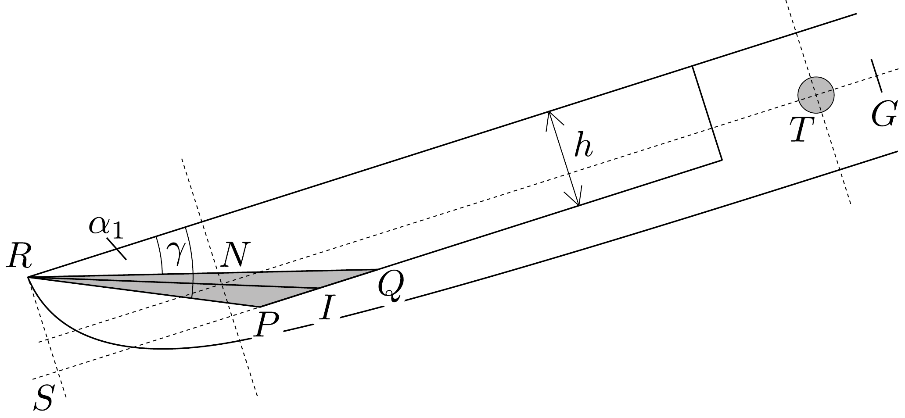
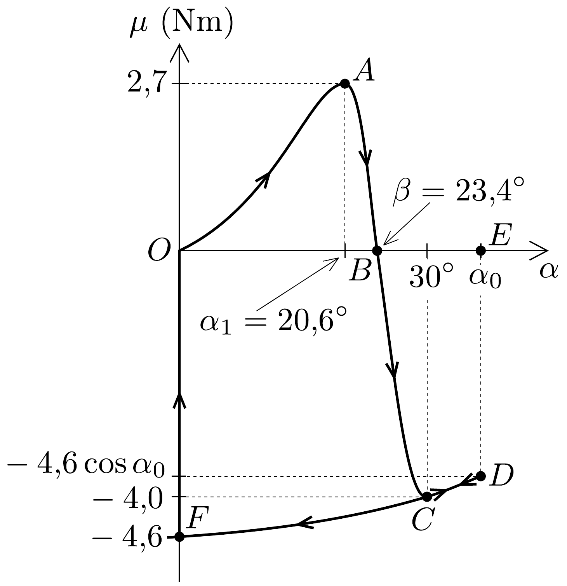
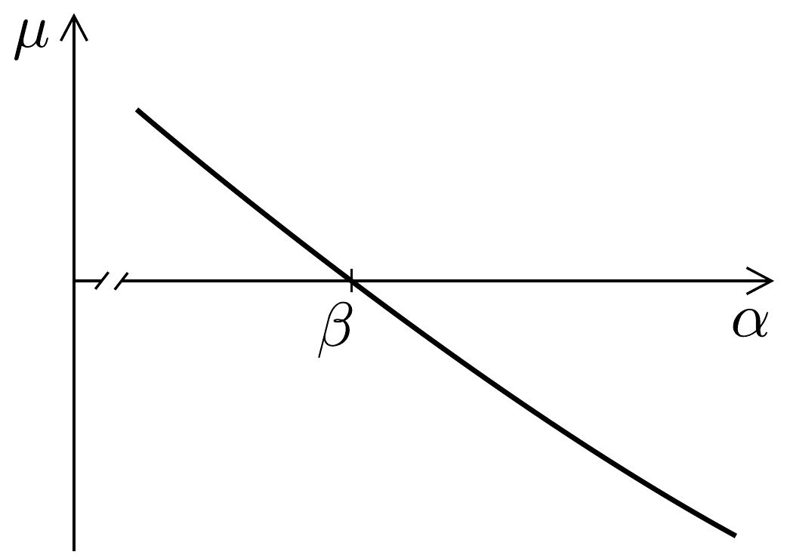

## Megoldás 1

1.1.1. A kanálban összegyült 1 liter víz forgatónyomatéka egyensúlyt tart az emelőrúd súlyából származó forgatónyomatékkal. A kanál aljának hossza $L- -h / \operatorname{tg} 30^{\circ} \approx 53,2 \mathrm{~cm}$. Legyen a kanálban lévó vízmennyiség magassága $y$. Ekkor:
\[
1000 \mathrm{~cm}^{3}=15 \cdot 53,2 \mathrm{~cm}^{2} \cdot y+\frac{1}{2} \cdot 15 \mathrm{~cm} \cdot \frac{y}{\operatorname{tg} 30^{\circ}} \cdot y,
\]
ahonnét $y \approx 1,2 \mathrm{~cm}$. Mivel a kanál téglatest alakú részében van a vízmennyiség legtöbb hányada $\left(\sim 960 \mathrm{~cm}^{3}\right)$, így a vízmennyiség súlypontja nagyjából $20+$
$+53,2 / 2 \approx 47 \mathrm{~cm}$-re van a $T$ forgástengelytől. Mivel az emelőrúd tömege 30 -szor nagyobb 1 liter víz tömegénél, így a kérdéses $T G$ távolság $47 / 30 \mathrm{~cm} \approx 1,6 \mathrm{~cm}$.
1.1.2. Amikor az emelőrúd $\alpha_{1}$ dőlésszögénél a víz eléri a kanál peremét, akkor a 300, ábrán látható helyzetet veszi fel. Ekkor a kanálban lévő 1 liter víz a $P Q R$ háromszög alapú, $b$ magasságú egyenes hasábot tölt ki, melynek térfogatát könnyen felírhatjuk: $V=\frac{h \cdot P Q}{2} b=1$ liter. A számítás $P Q \approx 11,1 \mathrm{~cm}$ eredményre vezet.

Az emelőrúd $\alpha_{1}$ dőlésszögét így számíthatjuk ki:
\[
\operatorname{tg} \alpha_{1}=\frac{h}{S Q}=\frac{h}{P Q+h / \operatorname{tg} \gamma},
\]
amiból $\alpha_{1}=20,6^{\circ}$.
A kanálból akkor távozik az összes víz, ha az emelőrúd dőlésszöge: $\alpha_{2}=\gamma=$ $=30^{\circ}$.
1.1.3. Használjuk újra a 300, ábrát. Jelöljük a $P Q$ távolságot $x$-szel, amit mérjünk méterben: $P Q=x$. Ezzel a kanálban maradó víz $m$ tömege kilogrammban:
\[
m_{1}=\varrho_{\text {víz }} \frac{x h b}{2}=9 x .
\]
A víz $N$ súlypontja a $P Q R$ háromszög súlypontjában van, az $R I$ súlyvonal $2 / 3$ részénél, azaz a kanál aljától $h / 3=4 \mathrm{~cm}$ távolságra van. Emiatt az emelőrúd $G$ súlypontja, a $T$ forgástengely (középpontja) és a kanálban maradó víz $N$ súlypontja egy egyenes mentén helyezkedik el. A forgatónyomaték egyensúlyát így írhatjuk fel ( $g \cos \alpha$ szorzó kiesik):
\[
m_{1} \cdot T N=M \cdot T G \approx 0,48 \mathrm{kgm} .
\]
A $T N$ távolságot így írhatjuk fel:
\[
T N=a+L-\frac{2}{3}\left(\frac{h}{\operatorname{tg} \gamma}+\frac{x}{2}\right) \approx 0,801-\frac{x}{3} .
\]

A (08-1), (08-2) egyenletekkel (08-3) következő alakra hozható: $3 x^{2}-7,21+0,48=$ $=0$, melynek fizikailag értelmes gyöke: $x \approx 0,069 \mathrm{~m}$. Így a kérdéses tömeg: $m_{1}=$ $=9 x \approx 0,62 \mathrm{~kg}$, illetve $T N \approx 0,78 \mathrm{~m}$, továbbá a dőlési szöget így határozhatjuk meg:
\[
\operatorname{tg} \beta=\frac{h}{x+h / \operatorname{tg} \gamma}=0,43, \quad \text { amiből } \quad \beta=23,4^{\circ} .
\]
1.2.1. Kezdetben $(\alpha=0)$ nincs víz a kanálban. Ekkor az emelőrúdra ható forgatónyomaték:
\[
M g \cdot T G \approx 4,6 \mathrm{Nm} .
\]
Tekintsük ezt a forgatónyomatékot negatív előjelúnek, a negatív forgatónyomaték a rúd dőlésszögét csökkenteni igyekszik. Amikor lassan víz folyik a kanálba, az eredő forgatónyomaték növekedni kezd egészen addig, amíg kissé pozitívvá nem válik, és a mozsártörő emelkedni kezd. Ezt követően azzal a közelítéssel dolgozunk, hogy a kanálban lévő víz mennyisége nem változik.

Miközben a kanál lefelé billen, a benne lévő víz tömegközéppontja fokozatosan eltávolodik a forgástengelytől, így $\mu$ egészen addig növekszik, amíg a víz eléri a kanál peremét. Tehát a maximális forgatónyomaték az $\alpha=\alpha_{1}=20,6^{\circ}$-os dőlésszögnél jön létre:
\[
\mu_{\max }=(m \cdot T N-M \cdot T G) g \cos \alpha_{1} \approx 2,7 \mathrm{Nm} .
\]
A rúd további dőlése közben a víz elkezd kifolyni a kanálból, és $\alpha=\beta$ esetén $\mu=0$. A tehetetlenség következtében $\alpha$ tovább növekszik, miközben $\mu$ csökken. Az $\alpha=$ $=30^{\circ}$-os szög esetén a kanál teljesen kiürül. Ebben a helyzetben a forgatónyomaték: $\mu=-M g \cdot T G \cdot \cos 30^{\circ} \approx-4,0 \mathrm{Nm}$. Ezután a tehetetlenség következtében a szög még tovább nő, egészen $\alpha=\alpha_{0}$ értékig, amikor a forgatónyomaték: $\mu=$ $=-M g \cdot T G \cdot \cos \alpha_{0} \approx-4,6 \cdot \cos \alpha_{0} \mathrm{Nm}$. Végül a dőlésszög hirtelen nullára csökken (a mozsártörő lecsap), és a körfolyamat $\mu=-4,6 \mathrm{Nm}$ értékkel újra kezdődik. A fentiek alapján felvázolhatjuk a $\mu(\alpha)$ forgatónyomatékot az $\alpha$ szög függvényében (301. ábra).
1.2.2. A $\mu(\alpha)$ forgatónyomaték által végzett $W_{\text {teljes }}$ teljes munkavégzést a forgatónyomaték előjeles görbe alatti területeként számíthatjuk ki a teljes $O A B C D F O$ körfolyamatra. A mozsártörőnek átadott $W_{\text {ütés }}$ energiát az $\alpha_{0}$-tól 0-ig tekintett görbe alatti terület mérőszámaként kaphatjuk meg (EDFOE, ami egy koszinuszgörbe).
1.2.3. Az $\alpha_{0}$ szög értékét abból becsülhetjük meg, hogy ebben a pozícióban az emelőrúd mozgási energiája nulla, vagyis az $O A B O$ terület megegyezik a $B E D C B$ terület nagyságával. Az $O A B O$ területet háromszöggel, a $B E D C B$ területet pedig trapézzal közelítjük:
\[
\frac{2,7 \cdot 23,6}{2}=\frac{\alpha_{0}-23,6+\alpha_{0}-30}{2} \cdot 4 \rightarrow \alpha_{0} \approx 35^{\circ} .
\]
A mozsártörőnek átadott energia nemcsak a görbe alatti területből határozható meg, hanem az emelőrúd helyzeti energiájának megváltozásából is:
\[
W_{\text {ütés }}=M g \cdot T G \cdot \sin \alpha_{0} \approx 2,7 \mathrm{~J} .
\]

1.3.1.1. Az $\alpha=\beta$ egyensúlyi helyzet közelében a kanálban lévő víz által kifejtett forgatónyomaték:
\[
\tau_{1}=\varrho g \frac{b h}{2} \cdot P Q \cdot T N \cos \alpha=\frac{\varrho g b h^{2}}{2}\left(\frac{1}{\operatorname{tg} \alpha}-\frac{1}{\operatorname{tg} \gamma}\right) \cdot T N \cos \alpha,
\]
amiben felhasználtuk a $P Q=S Q-h / \operatorname{tg} \gamma$ az 1.1.2. részben látott összefüggést. Mivel az egyensúlyi $\beta$ szög körül vizsgáljuk az emelőt, feltehetjük, hogy $T N$ nagyjából állandó (a kanálban lévő víz mennyisége változik).

Az emelőrúdra ható nehézségi erő forgatónyomatéka:
\[
\tau_{2}=M g \cdot T G \cos \alpha .
\]

Tehát az eredő forgatónyomaték az egyensúlyi helyzet környékén:
\[
\tau(\alpha)=\tau_{1}-\tau_{2}=\left[\frac{\varrho b h^{2} \cdot T N}{2}\left(\frac{1}{\operatorname{tg} \alpha}-\frac{1}{\operatorname{tg} \gamma}\right)-M \cdot T G\right] g \cos \alpha .
\]
Behelyettesítve a megadott és a korábban meghatározott értékeket:
\[
\tau(\alpha)=\left(8,23 \mathrm{Nm} \cdot \frac{1}{\operatorname{tg} \alpha}-19,0 \mathrm{Nm}\right) \cos \alpha .
\]
A függvényt vázlatosan a 302. ábra mutatja.
A grafikon alapján elmondhatjuk, hogy az egyensúyi helyzet stabil. Egyensúlyi helyzetből kitérítve úgy, hogy $\alpha<\beta$, a kanálban lévő víz forgatónyomatéka nagyobb, mint az emelőkaré $(\tau>0)$, tehát a szerkezet visszakerül a $\beta$-val jelölt

egyensúlyi helyzetbe. Ha a kitérítés eredményeként $\alpha>\beta$, akkor az emelőkar fejt ki nagyobb forgatónyomatékot, azaz ismét visszakerül a szerkezet az egyensúlyi helyzetbe.
1.3.1.2. Írjuk be a (08-5) egyenletbe az $\alpha=\beta+\Delta \alpha$ kifejezést. A tangensre vonatkozó addíciós tétellel és közelítve:
\[
\frac{1}{\operatorname{tg}(\beta+\Delta \alpha)}=\frac{\frac{1}{\operatorname{tg} \beta}-\Delta \alpha}{1+\frac{\Delta \alpha}{\operatorname{tg} \beta}} \approx\left(\frac{1}{\operatorname{tg} \beta}-\Delta \alpha\right)\left(1+\frac{\Delta \alpha}{\operatorname{tg} \beta}\right) \approx \frac{1}{\operatorname{tg} \beta}-\Delta \alpha\left(1+\frac{1}{\operatorname{tg}^{2} \beta}\right) .
\]
Ezt felhasználva, valamint hogy $\cos (\beta+\Delta \alpha) \approx \cos \beta$ és $\Delta \alpha$ zárójeles tényező́je $1 / \sin ^{2} \alpha$ :
\[
\tau(\Delta \alpha)=-\frac{8,23 \mathrm{Nm} \cdot \cos \beta}{\sin ^{2} \beta} \cdot \Delta \alpha=-48 \mathrm{Nm} \cdot \Delta \alpha .
\]
1.3.1.3. Alkalmazzuk a rúd mozgására a forgómozgás dinamikai alapegyenletét:
\[
\mu=\Theta_{\text {teljes }} \cdot \frac{\mathrm{d}^{2} \alpha}{\mathrm{~d} t^{2}},
\]
ahol $\alpha=\beta+\Delta \alpha$ és $\Theta_{\text {teljes }}$ a rúd és a kanálban lévő víz $T$ tengelyre vonatkoztatott, teljes tehetetlenségi nyomatéka. Tegyük fel, hogy kicsiny $\Delta \alpha$ szögek esetén a kanálban lévő víz tömege állandó $\left(m_{1} \approx 0,6 \mathrm{~kg}\right)$ és ezt a vízmennyiséget tekintsük tömegpontnak. Így: $\Theta_{\text {teljes }}=\Theta+m_{1} \cdot T N^{2} \approx 12,4 \mathrm{~kg} \cdot \mathrm{~m}^{2}$. Így a mozgásegyenlet numerikus alakja (SI egységrendszerben):
\[
-48 \cdot \Delta \alpha=12,4 \cdot \frac{\mathrm{~d}^{2} \Delta \alpha}{\mathrm{~d} t^{2}},
\]
ami egy harmonikus rezgőmozgás egyenlete. A mozgás rezgésideje:
\[
T=2 \pi \sqrt{\frac{12,4}{48}} \approx 3,2 \mathrm{~s} .
\]
1.3.2. A kanálban lévő víz időbeli változása az egyensúlyi $m_{1}$ tömeghez képest (08-4) szerint, ha a $\Delta \alpha$ szögkitérés változik (a leírt közelítést felhasználva):
\[
m_{1}+\Delta m=\frac{\varrho b h^{2}}{2}\left(\frac{1}{\operatorname{tg}(\beta+\Delta \alpha)}-\frac{1}{\operatorname{tg} \gamma}\right) \rightarrow \Delta m=-\frac{\varrho b h^{2}}{2 \sin ^{2} \beta} \cdot \Delta \alpha .
\]

Mivel harmonikus rezgés alakul ki, a szögkitérés időfüggése (felső szélsőhelyzetből indulva)
\[
\Delta \alpha=\Delta \alpha_{0} \cos \left(\frac{2 \pi}{T} t\right),
\]
ahol $\Delta \alpha_{0}=1^{\circ}=2 \pi / 360 \mathrm{rad}$. A kanálban lévő vízmennyiség változási üteme (nagyon kicsiny $\Delta t$ időt tekintve):
\[
\Phi^{\prime}(t)=\frac{\Delta m}{\Delta t}=-\frac{\varrho b h^{2}}{2 \sin ^{2} \beta} \frac{\Delta \alpha}{\Delta t}=\frac{\varrho b h^{2}}{2 \sin ^{2} \beta} \cdot \Delta \alpha_{0} \cdot \frac{2 \pi}{T} \sin \left(\frac{2 \pi}{T} t\right) .
\]
Tehát amikor az egyensúlyi $m_{1}$-nél kevesebb víz van a kanálban, határesetben ezen összefüggés szerint kell pótolni a vizet, hogy a folyamatos túlfolyás fennmaradjon. Mivel a külső $\Phi$ hozam állandó, így annak értéke legalább ezen $\Phi^{\prime}$ változási ütem maximuma kell legyen:
\[
\Phi \geq \Phi_{1}=\frac{\varrho \pi b h^{2}}{T \sin ^{2} \beta} \Delta \alpha_{0} \approx 0,23 \mathrm{~kg} / \mathrm{s} .
\]
1.3.3. Ha a kanál eléri az $\alpha_{1}=20,6^{\circ}$-os dőlési szöget, miközben mindvégig túlcsordul, akkor benne 1 kg víz lesz, és a rezgési amplitúdója $23,4^{\circ}-20,6^{\circ} \approx$ $\approx 3^{\circ}$ lesz. Eltekintve a rendszer tehetetlenségi nyomatékának változásától, amit a növekvő vízmennyiség okoz, a háromszoros amplitúdó háromszoros vízhozamot is jelent: $\Phi_{2}=3 \Phi_{1} \approx 0,7 \mathrm{~kg} / \mathrm{s}$. Ennél nagyobb vízhozam esetén a rizshántoló mozsár nem tud múködni, az emelő megállapodik a $\beta$ szögü helyzetben.
