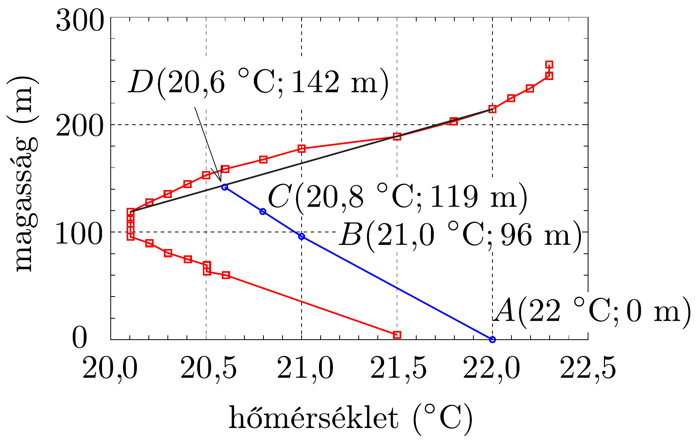

## Megoldás 3

3.1.1. A $z$ magasságban levő, $\varrho(z)$ súrúségú, $A$ területú, $\mathrm{d} z$ vastagságú levegőréteg $\varrho(z) g A \mathrm{~d} z$ súlya megegyezik a levegőréteg alján és tetején mérhető nyomáskülönbségből származó $-(p(z+\mathrm{d} z)-p(z)) A$ erővel. Felhasználva, hogy $\varrho=\frac{\mu p}{R T_{0}}$, a nyomás magasságtól való függésére a
\[
\frac{p(z+\mathrm{d} z)-p(z)}{\mathrm{d} z}=\frac{\mathrm{d} p}{\mathrm{~d} z}=-\frac{\mu g}{R T_{0}} p(z)
\]
differenciálegyenletet kapjuk, melynek megoldása
\[
p(z)=p_{0} e^{-\frac{\mu g}{R T_{0}} z} .
\]

Megjegyzés: A differenciálegyenletet a hidrosztatikai nyomásból közvetlenül is felírhatjuk: $\mathrm{d} p=-\varrho g \mathrm{~d} z$.
3.1.2.1. Az előzőekhez hasonlóan most a $p(z)$ függvényre a
\[
\frac{\mathrm{d} p}{\mathrm{~d} z}=-\frac{\mu g}{R(T(0)-\Lambda z)} p(z)
\]
(ún. szeparálható változójú) differenciálegyenletet kapjuk, amely a feladatban közölt segítség felhasználásával oldható meg:
\[
\begin{gathered}
\int_{p_{0}}^{p(z)} \frac{\mathrm{d} p}{p}=-\frac{\mu g}{R} \int_{0}^{z} \frac{\mathrm{~d} z}{T(0)-\Lambda z} \\
\ln \frac{p(z)}{p_{0}}=\frac{\mu g}{R \Lambda} \ln \left(1-\frac{\Lambda z}{T(0)}\right)
\end{gathered}
\]
ahonnan
\[
p(z)=p_{0}\left(1-\frac{\Lambda z}{T(0)}\right)^{\frac{\mu g}{R \Lambda}} .
\]
3.1.2.2. A súrúség magasságtól való függése:
\[
\varrho(z)=\frac{\mu p(z)}{R T(z)}=\frac{\mu p_{0}}{R T(0)}\left(1-\frac{\Lambda z}{T(0)}\right)^{\frac{\mu g}{R \Lambda}-1},
\]
ami akkor monoton növekedő függvény, ha a kitevő negatív, azaz ha
\[
\Lambda>\frac{\mu g}{R}=0,034 \frac{\mathrm{~K}}{\mathrm{~m}} .
\]

Érdemes észrevenni, hogy kis magasságok esetén a nyomás magasságfüggése mind a 3.1.1. pontban vizsgált izoterm légkör esetén, mind pedig a most vizsgált lineáris hőmérséklet-eloszlás esetén $p(z) \approx p_{0}\left(1-\frac{\mu g z}{R T(0)}\right)$ alakú. Tehát a légkör hőmérsékletének magassággal való változása „első rendben”, kis magasságok esetén nem befolyásolja a nyomás magasságtól való függését.
3.2.1. A levegőcsomag állapotváltozása adiabatikus, tehát kielégíti a
\[
T_{\text {csomag }}(z) \cdot p(z)^{\frac{1-\kappa}{\kappa}}=\text { állandó }
\]
állapotegyenletet, ahol $T_{\text {csomag }}(z)$ a levegőcsomag hőmérséklete, $p(z)$ a környezet és a levegőcsomag közös nyomása, $\kappa=c_{p} / c_{V}$. Mindkét mennyiség függ a $z$ magasságtól. Differenciáljuk az adiabatikus állapotegyenletet $z$ szerint:
\[
\frac{\mathrm{d} T_{\text {csomag }}}{\mathrm{d} z} \cdot p^{\frac{1-\kappa}{\kappa}}+T_{\text {csomag }} \cdot \frac{1-\kappa}{\kappa} \cdot p^{\frac{1-\kappa}{\kappa}} \cdot \frac{1}{p} \cdot \frac{\mathrm{~d} p}{\mathrm{~d} z}=0 .
\]
Az előző pontban láttuk, hogy
\[
\frac{1}{p} \cdot \frac{\mathrm{~d} p}{\mathrm{~d} z}=-\frac{\mu g}{R T}
\]
ahol $T$ a környezet hómérséklete. Ezt felhasználva kapjuk, hogy:
\[
\frac{\mathrm{d} T_{\text {csomag }}}{\mathrm{d} z}=-G, \quad \text { ahol } \quad G=\frac{\kappa-1}{\kappa} \frac{\mu g}{R} \frac{T_{\text {csomag }}}{T} .
\]
3.2.2.1-3.2.2.3. Ha $T_{\text {csomag }}=T$, akkor
\[
\Gamma=\left.G\right|_{T_{\text {csomag }}=T}=\frac{\kappa-1}{\kappa} \frac{\mu g}{R} \approx 10^{-2} \frac{\mathrm{~K}}{\mathrm{~m}},
\]
és így a hőmérséklet a $T(z)=T(0)-\Gamma z$ módon függ a magasságtól. (Ezt a speciális esetet adiabatikus légkörnek hívják.)
3.2.3. Ha a külső hőmérséklet $T(z)=T(0)-\Lambda z$ függvény szerint változik, akkor a (08-7) összefüggés szerint a $T_{\text {csomag }}(z)$ függvény a következő differenciálegyenletet elégíti ki:
\[
\frac{\mathrm{d} T_{\text {csomag }}}{\mathrm{d} z}=-\frac{\Gamma}{T(0)-\Lambda z} T_{\text {csomag }}(z) .
\]

A 3.1.2.1. pontban már megoldottunk egy hasonló differenciálegyenletet, így mostani egyenletünk megoldását a megfeleló változók átírásával azonnal megkaphatjuk:
\[
T_{\text {csomag }}(z)=T_{\text {csomag }}(0)\left(1-\frac{\Lambda z}{T(0)}\right)^{\Gamma / \Lambda} \approx T_{\text {csomag }}(0)-\Gamma z .
\]

Az utolsó közelítés a $|\Lambda z| \ll T(0) \approx T_{\text {csomag }}(0)$ esetén érvényes, amiben felhasználhatuk az $(1+x)^{\alpha} \approx 1+\alpha x$ formulát, amely $x \ll 1$ esetén érvényes.

Érdemes észrevenni, hogy a kapott hőmérsékletfüggés megegyezik az adiabatikus légkör esetén kapottal. Ezen nem kell meglepődnünk, ha visszaemlékezünk a 3.1.2.2. pont végén kapott eredményre, mely szerint a külső nyomás (kis magasságok esetén, „elsó rendben“) érzéketlen a hőmérsélket magasságfüggésére, a külső hőmérséklet pedig (feltevéseink szerint) nem befolyásolja a levegőcsomag hőmérsékletét.
3.3.1. A levegőcsomag és a külső levegő nyomása egyensúlyban van, tehát csak hőmérsékletük eltérése okozhat súrúségkülönbséget. Mivel $T\left(z_{0}\right)=T_{\text {csomag }}\left(z_{0}\right)$, így a $z_{0}$ körüli magasságban a külső levegő hőmérséklete a
\[
T\left(z_{0}+h\right)=T\left(z_{0}\right)-\Lambda h,
\]
a levegőcsomagé pedig
\[
T_{\text {csomag }}\left(z_{0}+h\right)=T\left(z_{0}\right)-\Gamma h
\]
szerint változik.
Ha $\Lambda>\Gamma$, akkor a légkör instabil. Ugyanis, ha a levegőcsomag kissé felemelkedik $(h>0)$, akkor $T<T_{\text {csomag }}$, azaz $\varrho>\varrho_{\text {csomag }}$, vagyis a levegőcsomag tovább emelkedik. Ha a csomag lesüllyed $(h<0)$, akkor fordított egyenlőtlenségek igazak, tehát a csomag tovább süllyed.

Ha $\Lambda=\Gamma$, akkor a légkör semleges, a külső levegő hőmérséklete ugyanúgy változik, mint a csomagé, azaz minden magasságban azonos a hőmérsékletük, tehát a levegőcsomag megmarad az elmozdult helyzetében.

Ha $\Lambda<\Gamma$, akkor a légkör stabil. Kis megemelkedés esetén $T>T_{\text {csomag }}$, azaz $\varrho<\varrho_{\text {csomag }}$, azaz a levegőcsomag visszasüllyed. Süllyedéskor fordított a helyzet, a csomag visszaemelkedik.
3.3.2. A levegőcsomag addig a $h$ magasságig emelkedik, ahol hőmérséklete megegyezik a külső levegő hőmérsékletével, tehát, felhasználva a (08-8) egyenletet,
\[
T(0)-\Lambda h=T_{\text {csomag }}(0)\left(1-\frac{\Lambda h}{T(0)}\right)^{\Gamma / \Lambda} .
\]
Átrendezve a $h$ magasságot kifejezhetjük:
\[
\begin{gathered}
1-\frac{\Lambda h}{T(0)}=\frac{T_{\text {csomag }}(0)}{T(0)} \cdot\left(1-\frac{\Lambda h}{T(0)}\right)^{\Gamma / \Lambda}, \\
h=\frac{T(0)}{\Lambda}\left[1-\left(\frac{T(0)}{T_{\text {csomag }}(0)}\right)^{\frac{\Lambda}{\Gamma-\Lambda}}\right] .
\end{gathered}
\]
3.4.1. A 306, ábra a megadott táblázat adatait mutatja. A piros színnel jelzett görbét tekintve a légkör három rétegre osztható, a középső réteg izoterm, míg a másik kettőben közel lineárisan változik a hőmérséklet (a harmadik szakaszon a fekete egyenes segítségével adhatjuk meg a hőmérséklet változását).

\begin{tabular}[t]{|l|l|l|}
\hline 1. réteg & $0 \mathrm{~m}<z<96 \mathrm{~m}$ & $\Lambda_{1}=\frac{21,5 \mathrm{~K}-20,1 \mathrm{~K}}{91 \mathrm{~m}} \approx 15,4 \cdot 10^{-3} \frac{\mathrm{~K}}{\mathrm{~m}}$ \\
\hline 2. réteg & $96 \mathrm{~m}<z<119 \mathrm{~m}$ & $\Lambda_{2}=0 \frac{\mathrm{~K}}{\mathrm{~m}}$, izoterm szakasz \\
\hline 3. réteg & $119 \mathrm{~m}<z<215 \mathrm{~m}$ & $\Lambda_{3}=\frac{20,1 \mathrm{~K}-22 \mathrm{~K}}{215 \mathrm{~m}-119 \mathrm{~m}} \approx-19,8 \cdot 10^{-3} \frac{\mathrm{~K}}{\mathrm{~m}}$ \\
\hline
\end{tabular}

Látható, hogy a (08-8) egyenlet közelítésénél használt feltételek teljesülnek, így a felemelkedő és adiabatikusan táguló levegőcsomag hőmérséklete a külső hőmérséklettől lényegében teljesen függetlenül a korábban megkapott $\Gamma \approx 10^{-2} \frac{\mathrm{~K}}{\mathrm{~m}}$ együttható szerint lineárisan csökken (306, ábra kék görbéje). Így
\[
\begin{gathered}
T_{\text {csomag }}(96 \mathrm{~m})=22^{\circ} \mathrm{C}-0,96^{\circ} \mathrm{C} \approx 21,0{ }^{\circ} \mathrm{C}, \\
T_{\text {csomag }}(119 \mathrm{~m})=22^{\circ} \mathrm{C}-1,19^{\circ} \mathrm{C} \approx 20,8^{\circ} \mathrm{C} .
\end{gathered}
\]
3.4.2. Induljunk ki a 119 m-es magasságból $\left(\Lambda=\Lambda_{3}, T(0)=20,1^{\circ} \mathrm{C}\right.$, $T_{\text {csomag }}(0)=20,8{ }^{\circ} \mathrm{C}$ ) és használjuk a (08-9) egyenletet. Innen az emelkedési magasságra $h \approx 23$ m-t kapunk, azaz a talajtól számítva az egyensúlyi magasság
\[
H=119 \mathrm{~m}+23 \mathrm{~m}=142 \mathrm{~m},
\]
és itt a hómérséklet $T_{\text {csomag }}(H)=22^{\circ} \mathrm{C}-1,42^{\circ} \mathrm{C} \approx 20,6^{\circ} \mathrm{C}$.
Megjegyzés: Látható, hogy 119 m magasan a levegőcsomag hőmérséklete még mindig csak 0,7 °C-kal magasabb, mint környezeté, ezért a (08-9) egyenletben alkalmazhatunk közelítést a
\[
T_{\text {csomag }}(0) \approx T(0) \quad \text { és } \quad \frac{T_{\text {csomag }}(0)-T(0)}{T_{\text {csomag }}(0)} \ll 1
\]
feltételek mellett. Átírva, hogy
\[
\frac{T(0)}{T_{\text {csomag }}(0)}=1-\frac{T_{\text {csomag }}(0)-T(0)}{T_{\text {csomag }}(0)},
\]
(08-9) közelítő formulája:
\[
h \approx \frac{T_{\mathrm{csomag}}(0)-T(0)}{\Gamma-\Lambda} .
\]
Ezzel az összefüggéssel is természetesen jó eredményt kapunk:
\[
h \approx \frac{20,8-20,1}{10^{-2}+19,8 \cdot 10^{-3}} \approx 23 \mathrm{~m}
\]
3.5.1. Az $L \times W \times H$ méretú téglatestben lévó teljes szén-monoxid mennyiség két tényezó miatt változik: egyrészt a motorok által kibocsátott mennyiséggel nő $(M \mathrm{~d} t)$, másrészt a szél által kifújt mennyiséggel csökken (-CLHudt). Tehát a szén-dioxid mennyiségére:
\[
L W H \cdot \frac{\mathrm{~d} C}{\mathrm{~d} t}=M-u L H C(t) .
\]
3.5.2. A fenti lineáris elsőrendú differenciálegyenlet megoldása $(C(0)=0)$ :
\[
\int_{0}^{C(t)} \frac{\mathrm{d} C}{M-u L H C}=\frac{1}{L W H} \int_{0}^{t} \mathrm{~d} t .
\]
Amiból
\[
-\frac{1}{u L H} \ln \frac{M-u L H C(t)}{M}=\frac{t}{L W H} \rightarrow C(t)=\frac{M}{L H u}\left(1-e^{-\frac{u}{W} t}\right) .
\]
3.5.3. Egy óra alatt kibocsátott CO mennyiségéből: $M=8 \cdot 10^{5} \cdot 5 \cdot 12=$ $=4,8 \cdot 10^{7} \mathrm{~g} / \mathrm{h}$. A fenti egyenletbe behelyettesítve a megadott adatokat ( $H$ a 3.4.2.-ben kiszámolt keveredési magasság), azt kapjuk, hogy a 8 órakor mérhető szén-monoxid koncentráció $C(3600 \mathrm{~s}) \approx 2,3 \frac{\mathrm{mg}}{\mathrm{m}^{3}}$.

"IPhO_konyv" - 2023/6/21 - 16:34 - page 476 - \#476

476
XL. OLIMPIA, 2009

\section*{
