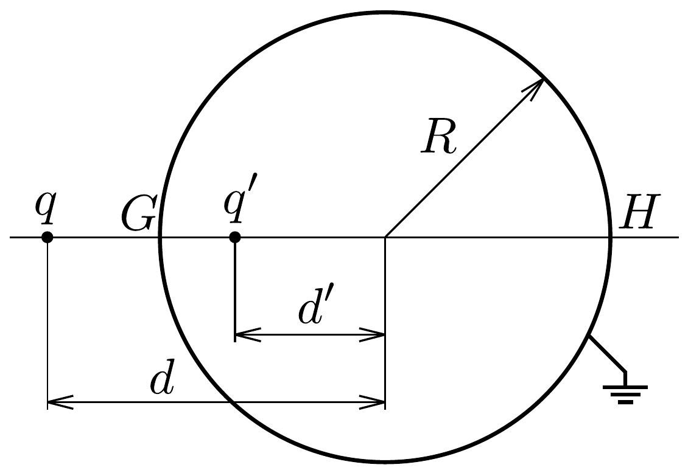
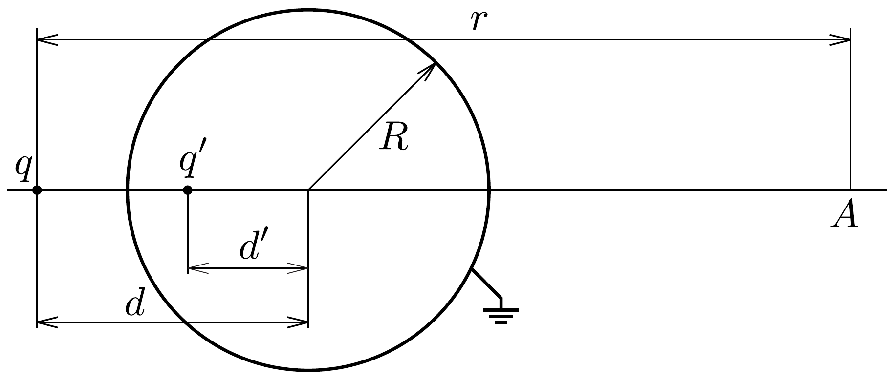
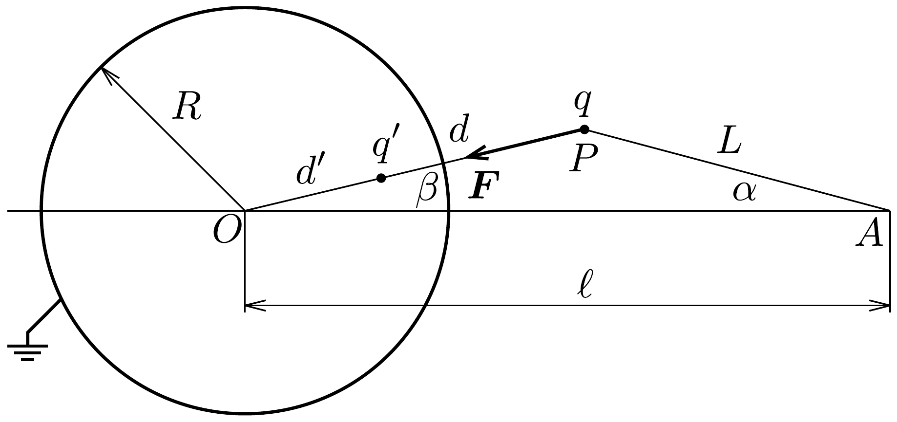

## Megoldás 1

1.1.1. Mivel a gömb földelt, az elektromos potenciál a felszínén zérus.
1.1.2. A feladat nem követeli meg a tükörtöltés módszerének igazolását, csupán a tükörtöltés nagyságának és helyzetének meghatározását kéri a módszer ismeretében. E két paraméter meghatározásához elegendő, ha a gömb két különböző pontjában előírjuk, hogy az elektromos potenciál legyen zérus. Célszerú a két töltés egyenesén fekvő $G$ és $H$ pontot választani (325. ábra):
\[
\begin{aligned}
& \Phi_{G}=\frac{1}{4 \pi \varepsilon_{0}}\left(\frac{q}{d-R}+\frac{q^{\prime}}{R-d^{\prime}}\right)=0, \\
& \Phi_{H}=\frac{1}{4 \pi \varepsilon_{0}}\left(\frac{q}{d+R}+\frac{q^{\prime}}{d^{\prime}+R}\right)=0 .
\end{aligned}
\]

Egyszerúen adódik, hogy az egyenletrendszer megoldása $q^{\prime}$-re és $d^{\prime}$-re:
\[
q^{\prime}=-q \frac{R}{d}, \quad d^{\prime}=\frac{R^{2}}{d} .
\]

Megjegyzés. A kapott eredményhez két elemi geometriai tétel is kapcsolódik. Egyrészt, mivel $d d^{\prime}=R^{2}$, a töltést és a tükörtöltést egy olyan inverzió (gömbi tükrözés) viszi át egymásba, melynek alapgömbje a földelt fémgömb. Másrészt, az a tény, hogy a két töltés eredő potenciálja a gömbön nulla, azt jelenti, hogy a gömb pontjainak a két töltéstől mért távolságaránya állandó, tehát a gömb a két töltéshez tartozó Apollóniusz-gömb.
1.1.3. Minthogy a fémgömb elektromos tere a gömbön kívül megegyezik a $q^{\prime}$ tükörtöltés terével, a gömb és a $q$ töltés közötti eró megegyezik a $q$ és $q^{\prime}$ töltések között ható Coulomb-erővel:
\[
F=\frac{1}{4 \pi \varepsilon_{0}} \frac{q \cdot\left|q^{\prime}\right|}{\left(d-d^{\prime}\right)^{2}}=\frac{1}{4 \pi \varepsilon_{0}} \frac{q^{2} R d}{\left(d^{2}-R^{2}\right)^{2}} .
\]
Mivel $q$ és $q^{\prime}$ ellentétes előjelúek, ezért a köztük ható $F$ erő vonzó. (A fémgömb felületén megosztás jön létre, a földből negatív töltések érkeznek rá, hogy a felülete zérus potenciálú legyen.)
1.2.1. A földelt gömb hatását helyettesíthetjük a $q^{\prime}$ tükörtöltéssel, így az elektromos tér két ponttöltés terének eredőjeként adódik (326. ábra):
\[
\boldsymbol{E}_{A}=\frac{1}{4 \pi \varepsilon_{0}}\left(\frac{q}{r^{2}}+\frac{q^{\prime}}{\left(r-d+d^{\prime}\right)^{2}}\right) \boldsymbol{e}_{A}=\frac{q}{4 \pi \varepsilon_{0}}\left(\frac{1}{r^{2}}-\frac{R d}{\left(r d+R^{2}-d^{2}\right)^{2}}\right) \boldsymbol{e}_{A},
\]
ahol $e_{A}$ a $q$ töltéstől az $A$ pontba mutató egységvektor. Az $A$ pontban a földelt gömb részlegesen leárnyékolja az elektromos teret
1.2.2. Ha $r \gg d$, akkor az előzó formula második tagja:
\[
\frac{R d}{\left(r d+R^{2}-d^{2}\right)^{2}}=\frac{R}{r^{2} d}\left(1-\frac{d}{r}+\frac{R^{2}}{r d}\right)^{-2} \approx \frac{R}{r^{2} d}\left(1+\frac{2 d}{r}-\frac{2 R^{2}}{r d}\right) .
\]

Ezt felhasználva az elektromos térerősségre az
\[
\boldsymbol{E}_{A} \approx \frac{q}{4 \pi \varepsilon_{0} r^{2}}\left(1-\frac{R}{d}+\frac{2 R}{r}\left(\frac{R^{2}}{d^{2}}-1\right)\right) \boldsymbol{e}_{A}
\]
közelítő formula adódik. Látható, hogy a fémgömb árnyékoló hatása mellett is nagy távolság esetén a távolság négyzetével csökken az elektromos térerősség.
1.2.3. A (10-1) kifejezés akkor túnik el, ha $d \rightarrow R$.
1.3.1. A fémgömb által kifejtett eró megegyezik a töltés és a tükörtöltés között fellépő Coulomb-eróvel. Az $O A P$ háromszögre felírt koszinusztétel alapján (327. ábra)
\[
d=\sqrt{\ell^{2}+L^{2}-2 \ell L \cos \alpha} .
\]
Így a $q$ töltésre ható erő nagysága:
\[
F=\frac{1}{4 \pi \varepsilon_{0}} \frac{q q^{\prime}}{\left(d-d^{\prime}\right)^{2}}=\frac{1}{4 \pi \varepsilon_{0}} \frac{q^{2} R d}{\left(d^{2}-R^{2}\right)^{2}}=\frac{1}{4 \pi \varepsilon_{0}} \frac{q^{2} R \sqrt{\ell^{2}+L^{2}-2 \ell L \cos \alpha}}{\left(\ell^{2}+L^{2}-2 \ell L \cos \alpha-R^{2}\right)^{2}} .
\]
Az eró a gömb középpontja felé mutat.

327. ábra.
1.3.2. Az $O A P$ háromszög $P$ csúcsnál levó külső szöge $\alpha+\beta$, így a keresett komponens $F_{\perp}=F \sin (\alpha+\beta)$. A szinusztétel alapján $\sin (\alpha+\beta)=\frac{\ell}{d} \sin \alpha$, így:
\[
F_{\perp}=F \frac{\ell}{d} \sin \alpha=\frac{1}{4 \pi \varepsilon_{0}} \frac{q^{2} R \ell \sin \alpha}{\left(\ell^{2}+L^{2}-2 \ell L \cos \alpha-R^{2}\right)^{2}} .
\]
1.3.3. A matematikai inga mozgásegyenlete $m L \ddot{\alpha}=-F_{\perp}$. Kicsiny kitérések esetén $\sin \alpha \approx \alpha, \cos \alpha \approx 1$, így a mozgásegyenlet alakja ekkor:
\[
m L \ddot{\alpha}=-\frac{1}{4 \pi \varepsilon_{0}} \frac{q^{2} R \ell}{\left((\ell-L)^{2}-R^{2}\right)^{2}} \cdot \alpha,
\]
ahonnan a kis rezgések körfrekvenciája:
\[
\omega=\frac{q}{(\ell-L)^{2}-R^{2}} \sqrt{\frac{R \ell}{4 \pi \varepsilon_{0} m L}} .
\]
1.4. Jelölje $W_{\text {kölcs }}$ a $q$ töltés és a polarizált gömb közötti elektrosztatikus kölcsönhatási energiát, legyen $W_{\text {gömb }}$ a gömbön polarizált töltéseloszlás elektrosztatikus energiája, és $W_{\text {össz }}$ a teljes rendszer energiája. A feladat három alkérdésben e három energia meghatározását kéri. Világos, hogy
\[
W_{\text {össz }}=W_{\text {kölcs }}+W_{\text {gömb }},
\]
tehát bármely két energia ismeretében a harmadik könnyen meghatározható.
1.4.1. Legyen az origó a gömb középpontja. A töltés és a gömbfelületen elhelyezkedő töltések közötti kölcsönhatási energia negatív, hiszen a $q$ töltés és a gömb vonzzák egymást:
\[
W_{\text {kölcs }}=\sum_{i=1}^{N} \frac{1}{4 \pi \varepsilon_{0}} \cdot \frac{q q_{i}}{\left|\boldsymbol{r}_{i}-\boldsymbol{d}\right|},
\]
ahol $q_{i}$ a gömb felületén az $\boldsymbol{r}_{i}$ helyen elhelyezkedő kicsiny előjeles töltések. Ennek a kifejezésnek a kiszámítása meglehetősen bonyolult feladat, azonban egy kis ötlettel könnyen meghatározhatjuk ezt az energiatagot.

A kölcsönhatási energia abszolút értéke megegyezik azzal a munkával, amelyet a gömb vonzása ellenében végeznünk kell, hogy a $q$ töltést a végtelenbe távolítsuk, miközben a töltések a gömbön nem mozdulnak el. A gömbön polarizált töltés hatása a gömbön kívül pont olyan, mint a $q^{\prime}$ tükörtöltésé, tehát úgy is képzelhetjük, hogy $q$-t a rögzített $q^{\prime}$ tükörtöltéstól távolítjuk el. Így a kölcsönhatási energia megegyezik a $q$ és $q^{\prime}$ közötti elektrosztatikus energiával:
\[
W_{\mathrm{kölcs}}=\frac{1}{4 \pi \varepsilon_{0}} \frac{q q^{\prime}}{d-d^{\prime}}=-\frac{1}{4 \pi \varepsilon_{0}} \frac{q^{2} R}{d^{2}-R^{2}} .
\]

Látható, hogy a fenti összeget így kifejezhetjük:
\[
\sum_{i=1}^{N} \frac{q_{i}}{\left|\boldsymbol{r}_{i}-\boldsymbol{d}\right|}=-\frac{q R}{d^{2}-R^{2}} .
\]
1.4.2. A keresett energia a párkölcsönhatási energiák összege:
\[
W_{\text {gömb }}=\frac{1}{2} \frac{1}{4 \pi \varepsilon_{0}} \sum_{i, j} \frac{q_{i} q_{j}}{\left|\boldsymbol{r}_{i}-\boldsymbol{r}_{j}\right|}=\frac{1}{2} \sum_{i} q_{i} \underbrace{\sum_{j} \frac{1}{4 \pi \varepsilon_{0}} \frac{q_{j}}{\left|\boldsymbol{r}_{i}-\boldsymbol{r}_{j}\right|}}_{\Phi\left(\boldsymbol{r}_{i}\right)} .
\]
ahol $\Phi\left(\boldsymbol{r}_{i}\right)$ a gömbön lévó töltésektől származó potenciál értéke az $\boldsymbol{r}_{i}$ helyen. A gömb felszínén, illetve azon kívül a polarizált töltésrendszer hatása helyettesíthető a tükörtöltés hatásával, tehát
\[
\Phi\left(\boldsymbol{r}_{i}\right)=\frac{1}{4 \pi \varepsilon_{0}} \frac{q^{\prime}}{\left|\boldsymbol{r}_{i}-\boldsymbol{d}^{\prime}\right|} .
\]
Ezen kívül tudjuk, hogy a töltés és a tükörtöltés együttesen zérus potenciált ad a gömb felszínén lévő, bármelyik $\boldsymbol{r}_{i}$ helyen:
\[
\frac{q^{\prime}}{\left|\boldsymbol{r}_{i}-\boldsymbol{d}^{\prime}\right|}=-\frac{q}{\left|\boldsymbol{r}_{i}-\boldsymbol{d}\right|}
\]
Tehát az energia kifejezése:
\[
W_{\text {gömb }}=-\frac{1}{2} \frac{q}{4 \pi \varepsilon_{0}} \sum_{i} \frac{q_{i}}{\left|\boldsymbol{r}_{i}-\boldsymbol{d}\right|} .
\]
Felhasználva a (10-2) eredményt, megkapjuk a választ:
\[
W_{\text {gömb }}=\frac{1}{8 \pi \varepsilon_{0}} \frac{q^{2} R}{d^{2}-R^{2}}=-\frac{W_{\text {kölcs }}}{2} .
\]
A kifejezés pozitív, mert a negatív töltések taszítják egymást.
1.4.3. A teljes kölcsönhatási energia negatív, abszolút értéke megegyezik azzal a munkával, ami a $q$ töltésnek a földelt fémgömbtől végtelen messzire való eltávolításához szükséges, miközben a fémgömbön is szabadon vándorolhatnak a töltések. Az 1.1.3. részben már meghatároztuk a gömb középpontjától $d$ távolságra lévó $q$ töltésre ható $F(d)$ erốt, tehát
\[
\begin{aligned}
W_{\text {össz }} & =-\int_{x=d}^{\infty} F(x) \mathrm{d} x=-\frac{q^{2} R}{4 \pi \varepsilon_{0}} \int_{x=d}^{\infty} \frac{x}{\left(x^{2}-R^{2}\right)^{2}} \mathrm{~d} x= \\
& =\frac{q^{2} R}{8 \pi \varepsilon_{0}}\left[\frac{1}{x^{2}-R^{2}}\right]_{x=d}^{\infty}=-\frac{1}{8 \pi \varepsilon_{0}} \frac{q^{2} R}{d^{2}-R^{2}}=\frac{E_{\text {kölcs }}}{2} .
\end{aligned}
\]

Látható, hogy teljesül a $W_{\text {össz }}=W_{\text {kölcs }}+W_{\text {gömb }}$ egyenlőség.
