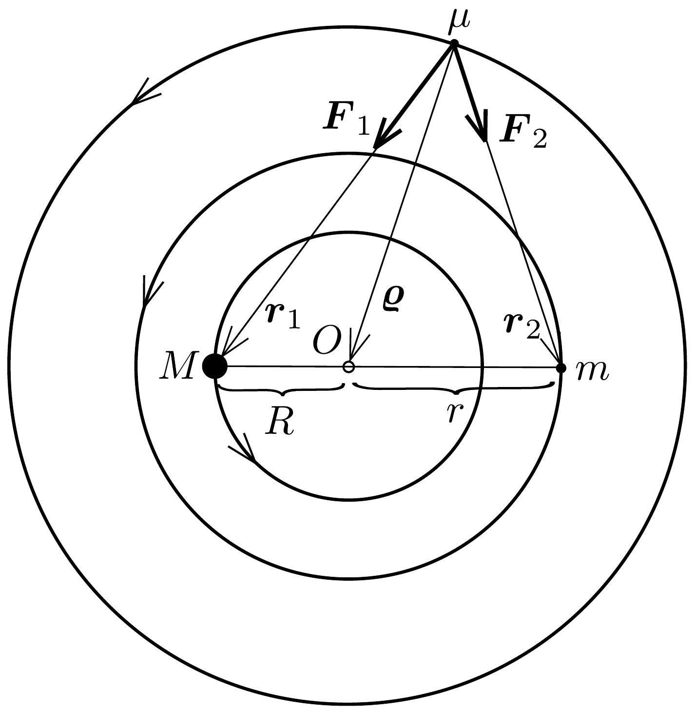
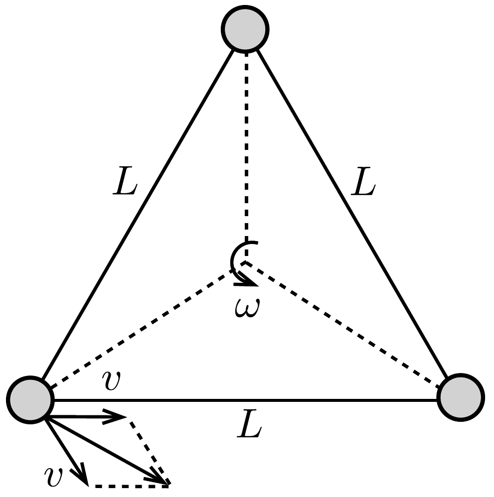

## Megoldás 1

1.1. A két tömegpont mozgásegyenlete:
\[
\begin{aligned}
m \omega_{0}^{2} r & =G \frac{m M}{(r+R)^{2}} \\
M \omega_{0}^{2} R & =G \frac{m M}{(r+R)^{2}}
\end{aligned}
\]
Bármelyik egyenletet rendezve, és felhasználva, hogy
\[
\frac{M}{r}=\frac{m}{R}=\frac{M+m}{R+r},
\]
a keresett szögsebesség
\[
\omega_{0}=\sqrt{G \frac{M+m}{(R+r)^{3}}} .
\]
1.2. A $\mu$ tömeg infinitezimálisan kicsi, ezért gravitációs ereje nem befolyásolja a másik két test mozgását.

A $\mu$ tömegú testet is a rá ható gravitációs erők eredője tartja körpályán (333. ábra):
\[
\boldsymbol{F}_{1}+\boldsymbol{F}_{2}=\mu \omega_{0}^{2} \boldsymbol{\varrho},
\]
vagyis
\[
G \frac{M \mu}{r_{1}^{3}} \boldsymbol{r}_{1}+G \frac{m \mu}{r_{2}^{3}} \boldsymbol{r}_{2}=G \mu \frac{M+m}{(R+r)^{3}} \boldsymbol{\varrho} .
\]
Másrészt a tömegközéppont definíciója szerint
\[
\boldsymbol{\varrho}=\frac{M \boldsymbol{r}_{1}+m \boldsymbol{r}_{2}}{M+m},
\]

333. ábra.
amit behelyettesítve, és egyszerúsítve
\[
\frac{M}{r_{1}^{3}} \boldsymbol{r}_{1}+\frac{m}{r_{2}^{3}} \boldsymbol{r}_{2}=\frac{M}{(R+r)^{3}} \boldsymbol{r}_{1}+\frac{m}{(R+r)^{3}} \boldsymbol{r}_{2} .
\]
Az egyenlet két oldalán $\boldsymbol{r}_{1}$ és $\boldsymbol{r}_{2}$ együtthatói külön-külön meg kell egyezzenek, ahonnan $r_{1}=r_{2}=R+r$ adódik, vagyis a három test egy szabályos háromszög csúcsain helyezkedik el. A koszinusztétel alapján
\[
\varrho^{2}=R^{2}+(R+r)^{2}-2 R(R+r) \cos 60^{\circ}=R^{2}+R r+r^{2} .
\]
Ezek szerint
- 1.2.1. $\mu$ és $M$ távolsága: $r_{1}=R+r$,
- 1.2.2. $\mu$ és $m$ távolsága: $r_{2}=R+r$,
- 1.2.3. $\mu$ és a tömegközéppont távolsága: $\varrho=\sqrt{R^{2}+R r+r^{2}}$.

1.3. Ahogy a feladat szövegénél jeleztük, a megadott útmutatás hibás, a kis test radiális irányú kitérítésére sem a perdület, sem a mechanikai energia nem marad meg. Ténylegesen még a vizsgált pont stabilitása sem valósul meg, ha $m / M>0,04$; márpedig a feladatban a $m=M$ speciális esetet kellett volna vizsgálni. Ekkor a kérdéses pont (a szabályos háromszög egyik csúcspontja) körül egyáltalán nem alakulhatnak ki harmonikus rezgések.

Ha mégis felhasználnánk a hibás útmutatást a szintén nem érvényes mechanikai energiamegmaradással, akkor az $\omega=\sqrt{7} \omega_{0} / 2$ eredményt kapnánk a versenyen elkészített hivatalos megoldás szerint. Azonban, mivel elvi hibás a feladat, ezt az egyébként hosszadalmas számolást nem mutatjuk be.
1.4. Az úrhajók egymás körül is $\omega=2 \pi / T$ ( $T=1$ év) szögsebességgel keringenek, így a relatív sebességük ( $L$ a „karok" hossza)
\[
v_{\mathrm{rel} .}=L \omega=\frac{2 \pi}{T} L \approx 996 \frac{\mathrm{~m}}{\mathrm{~s}} .
\]

Erre az eredményre juthatunk pl. a következő módon is. Az úrhajók a szabályos háromszög középpontja körül forognak $v=\frac{\sqrt{3}}{3} \omega L$ kerületi sebességgel. Ha beülünk az egyik ürhajóba, akkor másik úrhajó sebességét $2 v \cos 30^{\circ}=\omega L$-nek látjuk (334. ábra).
