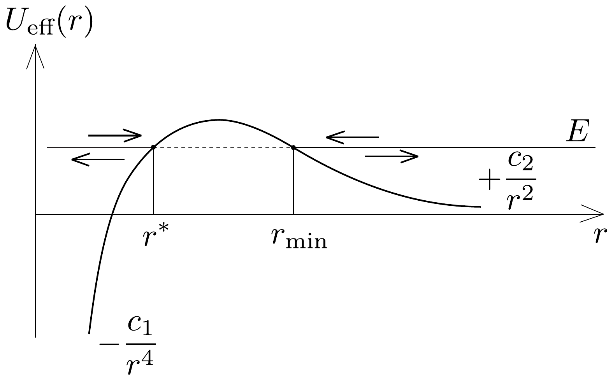

## Megoldás 3

3.1. A Coulomb-törvény alapján az elektromos térerősség a dipólus tengelyén, attól $r$ távolságra:
\[
E_{p}=\frac{q}{4 \pi \varepsilon_{0}(r-a)^{2}}-\frac{q}{4 \pi \varepsilon_{0}(r+a)^{2}}=\frac{q}{4 \pi \varepsilon_{0} r^{2}}\left[\left(1-\frac{a}{r}\right)^{-2}-\left(1+\frac{a}{r}\right)^{-2}\right] .
\]
Mivel $a / r \ll 1$, alkalmazhatjuk a kis $x$-ekre érvényes $(1+x)^{n} \approx 1+n x$ közelítést:
\[
E_{p}=\frac{q}{4 \pi \varepsilon_{0} r^{2}}\left[\left(1+2 \frac{a}{r}\right)-\left(1-2 \frac{a}{r}\right)\right]=\frac{2 q a}{2 \pi \varepsilon_{0} r^{3}}=\frac{p}{2 \pi \varepsilon_{0} r^{3}} .
\]
Vektoriálisan:
\[
\boldsymbol{E}_{p}=\frac{\boldsymbol{p}}{2 \pi \varepsilon_{0} r^{3}} .
\]
3.2. Az ion által a semleges atom helyén létrehozott térerósség a Coulombtörvény szerint
\[
\boldsymbol{E}_{\mathrm{ion}}=-\frac{Q}{4 \pi \varepsilon_{0}} \frac{\boldsymbol{r}}{r^{3}},
\]
így a neutrális atom
\[
\boldsymbol{p}=\alpha \boldsymbol{E}_{\mathrm{ion}}=-\frac{\alpha Q}{4 \pi \varepsilon_{0}} \frac{\boldsymbol{r}}{r^{3}}
\]
nagyságú és irányú elektromos dipólmomentumra tesz szert. A 3.1. alkérdés végeredményét felhasználva ez a dipólmomentum az ion helyén
\[
\boldsymbol{E}_{p}=\frac{1}{2 \pi \varepsilon_{0} r^{3}}\left(-\frac{\alpha Q}{4 \pi \varepsilon_{0}} \frac{\boldsymbol{r}}{r^{3}}\right)=-\frac{\alpha Q}{8 \pi^{2} \varepsilon_{0}^{2} r^{6}} \boldsymbol{r}
\]
térerősséget hoz létre, így az ionra ható erő:
\[
\boldsymbol{F}=Q \boldsymbol{E}_{p}=-\frac{\alpha Q^{2}}{8 \pi^{2} \varepsilon_{0}^{2} r^{6}} \boldsymbol{r} .
\]
A kifejezésből leolvasható, hogy az eró $Q$ előjelétől függetlenül mindig a semleges atom felé mutat, vagyis vonzó jellegú.
3.3. Az egymástól $r$ távolságra lévó ion és atom kölcsönhatási energiája egy előjeltől eltekintve azzal a munkával egyezik meg, amennyit a két részecske „végtelen messzire" történő eltávolítása során végzünk:
\[
U(r)=-\int_{r}^{\infty} F\left(r^{\prime}\right) \mathrm{d} r^{\prime}=-\frac{\alpha Q^{2}}{8 \pi^{2} \varepsilon_{0}^{2}} \int_{r}^{\infty} \frac{1}{r^{\prime 5}} \mathrm{~d} r^{\prime}=\frac{\alpha Q^{2}}{32 \pi^{2} \varepsilon_{0}^{2}}\left[\frac{1}{r^{\prime 4}}\right]_{r}^{\infty}=-\frac{\alpha Q^{2}}{32 \pi^{2} \varepsilon_{0}^{2} r^{4}} .
\]
3.4. A centrális erőtér miatt a mozgó ion perdülete az atom helyére vonatkoztatva megmarad. Amikor az ion legközelebb kerül az atomhoz, a sebességének nagysága maximális, iránya pedig meróleges a helyvektorára, így $m v_{0} b=$ $m v_{\text {max }} r_{\text {min }}$. A mechanikai energiamegmaradás szerint
\[
\frac{1}{2} m v_{0}^{2}=\frac{1}{2} m v_{\max }^{2}-\frac{\alpha Q^{2}}{32 \pi^{2} \varepsilon_{0}^{2} r_{\min }^{4}} .
\]
E két egyenletből a minimális távolságra az
\[
\left(\frac{r_{\min }}{b}\right)^{4}-\left(\frac{r_{\min }}{b}\right)^{2}+\frac{\alpha Q^{2}}{16 \pi^{2} \varepsilon_{0}^{2} m v_{0}^{2} b^{4}}=0,
\]
egyenletre jutunk, amely $r_{\text {min }}^{2}$-ben másodfokú. Az egyenlet megoldásai:
\[
r_{\min }=\frac{b}{\sqrt{2}} \sqrt{1 \pm \sqrt{1-\frac{\alpha Q^{2}}{4 \pi^{2} \varepsilon_{0}^{2} m v_{0}^{2} b^{4}}}} .
\]
Ha $Q=0$, akkor az ion egyenes pályán, $b$ távolságra halad el a semleges atom mellett, így a két gyök közül a nagyobbat kell megtartanunk. Az ion és az atom közötti legkisebb távolság tehát
\[
r_{\min }=\frac{b}{\sqrt{2}} \sqrt{1+\sqrt{1-\frac{\alpha Q^{2}}{4 \pi^{2} \varepsilon_{0}^{2} m v_{0}^{2} b^{4}}}} .
\]
3.5. Ha a $b$ impakt paraméter elég nagy, az előző kérdésben kiszámított $r_{\min }$ távolságra közelíti meg az ion az atomot. A $b$ paraméter csökkentésével azonban az $r_{\text {min }}$-re kapott kifejezésben a négyzetgyökjel alatt negatív érték adódik, azaz nincs minimális távolság az ion és az atom között: az ion spirális pályán a semleges atomba csapódik. Ez akkor következik be, ha
\[
b<b_{0}=\left(\frac{\alpha Q^{2}}{4 \pi^{2} \varepsilon_{0}^{2} m v_{0}^{2}}\right)^{\frac{1}{4}},
\]
így az ion befogásának hatáskeresztmetszete
\[
A=\pi b_{0}^{2}=\pi\left(\frac{\alpha Q^{2}}{4 \pi^{2} \varepsilon_{0}^{2} m v_{0}^{2}}\right)^{\frac{1}{2}}=\frac{|Q|}{2 \varepsilon_{0} v_{0}} \sqrt{\frac{\alpha}{m}} .
\]

Megjegyzés. A 3.4. és 3.5. alkérdésekben tárgyaltak grafikusan is szemléltethetők az ún. effektív potenciál segítségével. Ha az energiamegmaradást kifejező
\[
\frac{1}{2} m\left(v_{r}^{2}+r^{2} \omega^{2}\right)+U(r)=E\left(=\frac{1}{2} m v_{0}^{2}\right)
\]
egyenletből a szögsebességet kiküszöböljük a perdületmegmaradás $m r^{2} \omega=J$ (ahol $J=$ $=m b v_{0}$ ) törvényének felhasználásával, akkor a sugárirányú (radiális) mozgásra kapunk egyenletet:
\[
\frac{1}{2} m v_{r}^{2}+\left(U(r)+\frac{J^{2}}{2 m r^{2}}\right)=E
\]
A zárójelben álló kifejezést effektív potenciálnak szokták nevezni. $U_{\text {eff }}(r)$ a két részecske valódi (vonzó jellegữ) kölcsönhatási energiája mellett tartalmaz egy - a perdület nagyságától is függő - taszító („centrifugális”) potenciális energiát is.

Az ion-atom távolság időbeli változása éppen úgy zajlik le, mint egy tömegpont egydimenziós mozgása $U_{\text {eff }}(r)$ potenciállal megadott erőtérben. (Kicsit eróltetett hasonlattal: ahogy egy golflabda gurul az $U_{\text {eff }}(r)$ függvénnyel megadott domborzati viszonyok között.)

Jelen esetben az effektív potenciál $-\frac{c_{1}}{r^{4}}+\frac{c_{2}}{r^{2}}$ alakú, ahol $c_{1}$ és $c_{2}$ a feladatban szereplő paraméterekkel kifejezhető́ pozitív állandók (335. ábra). A nagy távolságból érkező, $E$ energiájú ion radiális sebessége ott válik nullává, ahol $U_{\text {eff }}(r)=E$. Ez a feltétel a korábban kiszámított $r=r_{\text {min }}$ értéknél és egy ennél kisebb $r=r^{*}$-nál is fennáll. Az ion (ha csak a radiális mozgását nézzük) nyilván $r=r_{\min }$ távolságnál „fordul vissza”, a potenciálhegy $r^{*}<r<r_{\text {min }}$ tartományába egyáltalán el sem jut. (Érdekes, hogy a kvantumelméletben nem ez a helyzet: a hullámként viselkedő ion „át tud bújni” a potenciálhegy alatt, és még akkor is eljut az atomig, amikor ezt a klasszikus fizika szerint nem tehetné meg. Ez a furcsa jelenség az ún. alagúteffektus.)

Az $r=r^{*}$-os fordulópontnak is van fizikai jelentése: ha az ion nem végtelen messziről, hanem az atom közeléből, az atomtól távolodva indulna, akkor nem tudna tetszőleges messze eljutni, hanem $r=r^{*}$-nál a radiális mozgás visszafordulna (tehát ez az érték lenne az atom és az ion közötti maximális távolság.)

Ha a $b$ paraméter (és az ezzel arányos perdület) nem elég nagy, akkor az effektív potenciál maximumának értéke az $E$ energia alá kerül. Ilyenkor a messziről érkező részecske - már a klasszikus fizika törvényei szerint is - beleesik az atomba.

\section*{
