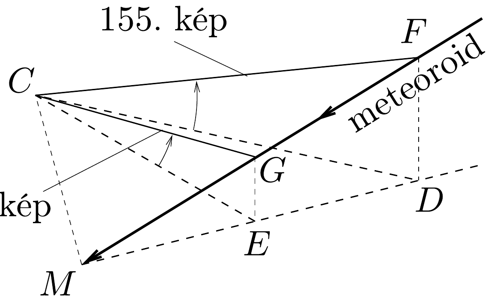
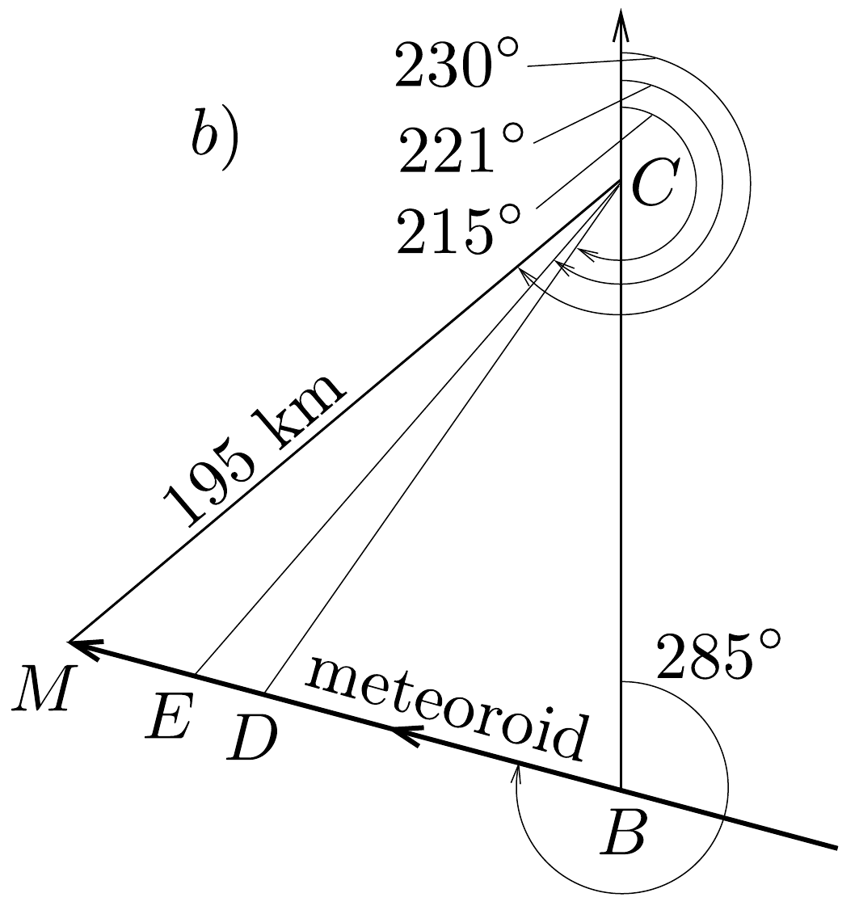

## Megoldás 1

1.1. A meteorit útját a 351. ábra mutatja. A $C$ pont az észleló biztonsági kamera helye, $M$ a becsapódási pont, $F$ a 155. képkockán, $G$ pedig a 161. képkockán észlelt pozíció, $D$ és $E$ ezeknek a pontoknak a Föld felszínére vett vetülete. A $C B$ egyenes észak-déli irányban áll, az északi irányt a nyíl jelzi.
161.

351. ábra.

A megadott szögeket a 351 b) vetületi rajzon ívek jelölik; $M B C \varangle=75^{\circ}$, $B C M \varangle=50^{\circ}$, melyekkel $B M C \varangle=55^{\circ}$. A $C E M$ háromszögben $E C M \varangle=9^{\circ}$
és így $M E C \varangle=116^{\circ}$. Alkalmazva a szinusztételt:
\[
\frac{195 \mathrm{~km}}{\sin 116^{\circ}}=\frac{C E}{\sin 55^{\circ}} \rightarrow C E=177,7 \mathrm{~km} .
\]
Hasonló módon a $C D M$ háromszögben $D C M \varangle=15^{\circ}$ és $M D C \varangle=110^{\circ}$, tehát
\[
\frac{195 \mathrm{~km}}{\sin 110^{\circ}}=\frac{C D}{\sin 55^{\circ}} \rightarrow C D=170,0 \mathrm{~km} .
\]
Az $E D C$ háromszögben pedig $D C E \varangle=6^{\circ}, C E D \varangle=64^{\circ}$, azaz
\[
\frac{C D}{\sin 64^{\circ}}=\frac{D E}{\sin 6^{\circ}} \rightarrow D E=19,77 \mathrm{~km} .
\]

A 351. a) távlati rajzon az ívvel jelölt, ismert magassági szögek segítségével az $F$ és $G$ pont magassága megkapható:
\[
D F=C D \cdot \operatorname{tg} 19,2^{\circ}=59,20 \mathrm{~km}, \quad \mathrm{EG}=\mathrm{CE} \cdot \operatorname{tg} 14,7^{\circ}=46,62 \mathrm{~km} .
\]

Ezután a 155. és a 161. képkocka között megtett $F G$ út a Pitagorasz-tételből adódik:
\[
F G=\sqrt{D E^{2}+(D F-E G)^{2}}=23,43 \mathrm{~km},
\]
így a képkockák idejének ismeretében a keresett sebesség:
\[
v=\frac{F G}{2,28 \mathrm{~s}-1,46 \mathrm{~s}}=28,6 \frac{\mathrm{~km}}{\mathrm{~s}} .
\]
1.2.1 A légkörben lassuló meteoroidra sebességtől függő, változó eró hat, így mozgását az
\[
m_{\mathrm{M}} \frac{\mathrm{~d} v}{\mathrm{~d} t}=-\lambda v^{2}, \quad \lambda=k \varrho_{\mathrm{atm}} \pi R_{\mathrm{M}}^{2}
\]
differenciálegyenlet írja le, mely a változók szétválasztásának módszerével egzaktul megoldható:
\[
\frac{\mathrm{d} v}{v^{2}}=-\frac{\lambda}{m_{\mathrm{M}}} \mathrm{~d} t, \quad \int_{v_{\mathrm{M}}}^{0,9 v_{\mathrm{M}}} \frac{\mathrm{~d} v}{v^{2}}=-\int_{0}^{t_{1}} \frac{\lambda}{m_{\mathrm{M}}} \mathrm{~d} t, \quad-\left(\frac{1}{0,9}-1\right) \frac{1}{v_{\mathrm{M}}}=-\frac{\lambda}{m_{\mathrm{M}}} t_{1} .
\]
Így a keresett idő:
\[
t_{1}=\frac{m_{\mathrm{M}}}{k \varrho_{\mathrm{atm}} \pi R_{\mathrm{M}}^{2}}\left(\frac{1}{0,9}-1\right) \frac{1}{v_{\mathrm{M}}}=0,88 \mathrm{~s} .
\]

Differenciálegyenlet nélkül is adható egy igen jó közelítő megoldás. Miközben a sebesség $v_{\mathrm{M}}$-ról $0,9 v_{\mathrm{M}}$-re csökken, a közegellenállási erő nem nagyon változik, átlagos értékét vehetjük $F_{\text {átl }}=-\lambda\left(0,95 v_{\mathrm{M}}\right)^{2}$-nek. Ebből a mozgás átlagos lassulása $a_{\text {átl }}=\frac{F_{\text {átl }}}{m_{\mathrm{M}}}$, ahonnan a keresett idő:
\[
t_{1}=\frac{-0,1 v_{\mathrm{M}}}{a_{\text {átl }}}=\frac{m_{\mathrm{M}}}{k \varrho_{\text {atm }} \pi R_{\mathrm{M}}^{2}} \frac{0,1}{0,95^{2}} \frac{1}{v_{\mathrm{M}}}=0,87 \mathrm{~s} .
\]
1.2.2. A meteoroid kinetikus energiájának és a teljes megolvasztáshoz szükséges energiának hányadosa az ismert összefüggések alapján:
\[
\frac{E_{\mathrm{kin}}}{E_{\mathrm{olv}}}=\frac{\frac{1}{2} m_{\mathrm{M}} v_{\mathrm{M}}^{2}}{c_{\mathrm{ko}} m_{\mathrm{kö}}\left(T_{\mathrm{kö}}-T_{0}\right)+m_{\mathrm{kö}} L_{\mathrm{kö}}}=2,1 \cdot 10^{2} \gg 1 .
\]
1.3.1.-1.3.2. Az $x \approx t^{\alpha} \varrho_{\text {kǒo }}^{\beta} c_{\text {kó }}^{\gamma} k_{\text {kó }}^{\delta}$ összefüggésben csak a dimenziókat megtartva az
\[
1 \mathrm{~m}=(1 \mathrm{~s})^{\alpha} \cdot\left(1 \frac{\mathrm{~kg}}{\mathrm{~m}^{3}}\right)^{\beta} \cdot\left(1 \frac{\mathrm{~m}^{2}}{\mathrm{~s}^{2} \mathrm{~K}}\right)^{\gamma} \cdot\left(1 \frac{\mathrm{~kg} \mathrm{~m}}{\mathrm{~s}^{3} \mathrm{~K}}\right)^{\delta}
\]
egyenletet kapjuk, ami a keresett kitevőkre a
\[
\beta+\delta=0, \quad-3 \beta+2 \gamma+\delta=1, \quad \alpha-2 \gamma-3 \delta=0, \quad-\gamma-\delta=0
\]
lineáris egyenletrendszert adja. Ennek megoldása
\[
\alpha=\delta=\frac{1}{2}, \quad \beta=\gamma=-\frac{1}{2}, \quad \text { tehát } \quad x \approx \sqrt{\frac{k_{\mathrm{kö}} t}{\varrho_{\mathrm{ko}} c_{\mathrm{kö}}}} .
\]
Beírva az adatokat:
\[
x(5 \mathrm{~s})=1,6 \mathrm{~mm} \quad \text { és } \quad \frac{x}{R_{\mathrm{M}}}=\frac{1,6 \mathrm{~mm}}{130 \mathrm{~mm}}=0,012 .
\]
1.4.1. Mivel a ${ }_{37}^{87} \mathrm{Rb}$ izotóp ${ }_{38}^{87} \mathrm{Sr}$-ra való bomlásakor a tömegszám nem változik, a rendszám eggyel nő, negatív béta-bomlásról van szó, melynek egyenlete:
\[
{ }_{37}^{87} \mathrm{Rb} \rightarrow{ }_{38}^{87} \mathrm{Sr}+\mathrm{e}^{-}+\bar{\nu}_{\mathrm{e}} .
\]
1.4.2. A ${ }^{87} \mathrm{Rb}$ izotópok száma a bomlás miatt exponenciálisan csökken az idő függvényében, ugyanakkor a ${ }^{87} \mathrm{Sr}$ izotópok száma az elbomlott ${ }^{87} \mathrm{Rb}$ izotópok számával nő, tehát:
\[
\begin{gathered}
N_{87 \mathrm{Rb}}(t)=N_{87 \mathrm{Rb}}(0) \mathrm{e}^{-\lambda t}, \\
N_{87 \mathrm{Sr}}(t)=N_{87 \mathrm{Sr}}(0)+\left[\left(N_{87 \mathrm{Rb}}(0)-N_{87 \mathrm{Rb}}(t)\right]=N_{87 \mathrm{Sr}}(0)+\left(\mathrm{e}^{\lambda t}-1\right) N_{87 \mathrm{Rb}}(t) .\right.
\end{gathered}
\]
A második egyenletet elosztva a ${ }^{86} \mathrm{Sr}$ izotópok számával, megkapjuk az egyidejúségi egyenes egyenletét
\[
\frac{N_{87 \mathrm{Sr}}(t)}{N_{86 \mathrm{Sr}}}=\frac{N_{87 \mathrm{Sr}}(0)}{N_{86 \mathrm{Sr}}}+\left(e^{\lambda t}-1\right) \frac{N_{87 \mathrm{Rb}}(t)}{N_{86 \mathrm{Sr}}},
\]
melynek meredeksége valóban $e^{\lambda t}-1$.
1.4.3. A grafikonról leolvasható, hogy a meredekség
\[
a=\mathrm{e}^{\lambda t}-1=\frac{0,712-0,700}{0,25}=0,050 .
\]

A felezési idő és a bomlási állandó kapcsolata: $T_{1 / 2}=\frac{\ln 2}{\lambda}=4,9 \cdot 10^{10}$ év. Így a meteorit életkora:
\[
\tau_{\mathrm{M}}=\frac{\ln (1+a)}{\lambda}=\frac{\ln (1+a)}{\ln 2} T_{1 / 2}=3,4 \cdot 10^{9} \text { év. }
\]
1.5. Az Encke üstökös pályájának fél nagytengelye
\[
a_{\text {Encke }}=\frac{1}{2}\left(a_{\min }+a_{\max }\right)=3,33 \cdot 10^{11} \mathrm{~m} .
\]
Kepler III. törvényét alkalmazva a Földre és az Encke üstökösre azt kapjuk, hogy:
\[
\frac{a_{\text {Encke }}^{3}}{T_{\text {Encke }}^{2}}=\frac{a_{\text {NF }}^{3}}{T_{\text {Föld }}^{2}}, \quad \text { tehát } \quad T_{\text {Encke }}=\sqrt{\frac{a_{\text {Encke }}^{3}}{a_{\text {NF }}^{3}}} \cdot T_{\text {Föld }}=3,30 \text { év }=1,04 \cdot 10^{8} \mathrm{~s} .
\]
1.6.1. A Föld tehetetlenségi nyomatékát (a forgástengely irányában) elhanyagolhatóan befolyásolja az aszteroida becsapódása, hiszen a becsapódás helye a forgástengelyre esik. Tehát a Föld impulzusmomentumának és a forgástengelyének iránya az ütközés előtt és után is egybeesik. Ezért a forgástengely szögeltérülése helyett a Föld impulzusmomentum-vektorának maximális szögeltérülését határozzuk meg az impulzusmomentum megmaradását felhasználva.

A Föld saját impulzusmomentuma a megadott adatok alapján ismert:
\[
N_{\mathrm{F}}=\Theta_{\mathrm{F}} \omega_{\mathrm{F}}=0,83 \frac{2}{5} m_{\mathrm{F}} R_{\mathrm{F}}^{2} \frac{2 \pi}{24 \mathrm{~h}}=5,87 \cdot 10^{33} \frac{\mathrm{~kg} \mathrm{~m}^{2}}{\mathrm{~s}} .
\]
Az Északi-sarkra becsapódó aszteroidának a Föld középpontjára vonatkoztatott impulzusmomentuma akkor maximális, ha az aszteroida a Föld forgástengelyére merőlegesen mozog, tehát a felszínre érintőlegesen csapódik be. Ekkor az aszteroida impulzusmomentuma: $N_{\text {aszt }}=m_{\text {aszt }} v_{\text {aszt }} R_{\mathrm{F}}=2,51 \cdot 10^{26} \frac{\mathrm{~kg} \mathrm{~m}^{2}}{\mathrm{~s}}$. Az impulzusmomentum vektora merőleges a Föld forgástengelyére. Ütközéskor a Föld impulzusmomentuma az aszteroida impulzusmomentumával változik, ezért a Föld impulzusmomentum-vektorának szögeltérülése akkor a legnagyobb, ha az aszteroida impulzusmomentuma merőleges a Földére. Érintőleges becsapódáskor ez a feltétel is teljesül. Így az impulzusmomentum (és egyben a forgástengely) maximális szögeltérülése:
\[
\Delta \varphi \approx \operatorname{tg} \Delta \phi=\frac{N_{\mathrm{aszt}}}{N_{\mathrm{F}}}=4,27 \cdot 10^{-8} \mathrm{rad} .
\]

Megjegyezzük, hogy a forgástengelynek a Föld felszínével való metszéspontja $R_{\mathrm{F}} \Delta \varphi=27$ cm-rel mozdul el. Azt is érdemes látni, hogy ez az elmozdulás merőleges az aszteroida becsapódási sebességére, hiszen az aszteroida impulzusmomentumának irányába esik.
1.6.2. Az Egyenlítőre való függőleges becsapódáskor nem változik a Föld impulzusmomentuma, hiszen az aszteroida impulzusmomentuma a Föld középpont-
jára vonatkoztatva zérus. Azonban $\Delta \Theta_{\mathrm{F}}=m_{\text {aszt }} R_{\mathrm{F}}^{2}$-tel megnő a Föld tehetetlenségi nyomatéka, és ez okozza a szögsebesség lassulását:
\[
\Theta_{F} \omega_{F}=\left(\Theta_{F}+\Delta \Theta_{F}\right)\left(\omega_{F}+\Delta \omega_{F}\right), \quad \Delta \omega_{F} \approx-\frac{\Delta \Theta_{F} \omega_{F}}{\Theta_{F}}=-5,76 \cdot 10^{-14} \frac{1}{s} .
\]
Így a Föld forgási periódusának növekedése:
\[
\Delta \tau_{\text {függ. }}=2 \pi\left(\frac{1}{\omega_{\mathrm{F}}+\Delta \omega_{\mathrm{F}}}-\frac{1}{\omega_{\mathrm{F}}}\right) \approx-2 \pi \frac{\Delta \omega_{\mathrm{F}}}{\omega_{\mathrm{F}}^{2}}=6,84 \cdot 10^{-5} \mathrm{~s} .
\]
1.6.3. Ebben az esetben az aszteroida és a Föld impulzusmomentuma egy egyenesbe esik, és becsapódáskor a Föld impulzusmomentuma és tehetetlenségi nyomatéka is megváltozik. A teljes rendszer impulzusmomentuma megmarad, tehát
\[
\begin{gathered}
N_{\mathrm{F}} \pm N_{\mathrm{aszt}}=\left(\Theta_{\mathrm{F}}+\Delta \Theta_{\mathrm{F}}\right)\left(\omega_{\mathrm{F}}+\Delta \omega_{\mathrm{F}}\right) \\
\Delta \omega_{\mathrm{F}} \approx \frac{-\Delta \Theta_{\mathrm{F}} \omega_{\mathrm{F}} \pm N_{\mathrm{aszt}}}{\Theta_{\mathrm{F}}} \approx \pm \frac{N_{\mathrm{aszt}}}{\Theta_{\mathrm{F}}}= \pm 3,11 \cdot 10^{-12} \frac{1}{\mathrm{~s}} .
\end{gathered}
\]
Felhasználtuk, hogy $\frac{\Delta \Theta_{\mathrm{F}} \omega_{\mathrm{F}}}{N_{\text {aszt }}} \approx 5 \cdot 10^{-16} \ll 1$. A ± előjel azt veszi számításba, hogy az aszteroida impulzusmomentuma azonos vagy ellentétes irányú a Földével. Innen a Föld forgási periódusának megváltozása:
\[
\Delta \tau_{\text {érintő }} \approx-2 \pi \frac{\Delta \omega_{\mathrm{F}}}{\omega_{\mathrm{F}}^{2}}=\mp 3,62 \cdot 10^{-3} \mathrm{~s} .
\]
1.7. A maximális becsapódási sebességet három lépésben határozzuk meg.

Az energiamegmaradás törvénye szerint a Nap gravitációs terében a Naptól a Föld pályasugarával megegyező távolságban az $m$ tömegú test maximális $v_{1}$ sebességére (a test parabolapályán mozog)
\[
0=\frac{1}{2} m v_{1}^{2}-G \frac{m m_{\mathrm{N}}}{a_{\mathrm{NF}}} \text { teljesül, ahonnan } v_{1}=\sqrt{\frac{2 G m_{\mathrm{N}}}{a_{\mathrm{N}-\mathrm{F}}}}=42,1 \frac{\mathrm{~km}}{\mathrm{~s}} .
\]

Szerencsés esetben a test éppen szembe halad a pályáján $v_{\mathrm{F}}=\frac{2 \pi a_{\mathrm{NF}}}{1 \text { év }}=$ $=29,8 \frac{\mathrm{~km}}{\mathrm{~s}}$ sebességgel keringő Földdel, tehát a Föld vonatkoztatási rendszerében a sebessége $v_{1}+v_{\mathrm{F}}$.

Most a Föld vonatkoztatási rendszerében írhatjuk föl az energiamegmaradás törvényét:
\[
\frac{1}{2} m\left(v_{1}+v_{\mathrm{F}}\right)^{2}=\frac{1}{2} m\left(v_{\text {becs. }}^{\max }\right)^{2}-G \frac{m m_{\mathrm{F}}}{R_{\mathrm{F}}} .
\]
A Nap hatását elhanyagolhatjuk, hiszen a Föld közelében a Nap gravitációs potenciálja közel állandó, és a feladat szövege szerint kezdetben a Föld gravitációs hatása elhanyagolható. Innen a becsapódás maximális sebessége:
\[
v_{\text {becs. }}^{\max }=\sqrt{\left(v_{1}+v_{\mathrm{F}}\right)^{2}+\frac{2 G m_{\mathrm{F}}}{R_{\mathrm{F}}}}=72,8 \frac{\mathrm{~km}}{\mathrm{~s}} .
\]
