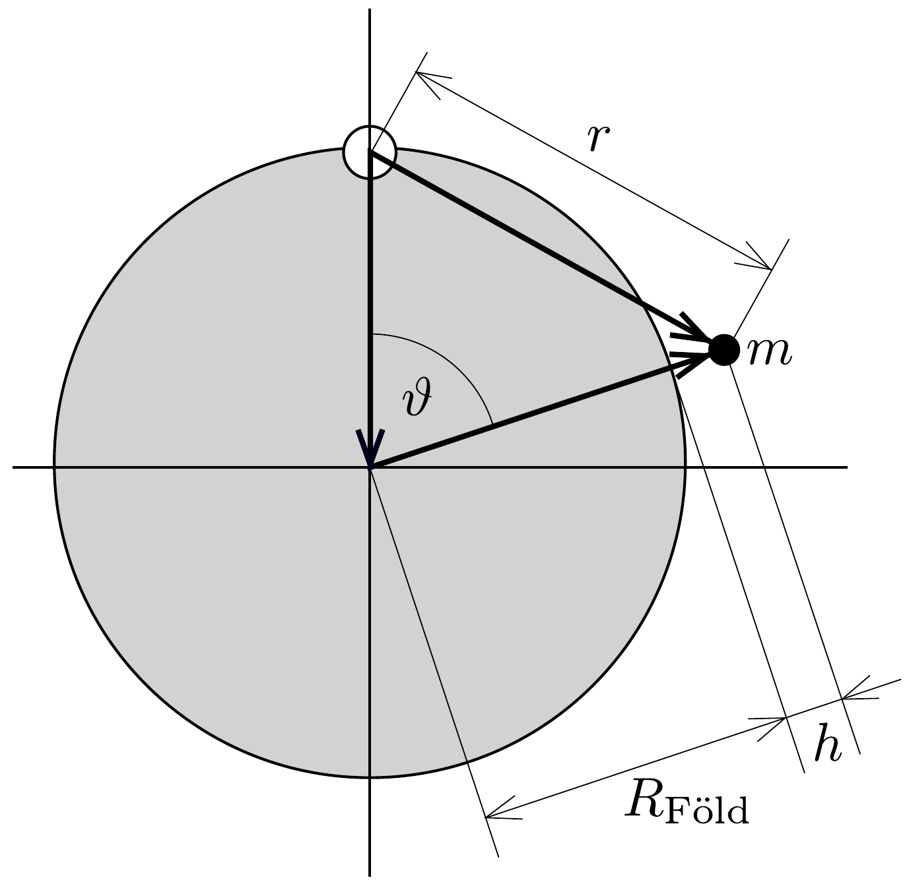
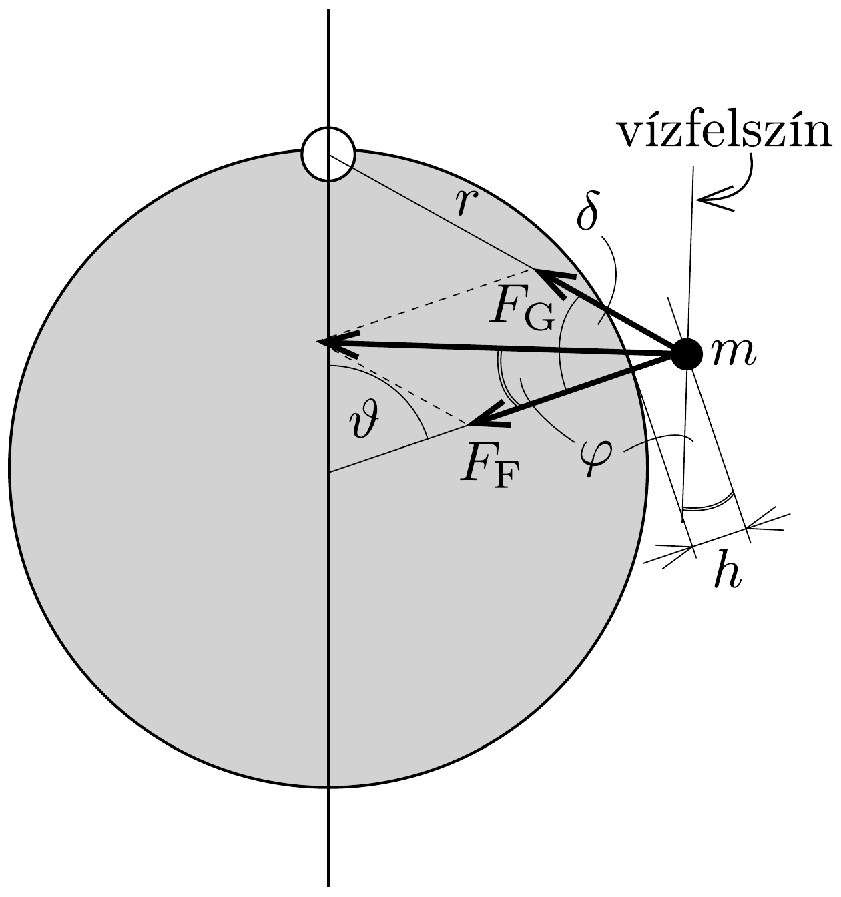

## Megoldás 3

3.1. A jégtakaró belsejében a hidrosztatikai nyomás, mint a jégválasztó vonaltól mért $x$ távolság és a földfelszíntől (tengerszinttől) mért $z$ magasság függvénye:
\[
p(x, z)=\varrho_{\text {jég }} g(H(x)-z) .
\]
3.2.1. Az $y-z$ síktól („jégválasztótól”) $x$ távolságra lévó függőleges oldalfalra ható erő kifejezhető:
\[
F(x)=\Delta y \int_{0}^{H(x)} \varrho_{\text {jég }} g(H(x)-z) \mathrm{d} z=\frac{1}{2} \Delta y \varrho_{\text {jég }} g H(x)^{2} .
\]
A függőleges oldalfalú jégrétegre ható két vízszintes erő különbsége:
\[
\Delta F=F(x)-F(x+\Delta x)=-\frac{\mathrm{d} F}{\mathrm{~d} x} \Delta x=-\Delta y \varrho_{\text {jég }} g H(x) \frac{\mathrm{d} H}{\mathrm{~d} x} \Delta x .
\]
Használjuk fel, hogy $\Delta F=S_{\mathrm{b}} \Delta x \Delta y$. Így adódik $S_{\mathrm{b}}$ értékére:
\[
S_{b}=\frac{\Delta F}{\Delta x \Delta y}=-\varrho_{\text {jég }} g H(x) \frac{\mathrm{d} H}{\mathrm{~d} x} .
\]
Ezzel igazoltuk, hogy $S_{\mathrm{b}}=k H(x) \mathrm{d} H / \mathrm{d} x$, ahol az arányossági tényező $k=-\varrho_{\text {jég }} g$.
3.2.2. Megkapjuk a jégsapka $H(x)$ magasságprofilját, ha megoldjuk a következő differenciálegyenletet:
\[
S_{\mathrm{b}}=-\varrho_{\text {jég }} g H(x) \frac{\mathrm{d} H}{\mathrm{~d} x}, \quad \text { ebből } \quad H \mathrm{~d} H=-\frac{S_{\mathrm{b}}}{\varrho_{\text {jég }} g} \mathrm{~d} x .
\]
Integráljuk mindkét oldalt:
\[
H(x)^{2}=-\frac{2 S_{\mathrm{b}}}{\varrho_{\text {jég }} g} x+C .
\]
Használjuk fel, hogy $H$ értéke az $x=L$ helyen 0 . Így az integrációs állandóra adódik:
\[
C=\frac{2 S_{\mathrm{b}}}{\varrho_{\mathrm{jég}} g} L .
\]

Most már a $H(x)$ magasságprofil megadható:
\[
H(x)=\sqrt{\frac{2 S_{\mathrm{b}}}{\varrho_{\text {jég }} g}(L-x)} .
\]
Megadhatjuk $H$ legnagyobb értékét, melyet az $x=0$ helyen vesz fel a függvény:
\[
H_{\mathrm{m}}=\sqrt{\frac{2 S_{\mathrm{b}}}{\varrho_{\text {jég }} g} L} .
\]
3.2.3. Grönland modelljében a jégsapka alapja egy téglalap, amelynek területe $A=10 L^{2}$. A jégsapka térfogatát úgy fogjuk megkapni, ha a 3.2.2. feladatrészben megismert magasságprofilt erre a területre integráljuk.
\[
\begin{aligned}
V_{\text {jég }} & =2 \cdot 5 L \int_{0}^{L} H(x) \mathrm{d} x=10 L \int_{0}^{L}\left(\frac{2 S_{\mathrm{b}}}{\varrho_{\text {jég }} g}\right)^{\frac{1}{2}} \sqrt{L-x} \mathrm{~d} x= \\
& =10 L H_{\mathrm{m}} \int_{0}^{L} \sqrt{1-\frac{x}{L}} \mathrm{~d} x
\end{aligned}
\]
Áttérve az $u=1-x / L$ integrálási változóra:
\[
V_{\text {jég }}=10 L^{2} H_{\mathrm{m}} \int_{0}^{1} \sqrt{u} \mathrm{~d} u=10 L^{2} H_{\mathrm{m}} \cdot \frac{2}{3} .
\]
Felhasználva, hogy $H_{\mathrm{m}} \sim L^{1 / 2}$, illetve az $L \sim A^{1 / 2}$ arányosságot azt kapjuk, hogy $V_{\text {jég }} \sim A^{5 / 4}$. Tehát a keresett kitevő $\gamma=5 / 4$.
3.3. A szimmetria miatt a jégválasztónál a jég $x$ irányú sebessége 0 . Tekintsük a jégsapka $x=0$ és $x>0$ között elhelyezkedő, $\Delta y$ szélességú darabját. Erre a darabra a hóesések miatt egységnyi idő alatt $V_{\mathrm{be}}=c x \Delta y$ térfogatú jég rakódik. Eközben a kiszemelt jégdarab $x>0$-nál elhelyezkedő, $H_{\mathrm{m}} \Delta y$ területű, függőleges keresztmetszetén egységnyi idő alatt $V_{\mathrm{ki}}=v_{x}(x) H_{\mathrm{m}} \Delta y$ térfogatú jég áramlik ki. Mivel a jégsapka alakja időben állandósult állapotban található, $V_{\mathrm{be}}=V_{\mathrm{ki}}$, ahonnan a
\[
v_{x}(x)=\frac{c x}{H_{\mathrm{m}}}
\]
eredményt kapjuk.
3.4. A jég áramlási sebességének komponenseire vonatkozó $\mathrm{d} v_{x} / \mathrm{d} x+\mathrm{d} v_{z} / \mathrm{d} z=$ $=0$ egyenletből, valamint a 3.3. feladatrész eredményét használva:
\[
\frac{\mathrm{d} v_{z}}{\mathrm{~d} z}=-\frac{c}{H_{\mathrm{m}}} .
\]
Integrálás után:
\[
v_{z}(z)=-\frac{c z}{H_{\mathrm{m}}}+C
\]
ahol a $C$ integrálási változó a $v_{z}(z=0)=0$ feltétel miatt zérus. A jégdarabkák függőleges sebességkomponense tehát:
\[
v_{z}(z)=-\frac{c z}{H_{\mathrm{m}}} .
\]
3.5. A jégdarabka sebességének $x$ és $z$ irányú komponensére kapott kifejezések differenciálegyenleteket szolgáltatnak az $x(t), z(t)$ koordinátákra:
\[
\frac{\mathrm{d} x}{\mathrm{~d} t}=\frac{c}{H_{\mathrm{m}}} x, \quad \frac{\mathrm{~d} z}{\mathrm{~d} t}=-\frac{c}{H_{\mathrm{m}}} z .
\]
A $z(0)=H_{\mathrm{m}}, x(0)=x_{i}$ kezdeti feltételeket figyelembe véve a következő két függvény adódik eredményül:
\[
x(t)=x_{i} \mathrm{e}^{\frac{c}{H_{\mathrm{m}}} t}, \quad z(t)=H_{\mathrm{m}} \mathrm{e}^{-\frac{c}{H_{\mathrm{m}}} t} .
\]
A két függvényt összeszorozva az idő kiküszöbölhető: $x \cdot z=x_{i} H_{\mathrm{m}}$, amiből látható, hogy a jégdarabka pályája egy
\[
x=\frac{x_{i} H_{\mathrm{m}}}{z}
\]
egyenletú hiperbola.
3.6. A jégválasztónál $(x=0)$ az áramlás csak függőleges irányú, és a $z(t)$ függvényt a 3.5. feladatrészben már felírtuk. Képezzük ennek inverzét:
\[
\tau(z)=\frac{H_{\mathrm{m}}}{c} \ln \left(\frac{H_{\mathrm{m}}}{z}\right) .
\]
3.7.1. A $c_{\mathrm{ig}}$ jégképződési sebesség meghatározásához szükségünk van a következő adatokra: $T_{1}=11700$ év; $z_{1}=3060 \mathrm{~m}-1492 \mathrm{~m}=1568 \mathrm{~m} ; H_{\mathrm{m}}=3060 \mathrm{~m}$. A 3.6. feladatrészben levezetett függvényt használva:
\[
c_{\mathrm{ig}}=\frac{H_{\mathrm{m}}}{T_{1}} \ln \left(\frac{H_{\mathrm{m}}}{z_{1}}\right)=0,175 \mathrm{~m} / \text { év. }
\]

A jégkorszak 120 ezer évvel ezelőtti kezdete a feladat szövege szerint 3040 m mélységnek feleltethető meg. Használjuk a jégfolyam áramlási sebességének függőleges komponensére a 3.4. feladatrészben kapott összefüggést:
\[
\frac{\mathrm{d} z}{\mathrm{~d} t}=-\frac{c}{H_{\mathrm{m}}} z .
\]
Átrendezve, majd mindkét oldalt integrálva 3040 m mélységtől a felszínig:
\[
\begin{aligned}
H_{\mathrm{m}}\left(-\frac{1}{z}\right) \mathrm{d} z & =c \mathrm{~d} t \\
H_{\mathrm{m}} \ln \left(\frac{H_{\mathrm{m}}}{H_{\mathrm{m}}-3040 \mathrm{~m}}\right) & =\int_{11700 \text { év }}^{120000 \text { év }} c_{\mathrm{jk}} \mathrm{~d} t+\int_{0}^{11700 \text { év }} c_{\mathrm{ig}} \mathrm{~d} t, \\
H_{\mathrm{m}} \ln \left(\frac{H_{\mathrm{m}}}{H_{\mathrm{m}}-3040 \mathrm{~m}}\right) & =c_{\mathrm{jk}} \cdot(108300 \text { év })+c_{\mathrm{ig}} \cdot(11700 \text { év). }
\end{aligned}
\]

Az egyenlet rendezése és behelyettesítés után a $c_{\mathrm{jk}}=0,123 \mathrm{~m} /$ év eredményt kapjuk, ami sokkal kevesebb csapadékot jelent, mint napjainkban.
3.7.2. A feladatban megadott 350, ábra b) grafikonjáról leolvasható, hogy a jégkorszakból a jégkorszak utáni időszakba történő átmenetkor a $\delta^{18} \mathrm{O}$ értéke kb. -43 ezrelékről -34 ezrelékre változott. A 349, ábra $a$ ) grafikonja szerint $\delta^{18} \mathrm{O}$ értékének ilyen változása kb. $-40^{\circ} \mathrm{C}$ és $-30^{\circ} \mathrm{C}$ hómérsékletek között következik be, ez 10 °C hómérséklet-emelkedést jelent.
3.8. A jégsapka alapját modellező téglalap területét ismerve kiszámolható a téglalap $L$ hosszúságparamétere:
\[
L=\sqrt{A_{\mathrm{G}} / 10}=4,14 \cdot 10^{5} \mathrm{~m} .
\]
A jégsapka térfogatának kiszámításához használjuk a 3.2.2. és 3.2.3. részben kapott eredményeket.
\[
V_{\text {jég }}=\frac{20}{3} L^{2} H_{\mathrm{m}}=\frac{20}{3} L^{5 / 2} \sqrt{\frac{2 S_{\mathrm{b}}}{\varrho_{\text {jég }} g}}=3,46 \cdot 10^{15} \mathrm{~m}^{3} .
\]
Ennek a jégnek a megolvadása során keletkezó víz térfogata:
\[
V_{\text {víz }}=\frac{\varrho_{\text {jég }}}{\varrho_{\text {víz }}} V_{\text {jég }}=3,17 \cdot 10^{15} \mathrm{~m}^{3},
\]
ezt az eredményt elosztva a Föld óceánjainak teljes területével megkapjuk az olvadás okozta átlagos vízszintemelkedést:
\[
h=\frac{V_{\text {víz }}}{A_{\text {óceán }}}=8,79 \mathrm{~m} \text {. }
\]
3.9. Az óceán felszíne ekvipotenciális. A vízfelszín $h$ magasságban lévő, Grönlandtól $r$ távolságra elhelyezkedő, $m$ tömegú darabkájának potenciális energiája egyrészt a Föld gravitációs terétől $(m g h)$, másrészt Grönland gravitációs vonzásából $\left(-G \frac{m_{\text {jég }} m}{r}\right)$ származik:
\[
U=m g h-G \frac{m_{\text {jég }} m}{r},
\]
ebből kifejezve a vízszint $h$ magasságát:
\[
h=h_{0}+\frac{G m_{\text {jég }}}{g r},
\]
ahol bevezettük a $h_{0}=U / m g$ jelölést. A 352, ábrán látható $\vartheta$ középponti szöggel az $r$ távolság kifejezhető $\left(h \ll R_{\mathrm{F}}\right)$, ennek segítségével megkapható a vízmagasság $\vartheta$-függése:
\[
h(\vartheta)=h_{0}+\frac{G m_{\text {jég }}}{2 g R_{\mathrm{F}}|\sin (\vartheta / 2)|} .
\]

Az ismert adatokat és a Grönlandon található jég tömegét ( $m_{\text {jég }}=\varrho_{\text {jég }} V_{\text {jég }}=$ $=3,18 \cdot 10^{18} \mathrm{~kg}$ ) behelyettesítve:
\[
h(\vartheta)=h_{0}+\frac{1,69 \mathrm{~m}}{|\sin (\vartheta / 2)|} .
\]
A Grönland és Koppenhága között lévő körívhez tartozó $\vartheta$ középponti szög:
\[
\vartheta_{\mathrm{K}}=\frac{3500 \mathrm{~km}}{R_{\mathrm{F}}}=31,4^{\circ},
\]
Grönland és a tőle legtávolabbi földrajzi pont közötti középponti szög pedig 180°, ezzel a keresett vízszintkülönbség:
\[
h_{\mathrm{CPH}}-h_{\mathrm{OPP}}=h_{0}+\frac{1,69 \mathrm{~m}}{\left|\sin \left(31,4^{\circ} / 2\right)\right|}-\left(h_{0}+\frac{1,69 \mathrm{~m}}{\left|\sin \left(180^{\circ} / 2\right)\right|}\right)=4,56 \mathrm{~m} .
\]

A vízszintkülönbséget erőkkel is meghatározhatjuk. A vízfelszín a 353. ábrán látható $\vartheta$ szöggel jellemzett helyen merőleges a vízre ható eredő eró irányára. A vízfelszín iránya a földfelszínt érintő irányhoz képest
\[
\operatorname{tg} \varphi=\frac{\mathrm{d} h}{\mathrm{~d} x}=\frac{F_{\mathrm{G}} \sin \delta}{F_{\mathrm{F}}+F_{\mathrm{G}} \cos \delta} .
\]

Mivel $h \ll R_{\mathrm{F}}$, ezért jó közelítéssel $2 \delta+\vartheta=\pi$, azaz $\delta=(\pi-\vartheta) / 2$, valamint
\[
\frac{F_{\mathrm{G}}}{F_{\mathrm{F}}}=\frac{m_{\text {jég }} R_{\mathrm{F}}^{2}}{M_{\mathrm{F}} r^{2}} \approx \frac{m_{\text {jég }}}{4 M_{\mathrm{F}} \sin ^{2} \frac{\vartheta}{2}}=\frac{1,33 \cdot 10^{-7}}{\sin ^{2} \frac{\vartheta}{2}} .
\]
Ha nem vagyunk túlságosan közel az Északi-sarkon lokalizált Gröndlandtól, akkor ez a hányados sokkal kisebb, mint egy. Koppenhága esetén az erők hányadosa $1,86 \cdot 10^{-6}$, azaz valóban kicsiny.

Az eddigieket felhasználva
\[
\frac{\mathrm{d} h}{\mathrm{~d} x}=\frac{F_{\mathrm{G}}}{F_{\mathrm{F}}} \cdot \frac{\cos \frac{\vartheta}{2}}{1+\frac{F_{\mathrm{G}}}{F_{\mathrm{F}}} \sin \frac{\vartheta}{2}} \approx \frac{F_{\mathrm{G}}}{F_{\mathrm{F}}} \cos \frac{\vartheta}{2} .
\]
Mivel $\mathrm{d} x=R_{\mathrm{F}} \mathrm{d} \vartheta$, így átrendezve $\mathrm{d} \vartheta$ szöggel arrébb a vízszint magasságváltozása
\[
\mathrm{d} h=\frac{m_{\text {jég }}}{4 M_{\mathrm{F}}} \cdot R_{\mathrm{F}} \frac{\cos (\vartheta / 2)}{\sin ^{2}(\vartheta / 2)} \mathrm{d} \vartheta .
\]
Koppenhága és a legtávolabbi pont közötti vízszintkülönbség
\[
h_{\mathrm{CPH}}-h_{\mathrm{OPP}}=\frac{m_{\mathrm{jég}}}{4 M_{\mathrm{F}}} R_{\mathrm{F}} \int_{\vartheta_{\mathrm{K}}}^{\pi} \frac{\cos (\vartheta / 2)}{\sin ^{2}(\vartheta / 2)} \mathrm{d} \vartheta .
\]
Elvégezve a $\sin (\vartheta / 2)=q$ helyettesítést, amiből deriválással $\cos (\vartheta / 2)=2 \mathrm{~d} q / \mathrm{d} \vartheta$, az integrált könnyen meghatározhatjuk:
\[
h_{\mathrm{CPH}}-h_{\mathrm{OPP}}=\frac{m_{\text {jég }}}{2 M_{\mathrm{F}}} R_{\mathrm{F}} \int_{\sin \frac{\vartheta_{\mathrm{K}}}{2}}^{1} \frac{\mathrm{~d} q}{q^{2}}=\frac{m_{\text {jég }}}{2 M_{\mathrm{F}}}\left[\frac{1}{\sin \left(\vartheta_{\mathrm{K}} / 2\right)}-1\right] R_{\mathrm{F}}=4,58 \mathrm{~m} .
\]
Az eredmény megfelel a korábban kapottal.

\title{
