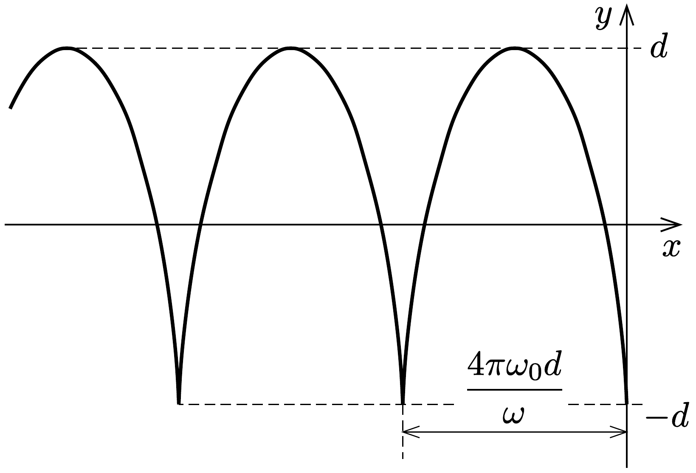
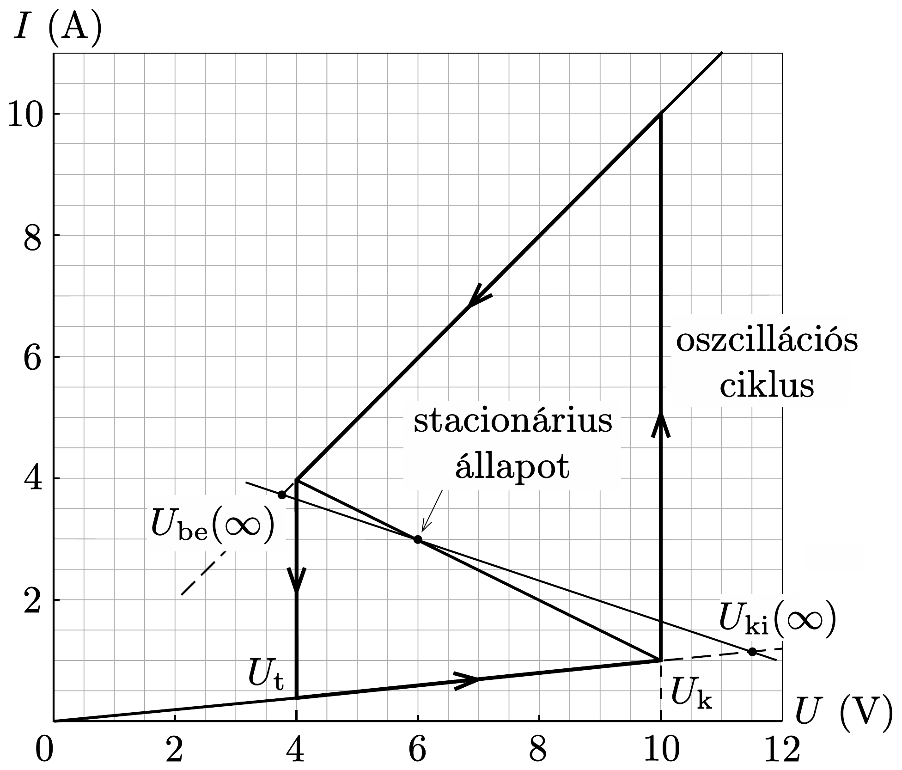
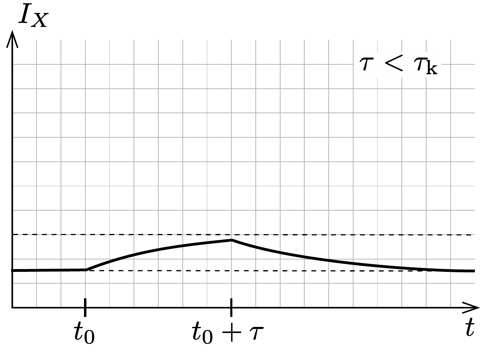
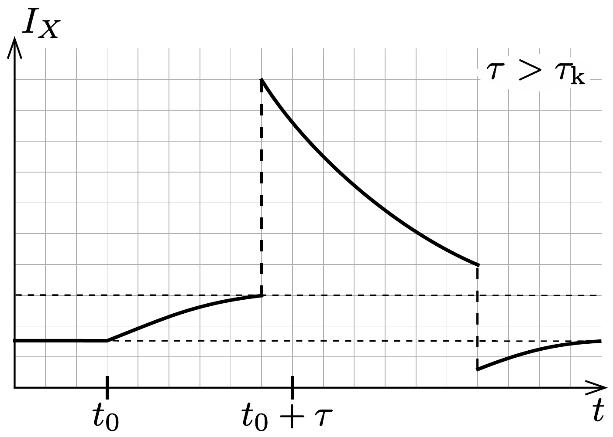

## Megoldás 2

2.A.1. Az ellenállások:
\[
\begin{gathered}
R_{\mathrm{be}}=\frac{10 \mathrm{~V}-4 \mathrm{~V}}{10 \mathrm{~A}-4 \mathrm{~A}}=1,00 \Omega, \\
R_{\mathrm{ki}}=\frac{10 \mathrm{~V}}{1 \mathrm{~A}}=10,0 \Omega,
\end{gathered}
\]

388. ábra.

A középső ág két végpontjára:
\[
\begin{aligned}
1 \mathrm{~A} & =I_{0}-\frac{10 \mathrm{~V}}{R_{\mathrm{k}}} \\
4 \mathrm{~A} & =I_{0}-\frac{4 \mathrm{~V}}{R_{\mathrm{k}}}
\end{aligned}
\]
Innen $R_{\mathrm{k}}=2,00 \Omega$ és $I_{0}=6,00 \mathrm{~A}$.
2.A.2. Az áramkörre felírva a huroktörvényt (stacionárius állapotban a tekercs vezetékként viselkedik):
\[
\mathcal{E}=I R+U, \quad \text { amiből } \quad I=\frac{\mathcal{E}-U}{R} .
\]

Az áramkör stacionárius állapotait ennek az egyenesnek és az $X$ elem $I$ - $U$ karakterisztikájának metszéspontjai adják meg. Adott $R$ esetén az egyenesek meredeksége állandó, $\mathcal{E}$-től függően kell eltolni az $I$ tengely mentén. Ez alapján
- - $R=3,00 \Omega$ esetében mindig 1 metszéspont van,
- - $R=1,00 \Omega$ esetében pedig $\mathcal{E}$ értékétől függően 1, 2 vagy 3 metszéspont lehetséges.

2.A.3. A stacionárius megoldás a középső ágra esik, így használhatjuk az arra vonatkozó összefüggést:
\[
\begin{aligned}
I_{\mathrm{st}} & =I_{0}-\frac{U_{\mathrm{st}}}{R_{\mathrm{k}}}, \\
I_{\mathrm{st}} & =\frac{\mathcal{E}-U_{\mathrm{st}}}{R},
\end{aligned}
\]
ahonnan
\[
\begin{aligned}
I_{\mathrm{st}} & =\frac{\mathcal{E}-R_{\mathrm{k}} I_{0}}{R-R_{\mathrm{k}}}=3,00 \mathrm{~A}, \\
U_{\mathrm{st}} & =R_{\mathrm{k}}\left(I_{0}-I_{\mathrm{st}}\right)=6,00 \mathrm{~V} .
\end{aligned}
\]
2.A.4. A huroktörvény alapján:
\[
\mathcal{E}=R I+U_{X}+L \frac{\mathrm{~d} I}{\mathrm{~d} t}=R I+R_{\mathrm{k}}\left(I_{0}-I\right)+L \frac{\mathrm{~d} I}{\mathrm{~d} t},
\]
amiből
\[
L \frac{\mathrm{~d} I}{\mathrm{~d} t}=\mathcal{E}-R_{\mathrm{k}} I_{0}-\left(R-R_{\mathrm{k}}\right) I .
\]
Eszerint,
ha $I>I_{\mathrm{st}}$, akkor $\mathrm{d} I / \mathrm{d} t<0$, azaz az áramerősség csökken,
ha $I<I_{\mathrm{st}}$, akkor $\mathrm{d} I / \mathrm{d} t>0$, azaz az áramerősség nő, tehát a stacionárius állapot stabil.
2.B.1. Az áramkör a stacinárius állapot felé próbál eljutni, de az a feladat szövege szerint nem következik be. A folyamat a 389. ábrán látható.

Stacionárius állapotban a kondenzátor fel van töltődve, rajta már nem folyik áram:
\[
R I+U_{\mathrm{st}}=\mathcal{E} \rightarrow I_{\mathrm{st}}=-\frac{1}{3 \Omega} U_{\mathrm{st}}+5 \mathrm{~A} .
\]
Ez az egyenes a megadott karakterisztika középső szakaszát az $U_{\mathrm{st}}=6 \mathrm{~V}, I_{\mathrm{st}}=3 \mathrm{~A}$ pontban metszi. Ahogyan a kondenzátor töltődik, feszültsége növekszik, ugyanúgy
az $X$ elemé is, tehát az $I-U$ karakterisztika alsó ágán haladunk. Azonban ez az ág a stacionárius egyenest az $U_{\mathrm{k}}=10 \mathrm{~V}$-nál nagyobb feszültségértéknél metszené $\left(U_{\mathrm{ki}}(\infty)\right)$, de az ág 10 V-nál véget ér. Ezt a pontot elérve az áram értéke hirtelen megváltozik úgy, hogy a feszülség állandó marad, mivel a kondenzátor feszültsége hirtelen nem változhat meg (különben végtelen nagy áram folyna a körben). Azaz elérjük a felső ágat. (10 V elérésénél nem „kanyarodik” a közbülső ágra, hiszen az alsó ágon haladva az $U_{\mathrm{ki}}(\infty)$ elérése a cél, tehát a feszültség növekedne, de a nemlineáris elem karakterisztikája ebben a pontban megváltozik. Másfelől, ha mégis a közbülső ágra térne, akkor nem alakulna ki oszilláció, hiszen a rendszer eléri a stabil stacionárius állapotát.) Innen a feszültség elkezd csökkenni, hiszen ez az ág az $U_{\mathrm{t}}=4 \mathrm{~V}$ alatt metszené a stacionárius állapot egyenesét $\left(U_{\text {be }}(\infty)\right)$, a rendszer ebbe az állapotba kerülne. Viszont a 4 V-ot elérve az áram hirtelen lecsökken (miközben a feszültség nem változik), és elérjük az alsó ágat, majd ismét ezen az ágon haladva kezd növekedni a feszültség, és a ciklus újraindul.
2.B.2. Mivel a nemlineáris áramköri elem a bekapcsolt ág és a kikapcsolt ág között ugrál, a feszültsége ilyen alakban írható fel: $U_{X}=R_{\mathrm{be} / \mathrm{ki}} I_{X}$, vagyis a nemlineáris elem egyszer egy $R_{\mathrm{be}}$, másszor egy $R_{\mathrm{ki}}$ ellenállással helyettesíthető. Az így kapott áramkör $R C$ időállandóját úgy határozhatjuk meg, ha gondolatban a feszültégforrást vezetékkel helyettesítjük (a konstans áramforrást szakadásnak tekinthetjük). Az így kapott kapcsolás eredő ellenállása az időállandóban szerepelő ellenállás. Esetünkben párhuzamosan kapcsolt ellenállásokat kapunk, azaz a két ág időállandója:
\[
\tau_{\mathrm{be} / \mathrm{ki}}=\frac{R_{\mathrm{be} / \mathrm{ki}} R}{R_{\mathrm{be} / \mathrm{ki}}+R} C .
\]
Ugyanezt az eredményt a Kirchhoff-törvényekkel is megkapjuk:
\[
\begin{gathered}
\mathcal{E}=R i+\frac{\int i_{C} \mathrm{~d} t}{C} \\
\frac{\int i_{C} \mathrm{~d} t}{C}=R_{\mathrm{be} / \mathrm{ki}}\left(i-i_{C}\right) .
\end{gathered}
\]
Mindkét egyenletet az idő szerint deriválva:
\[
\begin{gathered}
0=R \frac{\mathrm{~d} i}{\mathrm{~d} t}+\frac{i_{C}}{C}, \\
\frac{i_{C}}{C}=R_{\text {be } / \mathrm{ki}}\left(\frac{\mathrm{~d} i}{\mathrm{~d} t}-\frac{\mathrm{d} i_{C}}{\mathrm{~d} t}\right) .
\end{gathered}
\]
$\mathrm{d} i / \mathrm{d} t$ kiküszöbölésével:
\[
i_{C} \frac{1}{C} \frac{R+R_{\mathrm{be} / \mathrm{ki}}}{R R_{\mathrm{be} / \mathrm{ki}}}=-\frac{\mathrm{d} i_{C}}{\mathrm{~d} t},
\]
ahonnan az időállandó leolvasható.
Ha a be- vagy a kikapcsolt ágat a töréspontokon túl is meghosszabbítanánk, akkor az áramkör hosszú idő után a stacionárius állapotba érkezne, és a feszültsége
\[
U_{\mathrm{be} / \mathrm{ki}}(\infty)=\frac{R_{\mathrm{be} / \mathrm{ki}}}{R_{\mathrm{be} / \mathrm{ki}}+R} \mathcal{E}
\]
lenne. Numerikusan $U_{\mathrm{be}}(\infty)=3,75 \mathrm{~V}, U_{\mathrm{ki}}(\infty)=11,54 \mathrm{~V}$.
A nemlineáris elemen esó feszültség az állandósult állapot $U_{\mathrm{be} / \mathrm{ki}}(\infty)$ feszültségének és az exponenciálisan lecsengő feszültségtagnak az összege:
\[
U_{X}(t)=U_{\mathrm{be} / \mathrm{ki}}(\infty)+\left[U_{\mathrm{be} / \mathrm{ki}}(0)-U_{\mathrm{be} / \mathrm{ki}}(\infty)\right] \mathrm{e}^{-\frac{t}{\tau_{\mathrm{be} / \mathrm{ki}}}},
\]
ahol $U_{\mathrm{be}}(0)=U_{\mathrm{k}}$ és $U_{\mathrm{ki}}(0)=U_{\mathrm{t}}$. Azaz a rendszer által a bekapcsolt ágon töltött idő (egy ciklusban):
\[
t_{\mathrm{be}}=\tau_{\mathrm{be}} \ln \frac{U_{\mathrm{k}}-U_{\mathrm{be}}(\infty)}{U_{\mathrm{t}}-U_{\mathrm{be}}(\infty)}=2,41 \cdot 10^{-6} \mathrm{~s},
\]
a kikapcsolt ágon töltött idő pedig
\[
t_{\mathrm{ki}}=\tau_{\mathrm{ki}} \ln \frac{U_{\mathrm{ki}}(\infty)-U_{\mathrm{t}}}{U_{\mathrm{ki}}(\infty)-U_{\mathrm{k}}}=3,67 \cdot 10^{-6} \mathrm{~s}
\]

Az oszcilláció teljes periódusideje tehát: $T=t_{\mathrm{be}}+t_{\mathrm{ki}}=6,08 \cdot 10^{-6} \mathrm{~s}$.
2.B.3. Hanyagoljuk el a kikapcsolt ágon felhasznált energiát. A bekapcsolt ágon felhasznált energiát közelítsük a következőképp:
\[
W \approx \frac{1}{R_{\mathrm{be}}}\left(\frac{U_{\mathrm{t}}+U_{\mathrm{k}}}{2}\right)^{2} t_{\mathrm{be}}=1,2 \cdot 10^{-4} \mathrm{~J} .
\]
(Ily módon egyébként a kikapcsolt ágon is kiszámíthatjuk az energiát, de az egy nagyságrenddel kisebb lenne, úgyhogy jogos az elhanyagolás.) A teljesítmény ebból (közelítőleg):
\[
P=\frac{W}{T} \approx 20 \mathrm{~W} .
\]
2.B.4. A rádiójel hullámhossza: $\lambda=c T=1,82 \cdot 10^{3} \mathrm{~m}$. Az antenna optimális hossza $\lambda / 4$, az alapharmonikus (egyik végén csomópont, a másikon duzzadóhely), a felharmonikusok $3 \lambda / 4,5 \lambda / 4$, stb. A feltételeknek megfeleló egyetlen lehetséges választás: $s=\lambda / 4=456 \mathrm{~m}$.
2.C.1. Ha a telep feszültsége $\mathcal{E}^{\prime}=12,0 \mathrm{~V}$, az állandósult állapotot megadó egyenes:
\[
R I+U_{\mathrm{st}}^{\prime}=\mathcal{E}^{\prime} \rightarrow I_{\mathrm{st}}^{\prime}=-\frac{1}{3 \Omega} U_{\mathrm{st}}^{\prime}+4 \mathrm{~A} .
\]
Ez az $I-U$ karakterisztikát az $U_{\mathrm{st}}^{\prime}=9,23 \mathrm{~V}, I_{\mathrm{st}}^{\prime}=0,923 \mathrm{~A}$ helyen metszi, azaz a stacionárius állapot a kikapcsolt ágon van.

Ha ebből a stacionárius állapotból indulva a telep feszültségét $\mathcal{E}=15,0 \mathrm{~V}$ értékre növeljük, akkor a rendszer állapota elkezd jobbra mozogni a kikapcsolt ágon (ugyanúgy, mint a 2. B részben).

Ha a telep feszültsége még azelőtt újra lecsökken, hogy az $X$ elem feszültsége eléri az $U_{\mathrm{k}}$ küszöbfeszültséget, akkor a rendszer egyszerúen visszamegy a stacionárius állapotba. Az $X$ áramköri elem áramának időfüggését a 390. a) ábrán vázoltuk.

Ha viszont az elem feszültsége eléri a küszöbfeszültséget, akkor a rendszer felugrik a bekapcsolt ágra, és végigjár egy teljes oszcillációs ciklust (hiszen $\tau<T$ ), mielőtt visszaérkezik a stacionárius állapotba. Az $X$ áramköri elem áramának időfüggése vázlatosan a 390, b) ábrán látható.

390. ábra.
2.C.2. A kritikus idő a küszöbfeszültség eléréséhez szükséges idő (amit a 2.B. 2 részben megismert módon számíthatunk ki):
\[
\tau_{\mathrm{k}}=\tau_{\mathrm{ki}} \ln \frac{U_{\mathrm{ki}}(\infty)-U_{\mathrm{st}}^{\prime}}{U_{\mathrm{ki}}(\infty)-U_{\mathrm{k}}}=9,36 \cdot 10^{-7} \mathrm{~s} .
\]
2.C.3. Mivel $\tau>\tau_{\mathrm{k}}$, a rendszer végrehajt egy oszcillációt, tehát az áramkör ilyenkor neurisztor.
