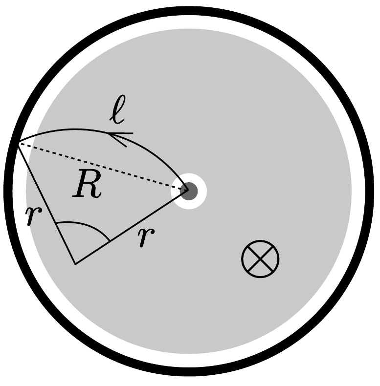

## Megoldás 3

3.A.1. Az energiamegmaradás törvénye szerint:
\[
e U=\frac{m c^{2}}{\sqrt{1-\frac{v^{2}}{c^{2}}}}-m c^{2}
\]
Ezt megoldva $v$-re:
\[
v=c \cdot \sqrt{1-\left(\frac{m_{\mathrm{p}} c^{2}}{m_{\mathrm{p}} c^{2}+e U}\right)^{2}} .
\]
3.A.2. A előző eredményt felhasználva:
\[
\Delta=1-\frac{v}{c}=1-\sqrt{1-\left(\frac{m_{\mathrm{e}} c^{2}}{m_{\mathrm{e}} c^{2}+e U}\right)^{2}} .
\]

Mivel $m_{\mathrm{e}} c^{2} \ll e U$, így
\[
\Delta \approx \frac{1}{2}\left(\frac{m_{\mathrm{e}} c^{2}}{e U}\right)^{2}=3,63 \cdot 10^{-11} .
\]
3.A.3. Mivel a részecskék impulzusának csak az iránya változik, az impulzus nagysága állandó. A körmozgás dinamikai feltétele:
\[
\frac{\mathrm{d} \boldsymbol{p}}{\mathrm{~d} t}=e \boldsymbol{v} \times \boldsymbol{B},
\]
ahol
\[
\boldsymbol{p}=\frac{m \boldsymbol{v}}{\sqrt{1-\frac{v^{2}}{c^{2}}}}
\]
E kettő egyenletből
\[
\frac{m}{\sqrt{1-\frac{v^{2}}{c^{2}}}} \cdot \frac{\mathrm{~d} \boldsymbol{v}}{\mathrm{~d} t}=e \boldsymbol{v} \times \boldsymbol{B} .
\]
A $\mathrm{d} \boldsymbol{v} / \mathrm{t}$ vektor a $v^{2} / r$ centripetális gyorsulást adja, mert $\boldsymbol{v}$-nek csak az iránya változik. Skalárisan felírva az egyenletet:
\[
\frac{\mathrm{d} p}{\mathrm{~d} t}=p \frac{v}{r}=\frac{m_{\mathrm{p}} v^{2}}{r \sqrt{1-\frac{v^{2}}{c^{2}}}}=e v B
\]
Az energia:
\[
E=\frac{m_{\mathrm{p}} c^{2}}{\sqrt{1-\frac{v^{2}}{c^{2}}}} .
\]
Ezekből (felhasználva, hogy $r=L /(2 \pi)$ és $v \approx c$ ):
\[
B=\frac{2 \pi E}{e c L}=5,50 \text { т. }
\]

Közelítés felhasználása nélkül:
\[
B=\frac{2 \pi m_{\mathrm{p}} c}{e L} \sqrt{\left(\frac{E}{m_{\mathrm{p}} c^{2}}\right)^{2}-\left(1+\frac{m_{\mathrm{p}} c^{2}}{E}\right)^{2}} .
\]
Mivel $m_{\mathrm{p}} c^{2} \ll E$, így a gyökjel alatti második tag az elsó mellett elhanyagolható, és az előző eredményt kapjuk.
3.A.4. Keressük a kisugárzott teljesítmény kifejezését a $P_{\mathrm{s}}=a^{\alpha} q^{\beta} c^{\gamma} \varepsilon_{0}^{\delta}$ alakban. A megfeleló dimenziók:
\[
\left[P_{\mathrm{s}}\right]=\frac{\mathrm{kg} \cdot \mathrm{~m}^{2}}{\mathrm{~s}^{3}}, \quad[a]=\frac{\mathrm{m}}{\mathrm{~s}^{2}}, \quad[q]=\mathrm{C}, \quad[c]=\frac{\mathrm{m}}{\mathrm{~s}}, \quad\left[\varepsilon_{0}\right]=\frac{\mathrm{C}^{2} \cdot \mathrm{~s}^{2}}{\mathrm{~kg} \cdot \mathrm{~m}^{3}} .
\]

A tömeg, a töltés, a hosszúság és az idő mértékegységének összevetéséből rendre a
\[
\delta=-1, \quad \beta+2 \delta=0, \quad \alpha+\gamma-3 \delta=2, \quad-2 \alpha-\gamma+2 \delta=-3
\]
egyenleteket kapjuk. Ezekből $\alpha=2, \beta=2, \gamma=-3, \delta=-1$, vagyis a sugárzási teljesítmény:
\[
P_{\mathrm{s}} \sim \frac{a^{2} \cdot e^{2}}{c^{3} \cdot \varepsilon_{0}} .
\]
3.A.5. Egyetlen részecske által kisugárzott teljesítmény:
\[
P_{\mathrm{s}}=\left(\frac{1}{\sqrt{1-\frac{v^{2}}{c^{2}}}}\right)^{4} \frac{1}{6 \pi} \frac{a^{2} \cdot e^{2}}{c^{3} \cdot \varepsilon_{0}} .
\]
Felhasználva az $E$ energia (16-4) alakját, valamint, hogy $a \approx c^{2} / r$ és $r=L /(2 \pi)$ :
\[
P_{\mathrm{s}}=\left(\frac{E}{m_{\mathrm{p}} c^{2}}\right)^{4} \frac{2 \pi e^{2} c}{3 \varepsilon_{0} L^{2}}=7,94 \cdot 10^{-12} \mathrm{~W} .
\]
A teljes kisugárzott teljesítmény (két nyalábra és a megadott táblázat adatait felhasználva):
\[
P_{\mathrm{t}}=2 \cdot 2808 \cdot 1,15 \cdot 10^{11} \cdot P_{\mathrm{s}}=5,13 \mathrm{~kW} .
\]
3.A.6. A relativisztikus mozgásegyenlet:
\[
F=e \frac{U}{d}=\text { állandó }=\frac{\mathrm{d} p}{\mathrm{~d} t}=\frac{p_{\text {vég. }}-p_{\text {kezd. }}}{T} .
\]
(Az erő állandósága miatt nincs szükség a $p=m v / \sqrt{1-v^{2} / c^{2}}$ kifejezés deriváltjára, persze úgy is megoldható a feladat, bár hosszadalmas.) Felhasználva a végsebesség (16-3) alakját, és hogy $p_{\text {vég. }}=m_{\mathrm{p}} v / \sqrt{1-v^{2} / c^{2}}$, továbbá $p_{\text {kezd. }}=0$ :
\[
T=\frac{m_{\mathrm{p}} c d}{e U} \sqrt{\left(1+\frac{e U}{m_{\mathrm{p}} c^{2}}\right)^{2}-1}=218 \mathrm{~ns} .
\]
3.B.1. A $v=\ell / t$ és a $p=m v / \sqrt{1-v^{2} / c^{2}}$ összefüggésekből:
\[
m=\frac{p}{\ell c} \sqrt{c^{2} t^{2}-\ell^{2}} .
\]
3.B.2. A repülési idők különbsége:
\[
\Delta t=3 \cdot 150 \mathrm{ps}=4,5 \cdot 10^{-10} \mathrm{~s} .
\]
Az előző részből
\[
t=\frac{\ell}{c} \sqrt{\left(\frac{m c}{p}\right)^{2}+1} .
\]

A kaon és a pion adatait felhasználva (és $p=1,00 \mathrm{GeV} / c$ ):
\[
\Delta t=\frac{\ell}{c}\left(\sqrt{0,494^{2}+1}-\sqrt{0,140^{2}+1}\right),
\]
ahonnan $\ell=1,28 \mathrm{~m}$ adódik.
3.B.3. Mivel a részecske a nyaláb irányára merólegesen halad, csakis transzverzális impulzusa van, tehát ez a teljes impulzusa is. A Lorentz-eró hatására a részecske körpályára kényszerül (lásd 391. ábra). A nyomkövetési csőben megtett

391. ábra.
körív hossza:
\[
\ell=2 r \arcsin \frac{R}{2 r} .
\]
A relativisztikus mozgásegyenlet $p_{\mathrm{T}}(v / r)=e v B$, azaz $p_{\mathrm{T}}=e r B$. Felhasználva a (16-5) eredményt:
\[
m=\frac{e B}{c} \sqrt{\left(\frac{c t}{2 \arcsin \frac{R}{2 r}}\right)^{2}-r^{2}} .
\]
3.B.4. A megadott adatokat behelyettesítve a (16-6) eredménybe, a tömegekre
\[
\begin{aligned}
& m_{\mathrm{A}}=1,673 \cdot 10^{-27} \mathrm{~kg}=938,65 \mathrm{MeV} / c^{2}, \\
& m_{\mathrm{B}}=0,240 \cdot 10^{-27} \mathrm{~kg}=134,88 \mathrm{MeV} / c^{2}, \\
& m_{\mathrm{C}}=1,667 \cdot 10^{-27} \mathrm{~kg}=935,10 \mathrm{MeV} / c^{2}, \\
& m_{\mathrm{D}}=0,890 \cdot 10^{-27} \mathrm{~kg}=499,44 \mathrm{MeV} / c^{2}
\end{aligned}
\]
adódik. Ezek alapján a megadott táblázat segítségével az A és C részecske proton, a B részecske pion, a D pedig kaon.

\title{
