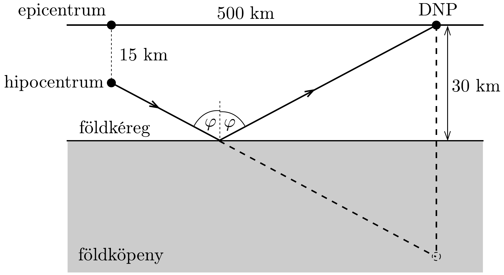
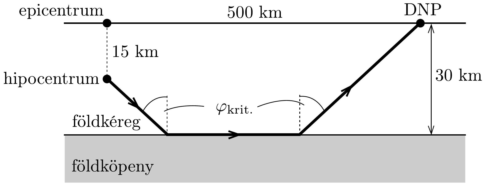
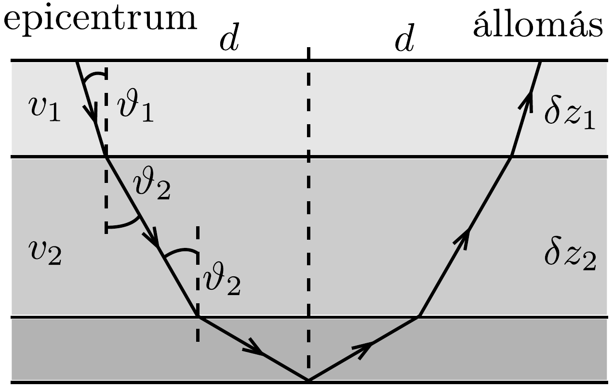

## Megoldás 2

2.A.1. A magma és a víz termikus kölcsönhatása során hőcsere történik:
\[
c_{\mathrm{w}} m_{\mathrm{w}}\left(T_{\mathrm{e}}-T_{\mathrm{w}}\right)=c_{\mathrm{m}} m_{\mathrm{m}}\left(T_{\mathrm{m}}-T_{\mathrm{e}}\right),
\]
ahonnan az egyensúlyi hőmérséklet
\[
T_{\mathrm{e}}=\frac{c_{\mathrm{m}} m_{\mathrm{m}} T_{\mathrm{m}}+c_{\mathrm{w}} m_{\mathrm{w}} T_{\mathrm{w}}}{c_{\mathrm{m}} m_{\mathrm{m}}+c_{\mathrm{w}} m_{\mathrm{w}}} .
\]
2.A.2. Ideális gázra $p V=n R T$, ebből és az előző rész eredményével:
\[
p_{\mathrm{e}}=\frac{n R T_{\mathrm{e}}}{V}=\frac{R T_{\mathrm{e}}}{v_{\mathrm{e}}}=\frac{R}{v_{\mathrm{e}}} \frac{c_{\mathrm{m}} m_{\mathrm{m}} T_{\mathrm{m}}+c_{\mathrm{w}} m_{\mathrm{w}} T_{\mathrm{w}}}{c_{\mathrm{m}} m_{\mathrm{m}}+c_{\mathrm{w}} m_{\mathrm{w}}} .
\]
2.A.3. A feladat szövege sugallja, hogy dimenzióanalízist használjunk, tehát tegyük fel, hogy a kitörő gáz sebessége
\[
u_{\mathrm{rel}}=\kappa p^{\alpha} V^{\beta} m^{\gamma}
\]
alakú. Dimenziókkal:
\[
\frac{\mathrm{m}}{\mathrm{~s}}=\left(\frac{\mathrm{kg}}{\mathrm{~m} \cdot \mathrm{~s}^{2}}\right)^{\alpha} \cdot \mathrm{m}^{3 \beta} \cdot \mathrm{~kg}^{\gamma} .
\]
A felírható egyenletek
\[
\begin{gathered}
\alpha+\gamma=0, \\
-2 \alpha=-1, \\
-\alpha+3 \beta=1 .
\end{gathered}
\]
Innen $\alpha=\beta=1 / 2$ és $\gamma=-1 / 2$, vagyis a keresett formula
\[
u_{\mathrm{rel}}=\kappa \sqrt{\frac{p V}{m}} .
\]
2.B.1. A szeizmogramon a zavar megjelenése a földrengés kezdetétől (22:54:00) számítva kb. 4,6 másodperc múlva található (ezt pl. vonalzóval megmérve egyenes arányossággal határozhatjuk meg). Ez idő alatt a hullám $\sqrt{22,5^{2}+15^{2}} \approx 27 \mathrm{~km}$ utat tett meg, vagyis a P-hullám sebessége a földkéregben:
\[
v_{\mathrm{P}}=\frac{27 \mathrm{~km}}{4,6 \mathrm{~s}} \approx 5,9 \frac{\mathrm{~km}}{\mathrm{~s}} .
\]
2.B.2. A direkt hullám terjedési ideje:
\[
t_{\mathrm{d}}=\frac{\sqrt{(15 \mathrm{~km})^{2}+(500 \mathrm{~km})^{2}}}{v_{\mathrm{P}}} \approx 84,8 \mathrm{~s} .
\]

A visszaverődő hullámra teljesül a visszaverődési törvény, azaz a beesési szög és a visszaverődési szög azonos. Tükrözzük a DNP-állomást a földkéreg-földköpeny határfelületre (402. ábra). A visszaverődő hullám útvonala az epicentrumot és DNP tükörképét összekötő egyenes szakasszal ekvivalens. Ezzel a visszaverődő hullám terjedési ideje:
\[
t_{\mathrm{v}}=\frac{\sqrt{(45 \mathrm{~km})^{2}+(500 \mathrm{~km})^{2}}}{v_{\mathrm{P}}} \approx 85,1 \mathrm{~s} .
\]
2.B.3. A kritkus beesési szög alatt érkező hullám szinte 90°-os törési szöggel behatol a földköpenybe, és a határfelület alatt halad, amíg újra ki nem lép a köpenyből és eljut a mérőállomásig ${ }^{28}$ (403. ábra).

Jelölje $v_{\mathrm{P}}=v_{1}$ a földkéregbeli, $v_{2}$ a földköpenybeli terjedési sebességet. A kritikus szögre a Snellius-Descartes-törvény alapján:
\[
\sin \varphi_{\text {krit. }}=\frac{v_{1}}{v_{2}} .
\]
Ebben az egyenletben két ismeretlen szerepel. Egy másik egyenlet felírásához azt kell észrevenni, hogy ez a kritkus hullám a legrövidebb idő alatt éri el a DNPállomást, mert a földköpenyben gyorsabban tud terjedni. A 400 ábrán 22:55:15kor találunk egy csúcsot, ami ezt a hullámot detektálja. A földrengés kezdetétől számítva tehát $t_{\mathrm{k}}=75 \mathrm{~s}$ alatt jutott el a denpasari állomásra. A terjedési idő:
\[
t_{\mathrm{k}}=\frac{15 \mathrm{~km} / \cos \varphi_{\text {krit. }}}{v_{1}}+\frac{30 \mathrm{~km} / \cos \varphi_{\text {krit. }}}{v_{1}}+\frac{500 \mathrm{~km}-(15 \mathrm{~km}+30 \mathrm{~km}) \operatorname{tg} \varphi_{\text {krit. }}}{v_{2}} .
\]

\footnotetext{
${ }^{28}$ A kritikus szög (vagy annál nagyobb szög) alatt beérkező hullám teljes visszaverődést szenved, nem hatol be az optikailag súrúbb közegbe. Azonban szigorúan véve vonalvékonyságú határfelület nincsen, még ebben az esetben is történik részleges behatolás, és megfelelő feltételek esetén (változó törésmutató) a hullám terjedhet ebben a közegben is. Geofizikában ezt a hullámot angolul head wave-nek nevezik

Átalakítva és felhasználva a (17-6) egyenletet (a távolságok mértékegységeit már nem írjuk ki):
\[
\cos \varphi_{\text {krit. }}\left(t_{\mathrm{k}}-\frac{500}{v_{2}}\right)=\frac{45}{v_{1}}+\frac{45 \cdot v_{1}}{v_{2}^{2}} .
\]
Ebben felhasználva, hogy $\cos \varphi_{\text {krit. }}=\sqrt{1-v_{1}^{2} / v_{2}^{2}}$, négyzetre emelve és átrendezve a
\[
\left(t_{\mathrm{k}}^{2}-\frac{45^{2}}{v_{1}^{2}}\right) v_{2}^{2}-1000 t_{\mathrm{k}} v_{2}+\left(500^{2}+45^{2}\right)=0 .
\]
másodfokú egyenletre jutunk, melynek megoldása:
\[
v_{2}=\frac{500 t_{\mathrm{k}} v_{1}^{2} \pm 45 v_{1} \sqrt{45^{2}+500^{2}-v_{1}^{2} t_{\mathrm{k}}^{2}}}{v_{1}^{2} t_{\mathrm{k}}^{2}-45^{2}} .
\]
Mindkét gyök poitív: 6,4 km/s és 7,1 km/s. Mivel az első eredmény közel van a kéregbeli sebességhez, feltesszük, hogy a második, a nagyobb a megoldás.
2.B.4. Ahogy a hullám egyre mélyebre jut, a beesési szög növekszik. Amint eléri a kritikus szöget egy bizonyos rétegben, visszaverődik, és felfelé fog terjedni, míg eléri az állomást. Ennek vázlata a 404. ábrán látható.

A Snellius-Descartes-törvény szerint rétegről rétegre haladva
\[
\frac{\sin \vartheta_{1}}{\sin \vartheta_{2}}=\frac{v_{1}}{v_{2}} \rightarrow \frac{\sin \vartheta_{1}}{v_{1}}=\frac{\sin \vartheta_{2}}{v_{2}}=p=\text { állandó. }
\]
A vízszintes irányú elmozdulás egy rétegben
\[
\delta x=\delta z \operatorname{tg} \vartheta=\delta z \frac{p v(z)}{\sqrt{1-p^{2} v(z)^{2}}}
\]
A visszaverődés $z_{\mathrm{v}}$ mélysége ott van, ahol a törési szög 90°, azaz
\[
v\left(z_{\mathrm{v}}\right)=v_{0}+a z_{\mathrm{v}}=\frac{1}{p} \rightarrow z_{\mathrm{v}}=\frac{1-p v_{0}}{a p} .
\]
Ezzel az epicentrum és az állomás távolsága:
\[
\begin{aligned}
2 d & =2 \int_{0}^{z_{\mathrm{v}}} \frac{p\left(v_{0}+a z\right)}{\sqrt{1-p^{2}\left(v_{0}+a z\right)^{2}}} \mathrm{~d} z= \\
& =-\frac{2}{a p}\left[\sqrt{1-p^{2}\left(v_{0}+a z\right)^{2}}\right]_{0}^{z_{\mathrm{v}}}=\frac{2}{a p} \sqrt{1-p^{2} v_{0}^{2}} .
\end{aligned}
\]
2.B.5. A terjedési idő egy kicsiny rétegben
\[
\mathrm{d} t=\frac{\mathrm{d} s}{v(z)}=\frac{\mathrm{d} z / \cos \vartheta}{v(z)}=\frac{\mathrm{d} z}{v(z) \sqrt{1-p^{2} v(z)^{2}}},
\]
így a teljes terjedési idő:
\[
T=2 \int_{0}^{z_{\mathrm{v}}} \frac{\mathrm{~d} z}{\left(v_{0}+a z\right) \sqrt{1-p^{2}\left(v_{0}+a z\right)^{2}}}
\]
2.B.6. Ez előzó eredmény folytonos $v(z)$ esetén érvényes. Ha csak három réteg van, akkor az integrálás helyett összegezni kell:
\[
T=2 \sum_{i=1}^{3} \frac{\delta z_{i}}{v_{i} \sqrt{1-p^{2} v_{i}^{2}}},
\]
behelyettesítve az adatokat:
\[
\begin{aligned}
T= & 2 \cdot \frac{6,0}{6,65 \cdot \sqrt{1-0,143^{2} \cdot 6,65^{2}}}+2 \cdot \frac{9,0}{6,97 \cdot \sqrt{1-0,143^{2} \cdot 6,97^{2}}}+ \\
& +2 \cdot \frac{15,0}{6,99 \cdot \sqrt{1-0,143^{2} \cdot 6,99^{2}}} \approx 184 \mathrm{~s} .
\end{aligned}
\]
A szeizmogram szerint a DNP-állomásig a terjedési idő 75 s. Ez azt mutatja, hogy a rétegfelosztást finomítnai kell megfelelő sebességeket, rétegvastagségokat
megadva. Ahogy közelítünk a mért időeredményhez, egyre jobban megismerhetjük a Föld szerkezetét.
2.C.1. Egy $h$ magasságú vízréteg emelkedett ki az óceánból, a tömegközéppont $h / 2$ magasra emelkedett, így a megemelt víz helyzeti energiája az óceán felszínéhez képest
\[
E_{\mathrm{h}}=\frac{\varrho \lambda L h^{2} g}{4} .
\]
2.C.2. Tekintsünk olyan sekély hullámot, amelyben a teljes víz mozog. A hullámzás során a $h$ magasságú megemelkedés terjed tova $v$ sebességgel, vagyis a hullámhossz $\lambda$. A megemelkedett vízmennyiség helyzeti energiája átalakul a $d$ magasságú vízmennyiség mozgási energiájává:
\[
\frac{\varrho \lambda L h^{2} g}{4}=\frac{1}{2} \varrho \frac{\lambda}{2} L d v^{2},
\]
ahonnan
\[
v=\sqrt{\frac{h^{2} g}{d}} .
\]
A hullámzás félperiódusideje alatt a kiemelkedés vízszintes irányban arrébb mozdul, így a tömegmegmaradás miatt
\[
h L \frac{\lambda}{2}=L d v \frac{T}{2} \rightarrow T=\frac{h \lambda}{v d} .
\]
Végül egy hullámhossznyi utat $T$ idő alatt tesz meg a hullám:
\[
v=\frac{\lambda}{T}=\frac{v d}{h}=\sqrt{g d} .
\]
Ez a sekély vízben terjedő hullámok ismert kifejezése, ami nem függ a hullámhossztól.
2.C.3. A hullámzásban tárolt $\varepsilon$ térfogati energiasúrúség arányos az amplitúdó négyzetével. Ott, ahol a mélység $d_{0}$, a part felé haladó hullám által elszállított energia a haladási irányára merőleges, kicsiny $\mathrm{d} S$ keresztmetszeten $\varepsilon_{0} v_{0} \mathrm{~d} S$. Mivel az áramlás lamináris és nincs energiaveszteség, ugyanekkora energia áramlik át ott, ahol a mélység már csak $d<d_{0}: \varepsilon v \mathrm{~d} S$. Tehát
\[
A_{0}^{2} \sqrt{g d_{0}}=A^{2} \sqrt{g d} \rightarrow A=A_{0} \sqrt[4]{\frac{d_{0}}{d}} .
\]
Ahogy a cunami a part felé halad, az amplitúdója növekszik és így a kiterjedése kisebb lesz.
