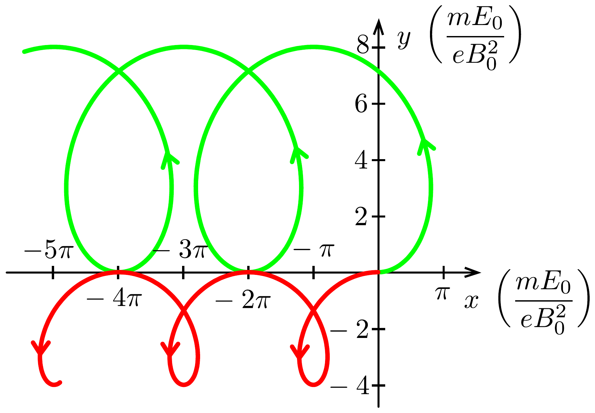
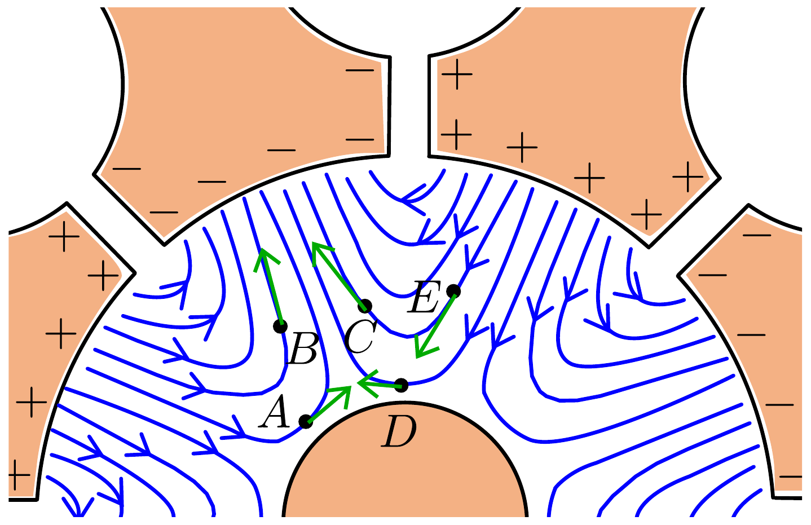
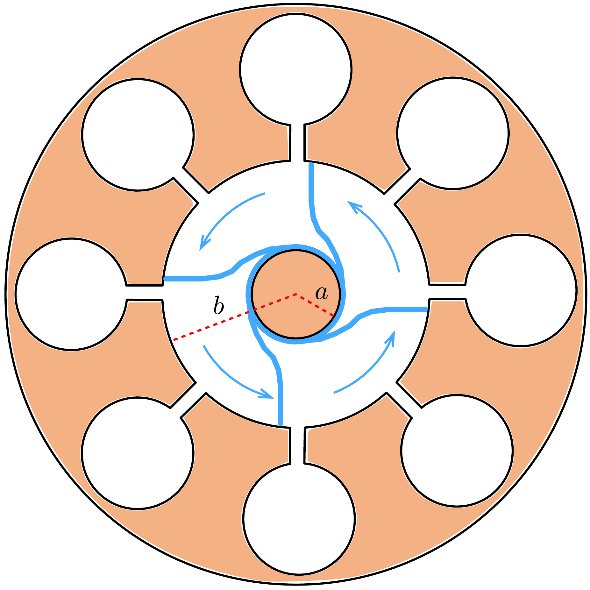

## Megoldás 2

2.A.1. Egy LC-kör rezonanciafrekvenciája $1 /(2 \pi \sqrt{L C})$. Ha $I$ erősségú áram folyik az üreg felületén, akkor a szolenoidközelítésnek megfelelően a mágneses indukció nagysága az üregben $B=0,6 \mu_{0} I / h$. A mágneses fluxus $B R^{2} \pi$, azaz az üreg induktivitása $L=0,6 \mu_{0} R^{2} \pi / h$. A síkfelülettől származó kapacitás $C=$ $=\varepsilon_{0} h \ell / d$. Ezzel a rezonátor frekvenciája
\[
f_{\mathrm{b}}=\frac{1}{2 \pi} \sqrt{\frac{d}{0,6 \mu_{0} \varepsilon_{0} \pi R^{2} \ell}} \approx 2,0 \mathrm{GHz} .
\]
2.A.2. Az elektronra ható eró
\[
\boldsymbol{F}=-e\left(-E_{0} \hat{\boldsymbol{y}}+\boldsymbol{u}(t) \times B_{0} \hat{\boldsymbol{z}}\right) .
\]
Üljünk be egy $\boldsymbol{u}_{1}=-E_{0} / B_{0} \hat{\boldsymbol{x}}$ sebességgel mozgó koordináta-rendszerbe. Ekkor az elektron sebességvektora $\boldsymbol{u}^{\prime}(t)=\boldsymbol{u}(t)-\boldsymbol{u}_{1}$. Ezt behelyettesítve az erő kifejezésébe, felhasználva, hogy $\hat{\boldsymbol{x}} \times \hat{\boldsymbol{z}}=-\hat{\boldsymbol{y}}$
\[
\boldsymbol{F}=-e B_{0} \boldsymbol{u}^{\prime}(t) \times \hat{\boldsymbol{z}},
\]
vagyis ebben a rendszerben az elektromos tér eltúnik, és az elektron egyenletes körmozgást végez, a körpálya sugara $m u^{\prime} /\left(e B_{0}\right)$. A labor rendszerébe vissztérve erre az $x-y$ síkú körmozgásra kell az $-x$ irányú egyenletes mozgást szuperponálni. Tehát az elektron sodródási sebessége $\boldsymbol{u}_{\mathrm{D}}=\boldsymbol{u}_{1}=-E_{0} / B_{0} \hat{\boldsymbol{x}}$. Az elektron sebességvektorának komponenseit a szuperpozíciós elvvel kifejezhetjük; legyen az indítási sebesség $\boldsymbol{u}(0)=\alpha \hat{\boldsymbol{x}}$ :
\[
\begin{gathered}
u_{x}(t)=\left(\alpha+\frac{E_{0}}{B_{0}}\right) \cos \left(\frac{e B_{0}}{m} t\right)-\frac{E_{0}}{B_{0}}, \\
u_{y}(t)=\left(\alpha+\frac{E_{0}}{B_{0}}\right) \sin \left(\frac{e B_{0}}{m} t\right),
\end{gathered}
\]
amelyekből integrálással megkaphatjuk az elektron helykoordinátáit figyelembe véve, hogy az elektron kezdetben az origóban volt:
\[
\begin{aligned}
& x(t)=\frac{m}{e B_{0}}\left(\alpha+\frac{E_{0}}{B_{0}}\right) \sin \left(\frac{e B_{0}}{m} t\right)-\frac{E_{0}}{B_{0}} t, \\
& y(t)=\frac{m}{e B_{0}}\left(\alpha+\frac{E_{0}}{B_{0}}\right)\left[1-\cos \left(\frac{e B_{0}}{m} t\right)\right] .
\end{aligned}
\]

A két esetet tekintve:
- 1. $u_{1}^{\prime}=4 E_{0} / B_{0}$ és a vektor kezdetben az $x$-tengely irányába mutat, a körpálya sugara $r_{1}=4 m E_{0} /\left(e B_{0}^{2}\right)$, periódusideje $T_{1}=2 \pi m /\left(e B_{0}\right)$;
- 2. $u_{2}^{\prime}=2 E_{0} / B_{0}$ és a vektor kezdetben az $-x$-tengely irányába mutat, a körpálya sugara $r_{1}=2 m E_{0} /\left(e B_{0}^{2}\right)$, periódusideje $T_{2}=2 \pi m /\left(e B_{0}\right)$.

Ezek alapján felrajzolhatjuk az elektron pályáját a két esetben. A megadott idő alatt az elektron $4 \pi m /\left(e B_{0}\right) \cdot u_{\mathrm{D}}=4 \pi m E_{0} /\left(e B_{0}^{2}\right)$ utat sodródik mindkét esetben. Ezt a 421. ábrán láthatjuk (a zöld görbe az első, a piros a második esetet mutatja).

Megjegyzés: Ha nem ülünk át mozgó koordináta-rendszerbe, akkor a mozgásegyenletet felbontva $x$ és $y$ irányú komponensekre, a sebességkomponensekre a harmonikus rezgésnek megfelelő differenciálegyenletet kapunk, amibő́l a megfelelő kezdeti feltételekkel a fenti kifejezések adódnak a sebességkomponensekre.
2.A.3. Az előző rész alapján a labor rendszerében az elektron legnagyobb és legkisebb sebessége $u_{\text {max }}=u^{\prime}+u_{\mathrm{D}}$, illetve $u_{\text {min }}=u^{\prime}-u_{\mathrm{D}}$, azaz $u^{\prime}=\left(u_{\text {max }}+\right.$ $\left.+u_{\text {min }}\right) / 2<u_{\text {max }}$. A megadott maximális mozgási energia alapján $u_{\text {max }}=$ $=\sqrt{\frac{2 K_{\text {max }}}{m}}$, amivel a mozgó rendszerben látott körpálya sugarára adhatunk egy
felső becslést:
\[
r=\frac{m u^{\prime}}{e B_{0}}<\frac{m u_{\max }}{e B_{0}}=\frac{\sqrt{2 m K_{\max }}}{e B_{0}} \approx 0,3 \mathrm{~mm} .
\]
Mivel ez az érték sokkal kisebb, mint az anód és a katód közötti távolság, az elektron mozgását tisztán sodródásként közelíthetjük, a körmozgásrészt elhanyagolhatjuk.
2.A.4. Az elektronok driftsebessége $\boldsymbol{E} \times \boldsymbol{B}$ irányú, ahol $\boldsymbol{E}$ a teljes (sztatikus és váltakozó) elektromos térerősségvektor. A sztatikus tér sugárirányban befelé mutat, a váltakozó tér pedig az erővonal irányításának megfelelően az erővonal adott pontbeli érintőjének irányába mutat. Mivel a teljes elektromos tér egyik pontban sem sugárirányú, ezért egyik pontban lévő elektron sem mozog sugárirányra merőlegesen. A sugárirányú mozgás vizsgálatához pedig elegendő a térerősség sugárirányra merőleges komponensét tekinteni. A sztatikus térnek nincs ilyen komponense, ezért csak a váltakozó teret kell figyelembe venni. Ez a komponens az $A$ és $B$ pontban „jobbra” mutat, míg a $C, D$ és $E$ pontban „balra” mutat (a 422. ábra zöld nyilainak sugárra merőleges komponensei). Ezért a jobbkéz-szabály alapján az $A$ és $B$ pontokban lévő elektron a katód felé, a $C, D$ és $E$ pontokban lévő pedig az anód felé sodródik.

2.A.5. A kérdés megválaszolásához a driftsebesség sugárirányra merőleges komponensét kell vizsgálnunk. Ezt a teljes elektromos térerősségvektor sugárirányú komponense határozza meg. Mivel mindegyik pont azonos távolságra van a katódtól, a sztatikus tér nagysága mindenütt ugyanakkora, ezért csak a változó elektromos tér radiális komponense határozza meg azt, hogy az elektronok helyzeteit megadó helyvektorok közötti szög csökken vagy növekszik. Ha ez a komponens befelé, azaz a katód felé mutat, akkor a jobbkéz-szabály szerint a driftsebesség sugárirányra merőleges komponense „balra” mutat, és „jobbra”, ha a térerősségvektor sugárirányú komponense kifelé, vagyis az anód felé mutat. Ezek alapján az $A B, B C$ és $A C$ párokra a szög csökken, a $D E, D F$ és $E F$ párok esetén a szög növekszik.
2.A.6. Az előző feladat eredménye szerint a küllők ott alakulnak ki, ahol az elektronok közelednek egymáshoz. Ezt mutatja a 423. ábra.

A váltakozó elektromos tér frekvenciája $f=2,45 \mathrm{GHz}$. Mire a váltakozó tér előjelet vált (fél periódus), a küllők a következő üreghez kerülnek a 423 ábrán látható nyilak irányába. Mivel a szögelfordulás $\pi / 4$, a forgás szögsebessége:
\[
\omega_{\mathrm{s}}=\frac{\pi / 4}{T / 2}=\frac{\pi f}{2} \approx 3,85 \cdot 10^{9} \frac{1}{\mathrm{~s}} .
\]
Mindegyik küllő egy teljes fordulatot tesz meg a magnetron körül a váltakozó tér négy periódusa alatt.
2.A.7. A közelítés szerint a teljes elektromos térerősség az $r_{0}=(a+b) / 2$ helyen (sugárirányban):
\[
E=\left\langle E_{\text {sztatikus }}\right\rangle_{r}=\frac{\int_{a}^{b} E(r) \mathrm{d} r}{b-a}=\frac{V_{0}}{b-a} .
\]
Ezzel a driftsebesség sugárirányra merőleges komponense
\[
u_{\mathrm{D}}=E / B_{0}=V_{0} /\left(B_{0}(b-a)\right) .
\]
Az $u_{\mathrm{D}} / r_{0}$ szögsebességet $\omega_{\mathrm{s}}$-sel azonosítva, a sztatikus fszültség:
\[
V_{0}=\frac{B_{0} \omega_{\mathrm{s}}\left(b^{2}-a^{2}\right)}{2}=\frac{\pi B_{0} f\left(b^{2}-a^{2}\right)}{4} .
\]
2.B.1. A dipólusra ható forgatonyomaték-vektor $\boldsymbol{\tau}=\boldsymbol{p} \times \boldsymbol{E}$, így
\[
\tau(t)=-p_{0} E(t) \sin \theta(t) .
\]
A tér által kifejtett forgatónyomaték teljesítménye pedig
\[
H_{i}(t)=\tau(t) \dot{\theta}(t)=-p_{0} E(t) \sin \theta(t) \dot{\theta}(t)=E(t) \frac{\mathrm{d}}{\mathrm{~d} t}\left(p_{0} \cos \theta(t)\right)=E(t) \frac{\mathrm{d} p_{x}(t)}{\mathrm{d} t} .
\]
2.B.2. A polarizációvektor párhuzamos a lokális térerősségvektorral, térfogategységenként elnyelt energia időátlaga
\[
\langle H(t)\rangle=\left\langle E_{0} \sin (\omega t) \frac{\mathrm{d} P_{x}}{\mathrm{~d} t}\right\rangle=E_{0}^{2} \beta \varepsilon_{0} \omega\langle\sin (\omega t) \cos (\omega t-\delta)\rangle .
\]
Addíciós tétellel
\[
\sin (\omega t) \cos (\omega t-\delta)=\sin (\omega t) \cos (\omega t) \cos \delta+\sin ^{2}(\omega t) \sin \delta .
\]
Az első tag időátlaga nulla, a másodiké pedig $(\sin \delta) / 2$, tehát
\[
\langle H(t)\rangle=\frac{1}{2} E_{0}^{2} \beta \varepsilon_{0} \omega \sin \delta .
\]
2.B.3. Az elektromágneses tér energiasúrúsége a vízben $z$ mélységben időátlagban (a 2-es faktor a mágneses mező energiasúrúsége miatt van jelen)
\[
w=2 \cdot \frac{1}{2} \varepsilon_{\mathrm{r}} \varepsilon_{0}\left\langle E(z, t)^{2}\right\rangle=\varepsilon_{\mathrm{r}} \varepsilon_{0} E_{0}(z)^{2}\left\langle\sin ^{2}(\omega t)\right\rangle=\frac{1}{2} \varepsilon_{\mathrm{r}} \varepsilon_{0} E_{0}(z)^{2} .
\]
Az időátlagolt energiafluxus ( $\mathrm{d} t$ idő alatt $A$ felületre $w \mathrm{~d} V$ energia érkezik $c / n$ sebességgel)
\[
I(z)=\frac{w \mathrm{~d} V}{A \mathrm{~d} t}=w \frac{c}{n}=\frac{1}{2} \sqrt{\varepsilon_{\mathrm{r}}} \varepsilon_{0} c E_{0}(z)^{2} .
\]
Az energiafluxus $z$ növekedtével csökken, hiszen a dielektrikum energiát nyel el. Az előző feladat alapján
\[
\frac{\mathrm{d} I(z)}{\mathrm{d} z}=-\frac{1}{2} E_{0}(z)^{2} \beta \varepsilon_{0} \omega \sin \delta=-\frac{\beta \omega \sin \delta}{c \sqrt{\varepsilon_{\mathrm{r}}}} I(z) .
\]
Megoldva a differenciálegyenletet
\[
I(z)=I(0) \mathrm{e}^{-\frac{\beta \omega \sin \delta}{c \sqrt{\varepsilon_{\mathrm{r}}}} z} .
\]
2.B.4. A (19-4) egyenletbe beírva a megadott elektromos térerősséget
\[
I(z)=\frac{1}{2} \sqrt{\varepsilon_{\mathrm{r}}} \varepsilon_{0} c E_{0}^{2} \mathrm{e}^{-\frac{\omega \sqrt{\varepsilon_{\mathrm{r}}} \operatorname{tg} \delta}{c} z},
\]
amit összevetve a (19-5) kifejezéssel, a $\beta=\varepsilon_{\mathrm{r}}$ eredmény adódik.
2.B.5.
- 1. Az $I(0) / 2$ értékhez tartozó mélység az előző rész eredménye alapján
\[
z_{1 / 2}=\ln 2 \frac{c}{\omega \sqrt{\varepsilon_{\mathrm{r}}} \operatorname{tg} \delta}=\ln 2 \frac{c \sqrt{\varepsilon_{\mathrm{r}}}}{\omega \varepsilon_{\ell}} .
\]
20 °C-os vízre a grafikonról leolvasva $\varepsilon_{\ell} \approx 12$ és $\varepsilon_{\mathrm{r}} \approx 78$, ezzel $z_{1 / 2} \approx 10 \mathrm{~mm}$. Láthatjuk, hogy a $z_{1 / 2}$ behatolási mélység $\sqrt{\varepsilon_{\mathrm{r}}} / \varepsilon_{\ell}$ hányadosal arányos. Ez alapján válaszolhatunk a többi kérdésre.
- 2. Egy adott frekvencián tiszta vízre a hőmérséklet növelésével $\varepsilon_{\ell}$ jelentősebben csökken, mint $\sqrt{\varepsilon_{\mathrm{r}}}$, ezért a behatolási mélység növekszik, azaz a mikrohullámú sugárzás mélyebbre képes behatolni, amivel a víz belsó részét is fel tudja melegíteni.
- 3. Leves esetén adott frekvencián a hőmérséklet növekedtével $\varepsilon_{\mathrm{r}}$ csökken, viszont $\varepsilon_{\ell}$ növekszik, vagyis a behatolási mélység csökken, kevesebb mikrohullámú sugárzás jut el a leves belső részébe.
