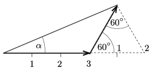

**Megoldás.**
 A labda talajhoz viszonyított sebességvektora az autó sebességének és az autóhoz viszonyított sebességnek a vektori összege.
 A méretarányos ábráról egy szögmérő segítségével leolvashatjuk, hogy $\alpha\approx 23^\circ.$

