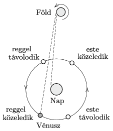

**Megoldás.**
 A reggel látható Vénusz (a ,,Hajnalcsillag'') a napfelkelte előtt figyelhető meg, tehát a ,,Nap előtt jár''. Ismeretes, hogy a Föld forgása és keringése nagyjából azonos irányú, és ugyanilyen irányú a Vénusz keringése is. Megállapíthatjuk tehát, hogy a Vénusz ugyanolyan irányban kering a Nap körül, mint amilyen irányban a Föld forog a tengelye körül. Az ábráról leolvashatjuk, hogy ha a Vénusz reggelente (látszólag) közeledik a Naphoz, akkor a Nap ,,mögött'' (pályájának a Földtől távolabbi oldalán) fog elhaladni. Az ábrán bejelöltük a Naptól távolodó esti és hajnali helyzeteket is.

