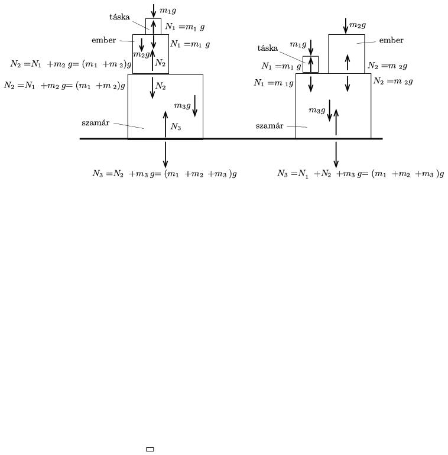

**Megoldás.**
 $a)$ A táska nyomja Naszreddin Hodzsa vállát, emiatt Naszreddin Hodzsa nagyobb erővel nyomja a szamarat, mintha nem lenne a vállán a táska. A szamarat mindkét esetben a táska és Naszreddin Hodzsa együttes súlya nyomja.
 $b)$ A táskára, az emberre, a szamárra és a talajra ható erők vázlatos ábrázolása:

