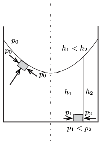

**Megoldás.**
 A folyadék – a belső súrlódása miatt – előbb-utóbb az edénnyel együtt egyenletesen fog forogni. A folyadék minden ,,darabkája'' kanyarodik, sebessége a tengely felé fordul el. Ehhez olyan (centripetális) erőnek kell hatnia, amely a forgástengely felé mutat.
 Vizsgáljuk meg a víznek egy – az edény aljánál (de nem a forgástengelynél) található – kicsiny darabkájára ható erőket. A tengely felé mutató erőt az hozza létre, hogy a vízdarabka forgástengely felé eső oldalánál kisebb a folyadék (hidrosztatikai) nyomása, mint az átellenes (külső) oldalon. A forgástengelytől távolodva tehát egyre nagyobb kell legyen a folyadék magassága, vagyis a felület felülről nézve homorú.
 Ugyanerre az eredményre jutunk, ha a folyadék felszínénél lévő vízdarabkát vizsgáljuk. Ott a felület érintősíkja mentén elhelyezkedő szomszédos vízrészek nyomása ugyanakkora (a légköri nyomással megegyező), ezek eredő erőhatása a szimmetria miatt nulla. Az érintősíkra merőlegesen (,,alul'') található darabka nyomóerejének viszont lehet a tengely irányába mutató, vízszintes komponense, de csak akkor, ha a felület nem sík, hanem felülről nézve homorú. (A vízdarabka alatt lévő víz nyomásából származó erő függőleges komponense a vízdarabkára ható nehézségi erővel tart egyensúlyt.)
 Be lehet látni, hogy a felület alakja forgási paraboloid.

