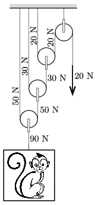

**Megoldás.**
 A ketrecet tartó kötelet kb. 90 N erő feszíti. Ezt a legalsó mozgócsiga kb. 10 N súlya 100 N-ra növeli, ami a két kötéldarabnál feleződik.

 Ugyanígy számolhatunk a következő két mozgócsigánál is, a legfelső (álló-)csigánál pedig nem változik meg a kötélerő. Ezek szerint $F\approx 20$ N.

