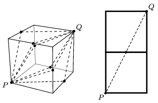

**Megoldás.**
 A bogár két egymással érintkező oldallapon haladva juthat el $P$-ből $Q$-ba. Ezt a két lapot síkba kiterítve egy $20~\rm cm \times 10~\rm cm$ méretű téglalapot kapunk, amelynek átlója (nyilván ez felel meg a legrövidebb útnak) $\sqrt{500}\approx 22{,}4$ cm hosszú. A bogár tehát leghamarabb 22,4 s alatt érhet el a $P$ csúcspontból a $Q$ csúcspontba.

 A bogár az ábrán látható hatféle útvonal bármelyikét választva ugyanannyi idő alatt ér a $P$ pontból a $Q$ pontba.

