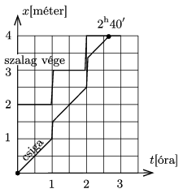

**Megoldás.**
 A csiga, illetve a szalag végének távolsága a faltól az alábbiak szerint változik:
 1. állapot: Közvetlenül az első óra eltelte előtt a szalag hossza 2 m, a csiga a faltól 1 méterre, a szalag $\tfrac12$ részénél lesz.
 2. állapot: Közvetlenül az első óra eltelte után a szalag hossza 3 méter, és a csiga a szalag $\tfrac12$ részénél van, tehát a faltól 1,5 méternyire kerül.
 3. állapot: Közvetlenül a második óra eltelte előtt a csiga a faltól 2,5 méterre van, ez a szalag hosszának $\tfrac56$ részének felel meg.
 4. állapot: Közvetlenül a második óra eltelte után a szalag hossza 4 méterre nő, a csiga pedig ennek $\tfrac56$ részénél, a faltól $\tfrac{10}3$ méterre lesz.
 5. állapot: A csiga $4-\tfrac{10}3=\tfrac23$ méternyi utat $\tfrac23$ óra, vagyis 40 perc alatt tesz meg, tehát az indulástól számítva $2^{\rm h}40'$ alatt érkezik a szalag végéhez. A csiga helyzetét és a szalag végének helyét az idő függvényében az alábbi ábra mutatja.

