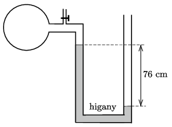

**Megoldás.**
 $a)$ 76 cm magas higanyoszlop nyomása 1 atm. A higany akkor lehet egyensúlyban, ha a gáz nyomása 2 atm.
 $b)$ A gáz kiszivattyúzása után az U alakú csőben a higanyszintek távolsága ismét 76 cm lesz, de most a tartály felőli oldalon fog magasabban állni a higany, ahogy azt az ábra mutatja.

