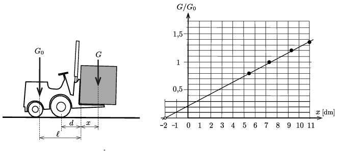

**I. megoldás.**
 Ha túl nehéz a teher, a targonca az első kerekei körül elfordulva felbillenhet. A felbillenés határesetében az első kerekekre vonatkoztatott forgatónyomatékok éppen egyensúlyban vannak. Ennek feltétele (a bal oldali ábra jelöléseivel):
 $(1)$ $G\,(x+d)=G_0\,(\ell-d).$
 (A targonca súlyához nem számítottuk hozzá a vezető súlyát, hiszen ő le is szállhat a járművéről, és a biztonságot nyilván nem szabad ilyen esetleges helyzetektől függővé tenni. A villaterhelési diagram tehát a kezelő nélküli viszonyokra vonatkozik.)

 A diagramon a BIZTONSÁGOS tartomány jobb széle azt jelzi, hogy a teher a villa vége körül is lebillenhet, a tartomány felső határvonala pedig a targonca teherbíróképességére utal. A tartomány ,,íves'' határvonala az (1) egyenletnek felel meg. A $G(x)$ függvény két ismeretlen adatot (paramétert) tartalmaz, ezeket szeretnénk a függvény grafikonja alapján meghatározni. Ábrázoljuk a
 $\frac{G_0}{G}=\frac{x+d}{\ell-d}$
 lineáris függvényt a feladatban megadott grafikon alapján. (A súlyok aránya helyett számolhatunk a kg-ban megadott tömegek arányával.) Néhány pont felvétele után megrajzolhatjuk a lineáris függvénynek megfelelő egyenest (ld. az ábra jobb oldali részét). A grafikonról leolvasható, hogy a $G_0/G=0$ tengelymetszetnél $\vert x\vert=d=2~$dm, a targonca első tengelye tehát 2 dm távol van a villa sarkától.
 A grafikonról az is leolvasható, hogy az egyenes meredeksége:
 $m=\frac{1}{\ell-d}\approx \frac{1{,}38}{13~\rm dm}=0{,}106~\rm dm^{-1}.$
 Innen $d$ már meghatározott értékének felhasználásával az $\ell\approx 11{,}4~\rm dm$ eredmény adódik. A targonca súlyvonala tehát kb. $11{,}4~\rm dm$ távolságban van a villa sarokvonalától.

**II. megoldás.**
 Az I. megoldás jelöléseit és gondolatmenetét követve az (1) egyenletből függvényillesztés nélkül is meghatározhatjuk az $\ell$ és $d$ paramétereket. A feladathoz tartozó grafikonon szaggatott vonallal jelölt pontok helyzetéből leolvasható, hogy $x=5{,}5~\rm dm$-nél a legnagyobb megengedett teher tömege 1500 kg, $x=10{,}5$ dm-nél pedig 900 kg. Felírhatjuk tehát (kg és dm egységekkel számolva) az
 $1500\,(5{,}5+d)=1200\,(\ell-d),$
 $900\,(10{,}5+d)=1200\,(\ell-d) $
 egyenletrendszert, amelynek megoldása: $d=$2 dm és $\ell= 11{,}375~{\rm dm}\approx 11{,}4~{\rm dm}$.

