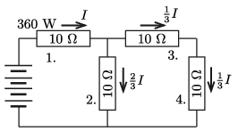

**Megoldás.**
 Számozzuk meg az ellenállásokat az ábrán látható módon. Az 1. ellenálláson folyik át a legnagyobb áram (hiszen az az 1. ellenállás után két részre oszlik), tehát az egyforma ellenállások közül az 1.-re jut a legnagyobb teljesítmény.

 Az áramerősség:
 $I=\sqrt{ \frac{P}{R} }=\sqrt{\frac{360~\rm W}{10~\Omega}}=6~\rm A.$
 Ez az áram $2:1$ arányban oszlik két részre, a 2. ellenálláson tehát $4~$A, a 3. és 4. ellenálláson pedig 2 A erősségű áram folyik.
 $a)$ Az 1. ellenálláson $(6~{\rm A})\cdot(10~\Omega))=60~\rm V$ feszültség esik, a 2. ellenálláson pedig 40 V, így a a telep kapocsfeszültsége 100 V.
 $b)$ A 2. ellenállás hőteljesítménye 160 W, a 3. és a 4. ellenállás teljesítménye pedig egyaránt $40$ W.

