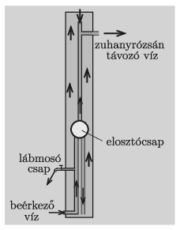

**Megoldás.**
 A beérkező hideg víz vezetékébe (mielőtt még elérné az elosztócsapot) egy szokásos csapot iktatnak be, ez adja a lábmosó hideg vizét. Az elosztócsap hasonlóan működik, mint a fürdőszobai keverőcsaptelep, csak a víz áramlási iránya ellentétes a két esetben. A keverőcsap két bejövő cső vizét egy harmadik csőbe engedi, a karja állásának megfelelő arányban és mennyiségben. Az elosztócsap a beérkező víz egy részét a jobb oldali alsó csövön keresztül a tartály aljához vezeti, ahol a víz még viszonylag hideg. A hideg víz másik része a felső csövön keresztül eljut a zuhanyrózsa csövébe.
 A napsugárzás hatására a tartályban lévő víz hőmérséklete fokozatosan növekszik, de nem mindenhol ugyanolyan mértékben. A tartály alsó részében hidegebb, a felső részében pedig kisebb sűrűségű, melegebb víz található. Az elosztócsapból lefelé áramló víz hatására a felső, meleg vízből valamennyi kiszorul a tartályból és ugyancsak a zuhanyrózsához jut. A kifolyó víz hőmérsékletét, valamint a mennyiségét az elosztócsappal szabályozhatjuk.

