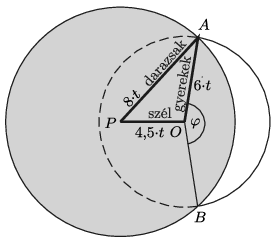

**Megoldás.**
 Ha az $O$ pontban történt a baleset, akkor a gyerekek $t$ idő alatt (méter és másodperc egységekben számolva) $6\cdot t$ távolságra jutnak el. Ezalatt a darazsak $8\cdot t$ távolságra tudnak elrepülni, miközben a szél miatt $4{,}5\cdot t$ távolsággal sodródnak el nyugati irányba. A darazsak tehát a $P$ középpontú, $8\,t$ sugarú, az ábrán sötétebben jelölt kör pontjaiba juthatnak el.

 Azok a gyerekek menekülnek meg a darázscsípéstől biztosan, akik a folytonos vonallal jelölt $AB$ ív irányába, a darazsak által elért sötétebb tartományt elkerülve kezdtek el szaladni. Az ő arányuk az összes gyerekhez képest kb. $\frac{\varphi}{360^\circ}$. Ez az arányszám nem függ a $t$ időtartamtól, hiszen az idő múltával az ábra arányai nem változnak, csak a mérete nővekszik.
 A szerkesztés menete:
 1. Körzővel rajzolunk egy 6 egység sugarú, $O$ középpontú kört.
 2. Vonalzóval felmérünk egy 4,5 egység hosszú, az $O$ ponttól induló (tetszőleges irányú) szakaszt.
 3. A szakasz másik végpontja $(P)$ köré körzővel rajzolunk egy 8 egység sugarú kört.
 4. Szögmérővel lemérjük a $\varphi$ szöget, és azt találjuk, hogy $\varphi\approx 165^\circ$.
 5. Kiszámítjuk, hogy a gyerekeknek kb. 46%-a, tehát csaknem a fele menekül meg a darazsaktól.

 A kérdéses $\varphi$ szöget a koszinusztétel segítségével is ki lehet számítani:
 $\cos\frac{\varphi}2=\frac{8^2-6^2-4{,}5^2}{2\cdot 6\cdot4{,}5}=0{,}144,$
 vagyis
 $\frac{\varphi}2=81{,}75^\circ,\qquad \text{tehát}\qquad \frac{\varphi}{360^\circ}=0{,}454=45{,}4\%.$

