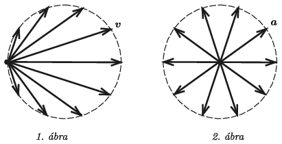

**Megoldás.**
 Az egyenletesen haladó kerékpár tengelyének sebessége vízszintes irányú, $v_0=3$ m/s nagyságú vektor. A kiszemelt kerületi pontnak a tengelyhez viszonyított sebessége ugyancsak $v_0$ nagyságú, érintő irányú vektor, ami a mozgás során körbefordul. A sebességhodográfot a kétféle mozgás sebességvektorainak összegzésével kapjuk meg. A talajhoz viszonyított sebességvektorok, ha azokat egy közös pontból kiindulva ábrázoljuk, egy $v_0$-lal eltolt középpontú, $v_0$ sugarú kör kerületi pontjaiba mutatnak ( 1. ábra ).
 A kiválasztott pont gyorsulásvektorai
 $a_0=\frac{v_0^2}{R}=25{,}7~\frac{\rm m}{\rm s^2}$
 nagyságú, egyenletesen körbeforduló vektorok, a gyorsuláshodográf tehát egy $a_0$ sugarú kör középpontjából a kerületi pontokba mutató vektorok serege ( 2. ábra ).

