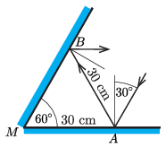

**Megoldás**
. Akkor telik el minimális idő a két visszaverődés között, ha a beeső és a visszavert fénysugarak egy olyan síkban haladnak, ami merőleges a két tükör metszésvonalára. Az ábra ezt a síkot mutatja.

 Láthatjuk, hogy a két tükör $M$ metszéspontja, valamint az első és a második visszaverődési pont ($A$ és $B$) egyenlő oldalú háromszöget alkot, tehát a két visszeverődés között a fénysugár legalább 30 cm-es utat fut be. Az eltelt időt a fénysebesség ($c=3 \cdot 10^8 \, \rm{m/s}$) segítségével számíthatjuk ki:
 $t=\frac{s}{c}=10^{-9}~\rm{s}=1~\rm ns.$

