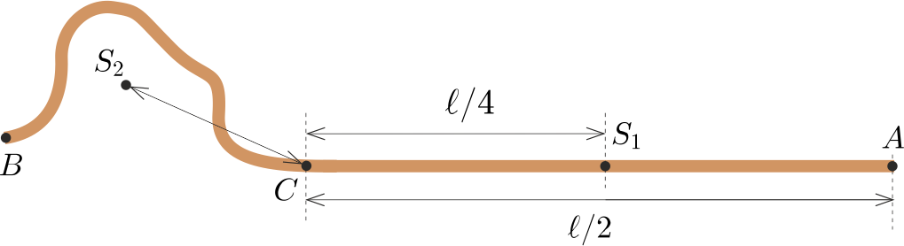
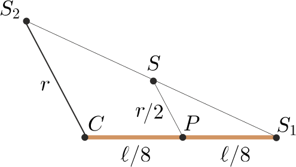
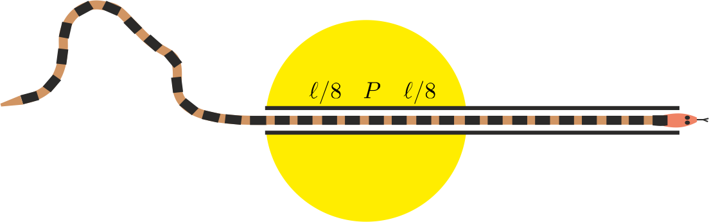
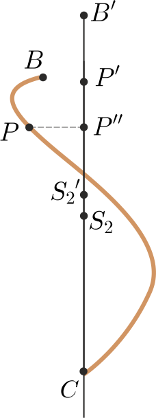

**Megoldás.**
 Legyen a kígyó teljes tömege $m$, ekkor (a tömegközéppont szempontjából) a csőben lévő része is és a kint kacskaringózó rész is egy-egy $m/2$ tömegű tömegponttal helyettesíthető. Jelöljük a cső egyik végét (amelyiknél a kígyó feje van) $A$-val, a cső felezőpontját $S_1$-gyel, a cső másik végét (ahol a kígyó ,,közepe'' van) $C$-vel, a kígyó farkának helyét pedig $B$-vel ( 1. ábra ).
 1. ábra

 A kígyó első (egyenes) részének $S_1$ tömegközéppontja $C$-től nyilván $\ell/4$ távol van, a másik rész $S_2$ tömegközéppontjának $C$-től mért távolságát pedig jelöljük $r$-rel. A kígyó alakjának ismerete nélkül $r$ nagyságát nem tudjuk pontosan megadni, de azt állíthatjuk, hogy $r\le \ell/4$. Ez – a továbbiakban fontos – egyenlőtlenség elég szemléletes (hiszen ha a kígyó kiegyenesedne, akkor éppen $r=\ell/4$ teljesülne), de szigorú bizonyítását a Függelék tartalmazza.
 Az egyenlőtlenséget felhasználva kétféle megoldás is adható a feltett kérdésre.

 I. (geometriai) megoldás. A kígyó tömegközéppontja az $S_1S_2$ szakasz $S$ felezőpontjában található. Jelöljük $CS_1$ felezőpontját (vagyis a cső nyolcadolópontját) $P$-vel ( 2. ábra ).
 2. ábra

 A $CS_1S_2$ és a $PS_1S$ háromszögek hasonlósága miatt
 $SP= \frac{r}2\le\frac{\ell}8.$
 Figyelembe véve, hogy a $CS_2$ egyenes iránya tetszőleges lehet, megállapíthatjuk, hogy a kígyó $S$ tömegközéppontja egy $P$ középpontú, $\ell/8$ sugarú körlapon található.

 II. (vektoralgebrai) megoldás. Jelöljük a $\overrightarrow{CS_1}$ vektort $\frac14\boldsymbol{\ell}$-lel, a $\overrightarrow{CS_2}$ vektort pedig $\boldsymbol r$-rel. Ekkor $C$-ből a kígyó $S$ tömegközéppontjába mutató vektor
 $\boldsymbol s=\frac12\left(\frac14\boldsymbol{\ell}+\boldsymbol r\right)=
\frac18\boldsymbol{\ell}+\frac12\boldsymbol r.$
 Innen leolvashatjuk, hogy $S$ és $P$ távolosága
 $\left|\boldsymbol s- \frac18\boldsymbol{\ell} \right|
=\frac12|\boldsymbol r|\le \frac{\ell}8.$
 A kígyó $S$ tömegközéppontja tehát egy $P$ középpontú, $\ell/8$ sugarú körlapon (a 3. ábra sárga tartományában) helyezkedhet el.
 3. ábra

 Függelék. Tekintsük a kígyó hátsó felét a $C$ és $B$ pontok között kanyargó görbe vonalnak, aminek tömegközéppontja $S_2$. Ha a ,,félkígyó'' kiegyenesedne, és a $CS_2$ egyenessel párhuzamos $CB'$ lenne, akkor az $S_2'$ tömegközéppontja $C$-tól $\ell/4$ távolra kerülne.
 Hasonlítsuk össze a kanyargós kígyó tetszőleges $P$ pontját ugyanezen pontnak a kiegyenesedett kígyón megtalálható $P'$ megfelelőjével ( 4. ábra ). Nyilván $CP\le CP'$, továbbá $CP''\le CP$ (ahol $P''$ a $P$ pont merőleges vetülete a $CB'$ egyenesen), és így
 $CP'\ge CP\ge CP''.$
 4. ábra

 A görbe félkígyó tömegközéppontját a $CP''$ távolságok határozzák meg. Mivel a fenti egyenlőtlenség minden $P$ pontra érvényes, a tömegközéppontokra is fennáll:
 $r=CS_2\le CS_2'=\frac{\ell}4,$
 és éppen ezt akartuk bizonyítani.

