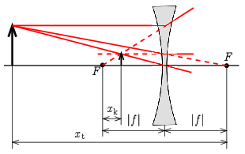

**Megoldás.**
 $a)$ A kitűzésben szereplő ábráról látható, hogy
$$\begin{align*}
 t&=x_\mathrm{t}+f,\\
 k&=x_\mathrm{k}+f,
\end{align*}$$
 amiket beírva a leképzési törvény szokásos alakjába:
 $\frac{1}{x_\mathrm{t}+f}+\frac{1}{x_\mathrm{k}+f}=\frac{1}{f}.$
 Az egyenletet mindhárom nevezővel beszorozva és rendezve:
 $x_\mathrm{t}x_\mathrm{k}=f^2.$

 $b)$ A szórólencse fókusztávolsága negatív, de a képletben $f^2$ szerepel, így ez nem okozna különbséget. Vegyük úgy figyelembe a fókusztávolság előjelét, hogy a távolságokat a túloldali fókusztól mérjük!

 Az ábra alapján:
$$\begin{align*}
 t&=x_\mathrm{t}-|f|>0,\\
 k&=x_\mathrm{k}-|f|<0,
\end{align*}$$
 amiket beírva a leképzési törvény szokásos alakjába:
 $\frac{1}{x_\mathrm{t}-|f|}+\frac{1}{x_\mathrm{k}-|f|}=-\frac{1}{|f|}.$
 Az egyenletet mindhárom nevezővel beszorozva és rendezve:
 $x_\mathrm{t}x_\mathrm{k}=f^2,$
 a gyűjtőlencsével megegyezően.

