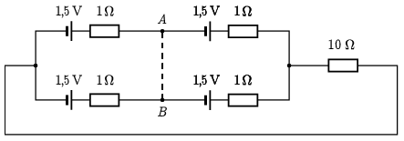

**Megoldás.**
 Az áramkör kapcsolási rajza:

 Vegyük észre, hogy a kapcsolási rajzon látható $A$ és $B$ pontok ekvipotenciálisak, vagyis ha ezt a két pontot összekötjük, akkor az összeköttetésen nem folyik áram. Ez azt jelenti, hogy a feladatban leírt kétféle kapcsolás egyáltalán nem különbözik egymástól.
 A négy egyforma ceruzaelem helyettesíthető egy 3 V-os teleppel, melynek a belső ellenállása $1\,\Omega$. Ennek megfelelően a $10\,\Omega$-os ellenálláson $I=\tfrac{3\,\mathrm{V}}{11\,\Omega}=0{,}27\,\mathrm{A}$ áram folyik.
 Megjegyzés: Ha a négy ceruzaelem nem egyforma, akkor sokkal bonyolultabb a számolás, és a kétféle kapcsolás eltérő eredményre vezet.

