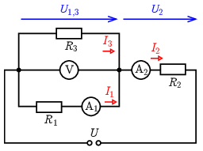

**Megoldás.**
 a) Az $R_1$ és $R_3$ ellenállásokon a voltmérő által mutatott feszültség, $U_{1,3}=10\,\mathrm{V}$ esik, így az $R_2$ ellenállásra $U_2=U-U_{1,3}=14\,\mathrm{V}$ jut. Az $R_1$ és $R_2$ ellenállások áramát közvetlenül mérik a velük sorba kapcsolt árammérők: $I_1=0{,}2\,\mathrm{A}$ és $I_2=0{,}7\,\mathrm{A}$. Az $R_3$ ellenállás árama a két áram különbsége: $I_3=I_2-I_1=0{,}5\,\mathrm{A}$.

 Az egyes ellenállások nagysága az Ohm-törvény alapján:
 $R_1=\frac{U_1}{I_1}=50\,\Omega,\qquad R_2=\frac{U_2}{I_2}=20\,\Omega,\qquad\textrm{és}\qquad R_3=\frac{U_3}{I_3}=20\,\Omega.$

 b) Az áramkör teljesítménye a kapocsfeszültség és a főágbeli áram szorzata:
 $P=UI_2=24\,\mathrm{V}\cdot 0{,}7\,\mathrm{A}=16{,}8\,\mathrm{W}.$
 Megjegyzés. A teljesítmény kiszámítható az egyes ellenállások teljesítményének összegeként is a $P_i=U_iI_i$, a $P_i=R_iI_i^2$ és a $P_i=U_i^2/R_i$ összefüggések valamelyikének használatával:
 $P=U_1I_1+U_2I_2+U_3I_3=I_1^2R_1+I_2^2R_2+I_3^ˇR_3=\frac{U_1^2}{R_1}+\frac{U_2^2}{R_2}+\frac{U_3^2}{R_3}=16{,}8\,\mathrm{W}.$
 Az áramkörben 2 perc alatt fejlődő hő:
 $Q=Pt=16{,}8\,\mathrm{W}\cdot 120\,\mathrm{s}=2016\,\mathrm{J}\approx 2\,\mathrm{kJ}.$
 Megjegyzés. A ma használt digitális voltmérők belső ellenállása legalább $1\,\mathrm{M}\Omega$, így a feladatban előforduló ellenállásokhoz képest nagyon nagy, ,,végtelennek'' tekinthető, tehát az ideális műszer közelítés mindenképp jogos. Az ampermérők belső ellenállása viszont a méréshatártól függően akár $1\,\mathrm{k}\Omega$ is lehet, ami egyáltalán nem elhanyagolható az ellenállások értéke mellett. (Épp ezért célszerű úgy kialakítani a mérő áramkört, hogy a voltmérő csak az ellenálláson eső feszültséget mérje, az ampermérőn esőt ne.) Esetünkben az lehet a megoldás, hogy az ampermérőt $10\,\mathrm{A}$-es méréshatáron használjuk, ahol az ellenállása csak néhány tized ohm, ami ha nem is nulla, de aránylag kicsi az ellenállások értéke mellett. (Ennek azonban az az ára, hogy az áram értékét kevésbé pontosan tudjuk mérni.)

