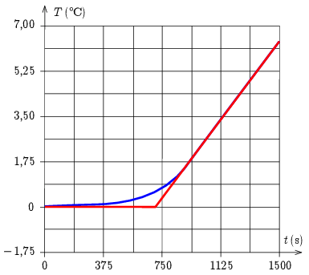

**Megoldás.**
 A kaloriméterben a jég megolvad, majd a víz felmelegszik. Interpoláció segítségével ezt a két folyamatot a hőmérséklet - idő grafikonon két egyenes szakaszra bonthatjuk, ahogy ezt az ábra mutatja.

 Ez a módszer egy közelítés, hiszen amikor már csak nagyon kevés jég van a kaloriméterben, akkor a víz felmelegedése már elindul. Ugyancsak közelítés az is, hogy a most következő számítások során a kaloriméter hőkapacitását elhanyagoljuk.
 A vízszintes szakasz azt mutatja, hogy nagyjából $t_1=700\,\mathrm{s}$-ig tart a jég olvadása, majd körülbelül $t_2=800\,\mathrm{s}$ alatt $0\,^{\circ}\mathrm{C}$-ról hozzávetőlegesen $6{,}4\,^{\circ}\mathrm{C}$-ra melegszik a kaloriméterben lévő $850\,\mathrm{ml}$ víz. A víz közismert fajhője ($c=4{,}2\,\mathrm{\tfrac{J}{g^{\circ}C}}$) alapján kiszámíthatjuk, hogy $850\,\mathrm{g}$ víz $6{,}4\,^{\circ}\mathrm{C}$-kal történő felmelegítéséhez $Q_2=cm\Delta T=22800\,\mathrm{J}$ hő szükséges, tehát a kaloriméter fűtőteljesítménye: $P=\tfrac{Q_2}{t_2}=28{,}5\,\mathrm{W}$.
 A felfűtés első szakaszában 700 s alatt a kaloriméter fűtőszála $Q_1=Pt_1=19900\,\mathrm{J}$ hőt adott le, ami $\Delta m=\tfrac{Q_1}{L_{\mathrm{olv}}}=60\,\mathrm{g}$ jég megolvasztásához elegendő. (A jég olvadáshője: $L_{\mathrm{olv}}=334\,\mathrm{\tfrac{J}{g}}$.) Tehát kezdetben 60 gramm jég és 790 ml víz volt a kaloriméterben.

