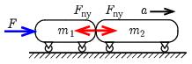

**Megoldás.**
 Vegyük fel az adatokat (a tömegeket váltsuk kg-ra), és tüntessük fel a kiszámolandó mennyiségeket: $m_1=100\,\mathrm{g}=0{,}1\,\mathrm{kg}$, $m_2=150\,\mathrm{g}=0{,}15\,\mathrm{kg}$, $F=0{,}5\,\mathrm{N}$. $a=?$ $F_\mathrm{ny}=?$

 a) Mivel a két kocsi együtt mozog, úgy tekinthetjük, mintha egyetlen $(m_1+m_2)$ tömegű kocsi mozogna, amelynek gyorsulása:
 $a=\frac{F}{m_1+m_2}=\frac{0{,}5\,\mathrm{N}}{0{,}25\,\mathrm{kg}}=2\,\mathrm{\frac{m}{s^2}}.$

 b) Egyszerűbb a nagyobb tömegű kocsit vizsgálnunk, mert arra vízszintesen csak a kisebb kocsi hat, mégpedig a kérdéses nyomóerővel:
 $F_\mathrm{ny}=m_2a=0{,}15\,\mathrm{kg}\cdot 2\,\mathrm{\frac{m}{s^2}}=0{,}3\,\mathrm{N}.$

 Megjegyzés. Természetesen tekinthetjük a kisebb tömegű kocsira ható nyomóerőt is, ami az ábrán látható módon éppen az előbb kiszámított nyomóerő ellenereje $(-F_\mathrm{ny})$. A kisebb tömegű kocsira felírható mozgásegyenlet:
 $F–F_\mathrm{ny}=m_1a,$
 amiből
 $F_\mathrm{ny}=F-m_1a=0{,}5\,\mathrm{N}-0{,}1\,\mathrm{kg}\cdot 2\,\mathrm{\tfrac{m}{s^2}}=0{,}3\,\mathrm{N}.$

 c) A két kiskocsi együttes gyorsulása nem függhet attól, hogy melyik irányból hat rájuk a külső $F$ erő, tehát a gyorsulásra a megoldás megegyezik az a) válasszal: $2\,\mathrm{\tfrac{m}{s^2}}$.
 A két kiskocsi közötti nyomóerő viszont függ attól, hogy melyik oldalon hat az $F$ erő. Ha a jobb oldalon hat $0{,}5\,\mathrm{N}$ erő, akkor most a bal oldali kocsira könnyebb elvégezni a számolást:
 $F'_\mathrm{ny}=m_1a=0{,}1\,\mathrm{kg}\cdot 2\,\mathrm{\frac{m}{s^2}}=0{,}2\,\mathrm{N}.$

 Megjegyzés. Ilyenkor a jobb oldali kocsira eredőben $0{,}5\,\mathrm{N}–0{,}2\,\mathrm{N}=0{,}3\,\mathrm{N}$ erő hat, ami a $0{,}15\,\mathrm{kg}$ tömegű kocsit az elvárt $2\,\mathrm{\tfrac{m}{s^2}}$ gyorsulással mozgatja.

