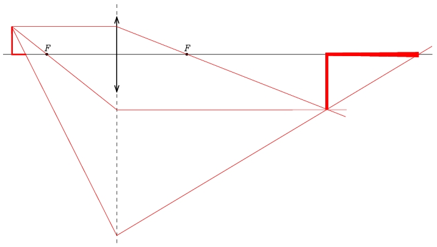

**Megoldás.**
 a) Ismert, hogy a lencsék egyenest egyenesbe képeznek le, aminek speciális esete, hogy az optikai tengelyen fekvő szakasz képe az optikai tengelyen lesz, továbbá az optikai tengelyre merőleges szakasz képe merőleges lesz az optikai tengelyre. Ennek felhasználásával elegendő megszerkesztenünk az L-alak két végpontjának képét, amint az a következő ábrán látható.

 Az L-alak legfelső pontját a szokásos módon, két speciális fénysugár segítségével szerkeszthetjük meg. (Az egyik sugár az optikai tengellyel párhuzamos, a másik pedig átmegy a tárgyoldali fókuszon.) Az L-alak alsó szárának végpontját úgy kaphatjuk meg, hogy egy olyan fénysugarat választunk, amely a függőleges szár tetőpontjából indul, és áthalad az alsó szár végpontján. A fénysugár a lencse síkjánál úgy törik meg, hogy utána áthaladjon a felső pont képén, majd metszi az optikai tengelyt, és ez a metszéspont lesz az alsó szár végpontjának a képe. (Ha egy fénysugár nem halad át ténylegesen a lencsén – annak véges mérete miatt –, a szerkesztés szempontjából akkor is úgy tekinthetjük, mintha áthaladna rajta.)

 b) Elegendő az alsó szár két végpontjának a képtávolságát kiszámítani a leképezési törvény segítségével. Kezdjük az L sarkával:
 $\frac{1}{f}=\frac{1}{t}+\frac{1}{k}\qquad\Rightarrow\qquad\frac{1}{10\,\mathrm{cm}}=\frac{1}{15\,\mathrm{cm}}+\frac{1}{k}\qquad\Rightarrow\qquad k=30\,\mathrm{cm}.$
 Látszik, hogy az L-alak függőleges szárának nagyítása kétszeres, tehát a függőleges szár képének hossza 8 cm.
 Folytassuk az L-alak vízszintes szakaszának elülső végével:
 $\frac{1}{f}=\frac{1}{t'}+\frac{1}{k'}\qquad\Rightarrow\qquad\frac{1}{10\,\mathrm{cm}}=\frac{1}{13\,\mathrm{cm}}+\frac{1}{k'}\qquad\Rightarrow\qquad k'=\frac{130}{3}\,\mathrm{cm}=43{,}3\,\mathrm{cm}.$
 A vízszintes szakasz képe egy fokozatosan vastagodó tartomány lesz, amelynek hossza: $k'-k=\tfrac{40}{3}\,\mathrm{cm}=13{,}3\,\mathrm{cm}$, tehát ennek nagyítása $\tfrac{20}{3}=6{,}67.$

