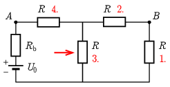

**Megoldás.**
 Számozzuk meg az áramkörben lévő ellenállásokat az ábrán látható módon.

 Az 1. és 2. ellenállás sorba van kötve, eredőjük $2R$. Ezek a 3. ellenállással párhuzamosan vannak kapcsolva, ezért ennek a háromnak az eredője $\tfrac{2R}{3}$. Ez a három sorba van kötve a 4. ellenállással, illetve a telep belső ellenállásával, tehát az egész kör eredő ellenállása $R_\mathrm{e}=\tfrac{5R}{3}+R_\mathrm{b}=\tfrac{59}{3}\Omega$. Így a telep
 $I=\frac{U_0}{R_\mathrm{e}}=\frac{27}{118}\,\mathrm{A}=0{,}229\,\mathrm{A}$
 áramot ad le, és ugyanekkora folyik a 4. ellenálláson is. A 3. ellenálláson kétszer akkora áram folyik, mint az 1. és 2. ellenállásokon, ezek összege a csomóponti törvény szerint $0{,}229\,\mathrm{A}$. Tehát az 1. és 2. ellenálláson $\tfrac{9}{118}\,\mathrm{A}=0{,}076\,\mathrm{A}$, míg a 3. ellenálláson $\tfrac{9}{59}\,\mathrm{A}=0{,}153\,\mathrm{A}$ áram folyik. Ezek után már tudunk válaszolni a gyakorlat kérdéseire.

 a) A nyíllal jelölt 3. ellenállás árama $0{,}153\,\mathrm{A}$, a rajta eső feszültség $1{,}53\,\mathrm{V}$, tehát a teljesítménye $0{,}233\,\mathrm{W}$.

 b) A fentiek alapján a 4. ellenállásra $2{,}29\,\mathrm{V}$, míg a 2. ellenállásra $0{,}76\,\mathrm{V}$ feszültség jut, tehát az $A$ és $B$ pontok közötti feszültség $U_{AB}=3{,}05\,\mathrm{V}$.

