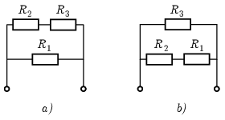

**Megoldás.**
 Az alsó két ellenállást vonjuk össze egyetlen ellenállásnak, és ezt jelöljük $R_1$-gyel. A felette lévő ellenállások legyenek így jelölve: $R_2$ és $R_3$. A kapcsolásokat így rajzolhatjuk át:

 Fejezzük ki, és tegyük egyenlővé a kétféle kapcsolás eredő ellenállását:
 $\frac{R_1(R_2+R_3)}{R_1+R_2+R_3}=\frac{(R_1+R_2)R_3}{R_1+R_2+R_3}\qquad\Rightarrow\qquad R_1R_2+R_1R_3=R_1R_3 +R_2R_3\qquad\Rightarrow\qquad R_1=R_3.$
 Ezzel a feltétellel lényegében az eredeti kapcsolási rajz vízszintes középvonalára tettük szimmetrikussá az összeállítást, tehát nem csoda, hogy az eredő ellenállások megegyeznek. Viszont beláttuk, hogy akkor és csak akkor egyenlő a kétféle eredő ellenállás, ha az alsó két ellenállás összege ($R_1$) megegyezik a legfelső ellenállással ($R_3$).

