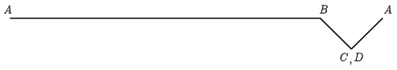

**Megoldás.**
 a) A téglalap kerülete $2(75\,\mathrm{m}+15\,\mathrm{m})=180\,\mathrm{m}$, a matróz sebessége 60 m/min, tehát a matróz 3 perc alatt járja körbe az útját.

 b) Az $A$ pontból a $B$-be a matróz kétszeres sebességgel 150 m utat tesz meg a parthoz képest, viszont a $C$-ből $D$-be történő mozgásakor a parthoz képest áll. $B$-ből $C$-be, illetve a $D$-ből $A$-ba haladva a parthoz (vagy a sodrásirányhoz) képest 45 fokos szögben mozog, tehát az útja mindkét esetben $\sqrt{2}\cdot 15\,\mathrm{m}\approx 21\,\mathrm{m}$, vagyis a teljes útja nagyjából 192 m.

 c) A matróz a parthoz képest 180 méterrel jut előbbre a körbejárása alatt.

