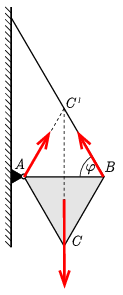

**Megoldás.**
 A lemezre három erő hat: a nehézségi erő, a fonálerő és a csuklóerő. Ezek eredője egyensúly esetén nulla, valamint a három erő hatásvonalának egy ponton kell átmennie. (Ha ez nem így lenne, akkor bármely két erő hatásvonalának metszéspontára vizsgálva a forgatónyomatékokat a harmadik erő eredő nyomatékot képezne.) Az ábráról láthatjuk, hogy a három erő metszéspontja a $C'$ pont, ami tükörszimmetrikus az $AB$ szakaszra. A szimmetriából következik, hogy a fonálerő és a csuklóerő egyforma nagy, és mindkettő $\varphi=60^\circ$-os szöget zár be az $AB$ szakasszal.

 Mindkét erő nagysága
 $\frac{mg}{2\sin{\varphi}}=\frac{mg}{\sqrt{3}}\approx 4\,\mathrm{N}.$

