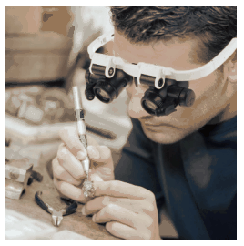

**Megoldás.**
 Ha az embernek egyszerű nagyítóra van szüksége, akkor ez is megteszi. A dupla szemüveg hasonlít ahhoz, amikor egy órás vagy egy ékszerész a képen látható módon nagyítót használ. Ezzel az ember lényegében a közelpontját csökkenti le, akkor is élesen látunk, ha a tárgy nagyon közel van.

