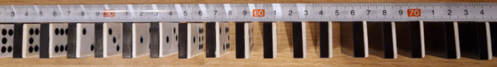
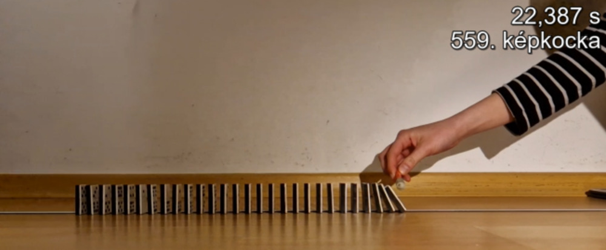
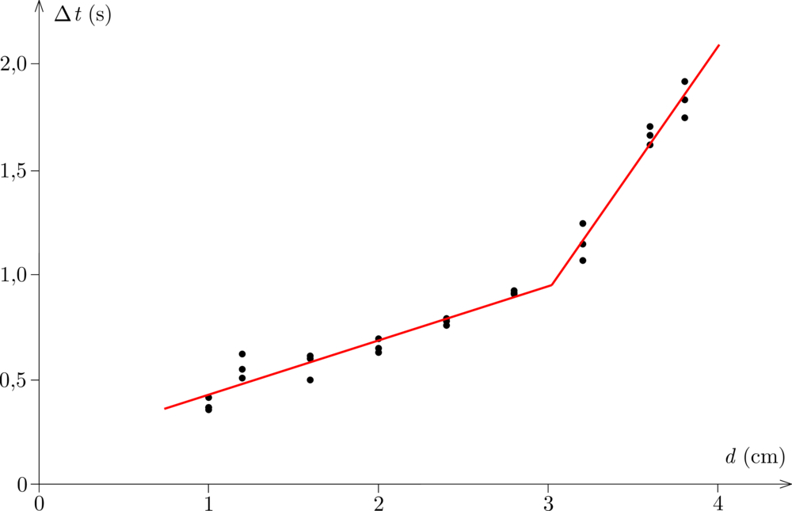

**Megoldás.**
 Körülbelül $1{,}5~\mathrm{m}$ hosszúra kihúztam a mérőszalagot, majd egy sima felületre, a padlóra ragasztószalaggal rögzítettem a két végét. Ennek a segítségével felállítottam a dominókat egymástól egyenlő távolságra ( 1. ábra ). A dominók száma minden esetben 28 volt. Ezután okostelefon segítséggel elkészítettem a felvételeket. Mindegyik távolsággal háromszor végeztem el a mérést. A mozgás rögzítéséhez 240 képkocka/másodperc fényképezési frekvenciát választottam, ami körülbelül $4{,}2~\mathrm{ms}$ időbeli felbontást tett lehetővé. A felvételeket ezután a VLC alkalmazással elemeztem. Az alkalmazás kiválasztásánál fontos szempont volt, hogy azzal a felvétel képkockái egyenként megnézhetőek legyenek, ezért a VLC alkalmazáshoz letöltöttem a Time v3.2 nevű bővítményt, ami ezt lehetővé tette ( 2. ábra ). A felvételekből ilyen módon meghatároztam azt, hogy a második és az utolsó dominó mikor kezdett el dőlni. Azért a másodikat vettem és nem az elsőt, mert az első dőlési idejét (amíg eléri a következő dominót) erősebben befolyásolja az, hogy mennyire erősen löktem meg.

 1. ábra

 2. ábra

 A két idő különbségéből kaptam a dominósor vizsgált részének $\Delta t$ eldőlési idejét. Az így kapott értékeket a dominók közötti $d$ távolság függvényében ábrázoltam ( 3. ábra ).

 3. ábra

 A grafikonon jól látható, hogy a teljes dominósor eldőlési ideje nem arányos a dominók közötti távolsággal, és így a dominósor teljes hosszával. Mivel a teljes dominó sor hossza a dominók közötti távolsággal arányos, ezért a dőlési front haladási sebessége függ a dominók távolságától. Kisebb dominók közötti távolságnál ez a sebesség nagyobb, mint nagyobb távolságoknál. A mérési pontokat két részre osztottam a kisebb, illetve a nagyobb távolságok szerint. Ezekre a csoportokra külön-külön egy-egy egyenest illesztettem. Az egyenesek meredekségeiből megbecsültem a dőlési front terjedési sebességét. Kis (kb. 3 cm-nél kisebb) dominóközök esetén a dőlési front terjedési sebessége
 $v_1=(101\pm 9)~\mathrm{cm}/\mathrm{s},
$
 és nagy (3 cm-nél nagyobb) dominóközök esetén
 $v_2=(22{,}5\pm 1{,}5)~\mathrm{cm}/\mathrm{s}.
$
 Előbbi körülbelül $4{,}5$-szer nagyobb, mint az utóbbi.
 Az időpontok leolvasási hibája körülbelül a képkockák közötti idővel becsülhető, ami $\pm 2{,}1~\mathrm{ms}$. Kisebb értékű hibát eredményezhet a dominók közötti távolság pontatlansága, ami körülbelül $\pm 0{,}25~\mathrm{mm}$. A dominók párhuzamossága sem volt tökéletes, ami szintén befolyásolhatta az időket.
 Fülöp Magdaléna (Pécsi Leőwey Klára Gimn., 10. évf.)

