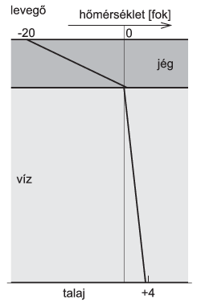

**Megoldás.**
 A jég felső felülete – ha még szél is van – a külső levegő hőmérsékletével, vagyis $-20\,^\circ$C-kal egyezik meg. (Szélcsendes időben a jég a levegő egy vékony rétegét valamennyire ,,megmelegíti'', állítólag ezért szeretnek bizonyos vízimadarak nagy hidegben a tó jegére szállni.)
 A jégréteg alsó felülete (mivel a folyékony vízzel érintkezik) $0\,^\circ$C-os. A jégben a hőmérséklet – jó közelítésben – a mélységgel arányosan változik, hiszen az egyensúlyi állapotnak tekinthető hőmérsékleteloszlásban a hőáram – ami a ,,hőmérsékletgradienssel'' (egységnyi távolságra eső hőmérsékletváltozással) arányos – helyfüggetlen.
 A jég alsó felületétől lefelé haladva a hőmérséklet a tó fenekéig lassan emelkedik. Ha a tófenék $+4\,^\circ$C -nál hidegebb, akkor a víz sűrűsége a mélységgel egyre nő, nem alakul ki folyadékáramlás (konvekció), csak lassú hővezetés. A hőmérséklet itt is a mélységgel arányosan (lineárisan) változik, ekkor teljesül az a feltétel, hogy bármelyik vízrétegbe alulról ugyanannyi hő érkezik, mint amennyi felfelé eltávozik. A jég vastagodásának ütemét az a feltétel szabja meg, hogy a vízből egységnyi idő alatt érkező hő és a fagyás közben keletkező hő összege egyenlő legyen a jégen keresztül eltávozó hővel.
 Ha a tó fenekén a talaj hőmérséklete $4\,^\circ$C-nál magasabb, akkor a 4 fokos vízréteg és a tófenék között konvektív áramlás alakul ki (hiszen a melegebb, ritkább víz nem maradhat alul). Ez az áramlás történhet térben elkülönülő fel- és leszálló cellákban (hasonlóan a légköri és a tengeri áramlásokhoz, vagy akár a lakóházak keringető szivattyú nélküli, ún. gravitációs fűtőrendszerekhez), vagy turbulens, erősen örvénylő formában. Egyik esetben sincs értelme egyértelmű hőmérséklet-mélység kapcsolatról beszélni, legfeljebb időben és térben átlagolt hőmérsékleteloszlásról. Az áramlással kísért hőátadás sokkal gyorsabb, mint a hővezetés, és viszonylag hamar (a külső hőmérséklettől, a tó mélységétől és a talaj kezdeti hőmérsékletétől függő idő alatt) a víz hőmérséklete még a tó fenekén is $4\,^\circ$C-ra, vagy esetleg az alá csökken.
 A hőmérsékleteloszlás – ebben a lelassult változási szakaszban – az alábbi ábrán láthatóan alakul:

 A víz hőmérsékletgradiensét első közelítésben állandónak tekinthetjük. (Ha még azt is figyelembe vesszük, hogy a víz hőmérséklete az idő múltával lassan ugyan, de csökken, akkor a víz hőmérsékletgradiensét lefelé haladva kisebbnek kellene rajzoljuk, mint a felsőbb vízrétegekben. Ezt a kis eltérést az ábrán nem próbáltuk érzékeltetni.)

