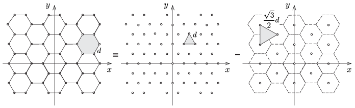
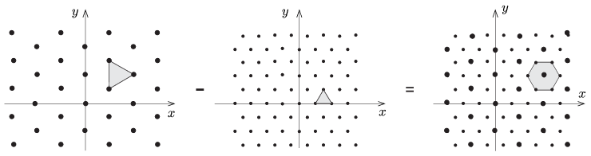

**Megoldás.**
 A Huygens–Fresnel-elv szerint a lyukak mindegyikéből azonos fázisú és a lyuk területével arányos amplitúdójú gömbhullám indul ki. Ezen hullámok fázishelyes összege adja meg az eredő hullámot, aminek az amplitúdónégyzetével arányos intenzitású elhajlási kép alakul ki az ernyőn.
 Ha egy $d$ rácsállandójú, szabályos háromszögekből álló rácsunk lenne, az elhajlási kép (az idézett cikkben leírtak szerint) egy olyan háromszögrács, amely $90^\circ$-kal elforgatott helyzetű az eredeti rácshoz képest, és szabályos háromszögeinek oldalhossza $D=\frac{2L\lambda}{\sqrt{3}d}.$
 A feladatban szereplő hatszögrács felfogható úgy is, mint egy $d$ rácsállandójú háromszögrács és egy $\sqrt{3}d$ rácsállandójú másik, $90^\circ$-kal elforgatott helyzetű rács különbsége ( 1. ábra ). Ha a ritkább rács (aminek rácspontjait a hatszögek középpontjai alkotják) minden pontjából jövő hullámot levonjuk a sűrűbb háromszögrács hullámaiból, a maradék éppen a feladatban szereplő hatszögrács elhajlási képét adja meg.
 1. ábra
 A sűrűbb háromszögrács önmagában egy $D=\frac{2L\lambda}{\sqrt{3}d}$ rácsállandójú, az eredeti rácshoz képest $90^\circ$-kal elforgatott elhajlási képet hoz létre az ernyőn. A ritkább rács elhajlási képe is ilyen jellegű lenne (ha csak önmagában okozná azt), de annak rácsállandója $D'=\sqrt{3}=\frac{2L\lambda}{d}$, az intenzitása pedig $3^2=9$-szer kisebb lenne. Ez utóbbi faktor onnan származik, hogy a ritkább rácsnak adott területen 3-szor kevesebb pontja van, mint a sűrűbb rácsnak, tehát a belőle kiinduló hullámok eredő amplitúdója 3-szor kisebb, mint a sűrűbb rács esetében.
 2. ábra
 A két elhajlási kép ,,eredőjét'', vagyis a feladatban szereplő hatszögrács által létrehozott képet a két alrács képének szuperponálásával kapjuk meg ( 2. ábra ). Ez egy olyan hatszögrács lesz, amelyben a hatszögek középpontjában az intenzitás 4-szer erősebb, mint a hatszögek csúcspontjaiban.

