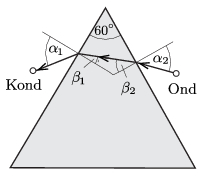

**Megoldás.**
 A feladat optikai megfelelője: Ha létezne $n=\frac{v_1}{v_2}=5$ törésmutatójú anyag, hogyan juthat el a fény egy ilyen anyagból készített prizma egyik oldaláról a másikra, az Ondnak megfelelő helyről indulva a Kondnak megfelelő helyre? (Az analógia alapja a Fermat-elv, ami a fény terjedési idejének minimumával jellemzi a tényleges fénysugarak pályáját.)
 Ha Ond valameddig a parton fut, majd a vízben halad tovább, és a túlsó parton ismét szaladva éri el Kondot, akkor a vízben megtett útjának iránya a partra merőleges egyenessel (az optikai analógia szerint) legfeljebb
 $\beta_1=\arcsin \frac{\sin\alpha_1}{n}\le \arcsin \frac{1}{5}=11{,}5^\circ$
 és
 $\beta_2=\arcsin \frac{\sin\alpha_2}{n}\le \arcsin \frac{1}{5}=11{,}5^\circ$
 lehet.
 Ez azonban nem lehetséges, mert az ábrán látható kisebb háromszög szögeinek összege:
 $(90^\circ-\beta_1)+(90^\circ-\beta_2)+60^\circ=180^\circ,$
 azaz $\beta_1+\beta_2=60^\circ$.

 A fény tehát nem juthat el $-$ a fénytörés törvényeit követve $-$ Ond helyétől Kond helyéig. (Érdekes, hogy ez az állítás nem függ a fény kiindulási és érkezési pontjától, bármilyen két pontra érvényes, amennyiben azok nem köthetők össze egy $-$ a prizmát kikerülő $-$ egyenessel.) Visszatérve az eredeti feladathoz: Ond úgy juthat el a leghamarabb Kondhoz, ha megkerüli a tavat, tehát egyenesen fut a háromszög ,,felső'' csúcsáig, és onnan tovább egyenesen a barátjáig.

